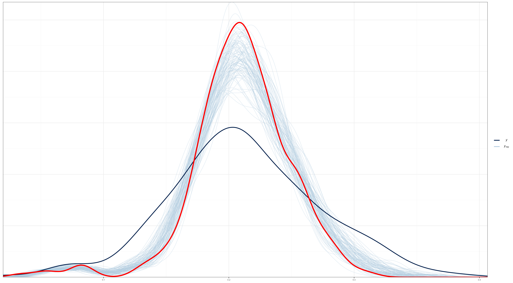

# Modelo de área para la estimación de la Escala de Experiencia de Inseguridad Alimentaria


El índice FIES (Escala de Experiencia de Inseguridad Alimentaria) se define como un sistema de medición para la inseguridad alimentaria a nivel individual y del hogar. La FIES se basa en cuestionarios que preguntan sobre las experiencias de los individuos y hogares en relación con el acceso a alimentos seguros y nutritivos. Estos cuestionarios se utilizan para definir un modelo probabilístico que vincule la medida (desconocida) de la inseguridad alimentaria con las respuestas (observables) a los cuestionarios basados en la experiencia. El modelo más sencillo utilizado para esto es el modelo de Rasch.

Los indicadores definidos son los porcentajes de individuos de la población con edades a partir de 15 años que experimentan niveles de inseguridad alimentaria moderada o grave (IA moderada+grave) y grave (IA grave). Estos indicadores se calculan utilizando una escala numérica que va desde 0 hasta 40, donde 0 indica seguridad alimentaria total y 40 indica inseguridad alimentaria extrema. Los puntajes más altos en la escala indican una mayor gravedad de la inseguridad alimentaria.


## Modelo de Rash 

El modelo de Rasch es un modelo matemático utilizado para el análisis de datos en la medición de habilidades y características de los individuos. Este modelo es ampliamente utilizado en la educación, psicología, medicina y otras áreas de investigación.

El modelo de Rasch se basa en la teoría de respuesta al ítem, que establece que la probabilidad de que un individuo responda correctamente a un ítem en particular depende de la habilidad del individuo y de la dificultad del ítem. El modelo de Rasch supone que la habilidad de un individuo y la dificultad de un ítem se pueden medir en una misma escala de medida, y que esta escala es unidimensional y lineal.

La ecuación del modelo de Rasch es la siguiente:

$$
P_i(X_j=1) = \frac{\exp(a_i -b_j)}{1 + \exp(a_i -b_j)}
$$

donde $P_i(X_j=1)$ es la probabilidad de que el individuo $i$ responda correctamente al ítem $j$, $a_i$ es el nivel de habilidad del individuo $i$, $b_j$ es la dificultad del ítem $j$, y $X_j$ es una variable indicadora que toma el valor de 1 si el individuo $i$ responde correctamente al ítem $j$, y 0 en caso contrario.

El proceso de estimación de los parámetros del modelo de Rasch se lleva a cabo mediante un procedimiento de máxima verosimilitud. Este proceso permite estimar tanto los niveles de habilidad de los individuos como las dificultades de los ítems. En el caso de las encuestas complejas, se utilizan métodos de estimación de la verosimilitud basados en muestras complejas para ajustar los parámetros del modelo. Es importante tener en cuenta el diseño de muestreo y la ponderación de las observaciones al utilizar el modelo de Rasch en encuestas complejas.


## Fuentes de error en la estimación del FIES

1. Error de muestreo: Este error se produce debido a la variabilidad natural en los datos recopilados a partir de una muestra de la población. Cuanto mayor sea el tamaño de la muestra, menor será este error.

2. Error de medición: Este error se produce debido a la variabilidad en las respuestas proporcionadas por los encuestados. El modelo de Rasch utilizado para estimar la inseguridad alimentaria tiene en cuenta este error y proporciona estimaciones precisas.


Debido a que los errores de muestreo y medición se consideran independientes, estos se combinan para obtener el error estándar de la prevalencia mundial de la siguiente forma: 

$$
\sigma^{2}_{total} = (Error de Muestreo)^2 + (Error de Medición)^2
$$

## Modelos de área 

La estimación de áreas pequeñas es un conjunto de técnicas que permiten la estimación de parámetros de interés para dominios donde los estimadores directos no pueden considerarse lo suficientemente confiables debido a que su varianza es demasiado alta para ser liberada. Las encuestas de oficinas estadísticas nacionales suelen planificarse a un nivel más alto, por lo que cuando se requiere información más detallada, el tamaño de la muestra puede no ser lo suficientemente grande como para garantizar la liberación de estimaciones directas y, en algunos casos, es posible que los dominios más pequeños no cuenten con unidades de muestra. Los métodos de estimación de áreas pequeñas aumentan la confiabilidad de la estimación "tomando fuerza prestada" de un conjunto de áreas en un dominio más grande para el cual el estimador directo es confiable. Esto significa que se utiliza información de otras áreas y / o se explota información adicional de diferentes fuentes.

Uno de los modelos más utilizados para la estimación de áreas pequeñas es el modelo de Fay-Herriot. El modelo de Fay-Herriot es un modelo lineal mixto que se utiliza para estimar parámetros de interés para pequeñas áreas en presencia de datos auxiliares. El modelo se utiliza para "prestar fuerza" de áreas más grandes a áreas más pequeñas y, por lo tanto, aumentar la precisión de las estimaciones para áreas pequeñas. 

En el modelo de Fay-Herriot, el parámetro de interés en cada área pequeña se modela como una combinación lineal de un estimador directo de la encuesta y un componente predicho basado en un modelo lineal mixto. El modelo relaciona el parámetro de interés con las variables auxiliares conocidas para cada uno de los dominios que constituyen la partición de la población completa. Se incluye un efecto para tener en cuenta la homogeneidad dentro de cada dominio. 


### Modelo de área de Fay-Herriot

Sea $P_d$ la probabilidad de encontrar un hogar con inseguridad alimentaria  en el $d-$ésimo dominio de la población. Entonces, el estimador directo de $P_d$ se puede escribir como:  

$$
\hat{P}^{DIR}_{d} = P_d + e_d
$$

Ahora bien, $P_d$ se puede modelar de la siguiente manera,  

$$
P_d = \boldsymbol{x}^{T}_{d}\boldsymbol{\beta} + u_d
$$
Luego, reescribiendo $\hat{P}^{DIR}_{d}$ en términos de las dos ecuaciones anteriores tenemos:  

$$
\hat{P}^{DIR}_{d} = \boldsymbol{x}^{T}_{d}\boldsymbol{\beta} + u_d + e_d
$$

Ahora, es posible suponer que $\hat{P}^{DIR}_d \sim N(\boldsymbol{x}^{T}_{d}\boldsymbol \beta, \sigma_u^2 +\sigma_{e_d}^2)$, $\hat{P}^{DIR}_d \mid u_d \sim N(\boldsymbol{x}^{T}_{d}\boldsymbol \beta + u_d,\sigma_{e_d}^2)$ y $u_d \sim N(0, \sigma^2_u)$

Luego, se asumen distribuciones previas para $\boldsymbol{\beta}$ y $\sigma^2_u$

$$
\begin{eqnarray*}
\beta_p & \sim   & N(0, 10000)\\
\sigma^2_u &\sim & IG(0.0001, 0.0001)
\end{eqnarray*}
$$

por tanto, el estimador bayesiano para $P_d$ esta dado como $\tilde{P}_d = E\left(P_d\mid\hat{P}_d^{DIR}\right)$


### Modelo de área de Fay-Herriot con tranformación arcoseno. 


En su concepción más básica, el modelo de **Fay-Herriot** es una combinación lineal de covariables. Sin embargo, el resultado de esta combinación pueden tomar valores que se salen del rango aceptable en el que puede estar una proporción; es decir, en general el estimador de Fay-Herriot $\theta \in R$, mientras que el estimador directo $\theta \in (0,1)$. La transformación arcoseno esta dada por: 

$$
\hat{z}_d = arcsin\left( \sqrt{ \hat{\theta}_d} \right)
$$ donde

$$
Var\left( \hat{z}_d \right) = \frac{\widehat{DEFF}_d}{4\times n_d} = \frac{1}{4\times n_{d,efectivo} }
$$

El modelo de Fay-Herriot  estaría definido de la siguiente forma:

$$
\begin{eqnarray*}
Z_d \mid \mu_d,\sigma^2_d &  \sim  & N(\mu_d, \sigma^2_d)\\
\mu_d & = & \boldsymbol{x}^{T}_{d}\boldsymbol{\beta} + u_d \\
\theta_d & = &  \left(sin(\mu_d)\right)^2
\end{eqnarray*}
$$ donde $u_d \sim N(0 , \sigma^2)$.


Suponga de las distribuciones previas para 
$\boldsymbol{\beta}$ y $\sigma_{u}^{2}$ son dadas por 
$$
\begin{eqnarray*}
\boldsymbol{\beta}	\sim	N\left(0,1000 \right)\\
\sigma_{u}^{2}	\sim	IG\left(0.0001,0.0001\right)
\end{eqnarray*}
$$

### Modelos de área con variable respuesta Beta. 


El modelo beta-logístico fue inicialmente considerado por Jiang y Lahiri (2006b) para un enfoque EBP en uno de sus ejemplos ilustrativos para estimar medias de dominio de población finita. 


El modelo de área beta-logístico estaría dado por las siguientes expresiones 
$$
\begin{eqnarray*}
\hat{p}_{d} \mid P_d & \sim & beta(a_d, b_d)\\
\end{eqnarray*}
$$
La función del enlace es 
$$
\begin{eqnarray*}
logit(P_{d}) \mid \boldsymbol{\beta}, \sigma^2_u  & \sim & N(\boldsymbol{x}_d^T\boldsymbol{\beta},\sigma^2_u)\\
\end{eqnarray*}
$$
Los parámetros $a_d$ y $b_d$ son estimados así: 
$$
\begin{eqnarray*}
a_d &=& P_d \times \phi_d\\
b_d &=& (1 - P_d) \times \phi_d\\
\end{eqnarray*}
$$ donde

$$\phi_d = \frac{n_d}{\widehat{DEFF}_d} -1 = n_{d,efecctivo} -1$$

Las distribuciones previas para $\boldsymbol{\beta}$ y $\sigma^2_u$

$$
\begin{eqnarray*}
\beta_k &\sim& N(0, 10000)\\
\sigma^2_u &\sim& IG(0.0001,0.0001)
\end{eqnarray*}
$$


### Modelos de área con variable respuesta Binomial.


El modelo lineal de Fay-Herriot puede ser reemplazado por un modelo mixto lineal generalizado (GLMM). Esto se puede hacer cuando los datos observados $Y_d$ son inherentemente discretos, como cuando son recuentos (no ponderados) de personas u hogares muestreados con ciertas características. Uno de estos modelos supone una distribución binomial para $Y_d$ con probabilidad de éxito $\theta_d$, y una logística modelo de regresión para $\theta_d$ con errores normales en la escala logit. El modelo resultante es


$$
\begin{eqnarray*}
Y_{d}\mid \theta_{d},n_{d} & \sim & Bin\left(n_{d},\theta_{d}\right)
\end{eqnarray*}
$$
para $d=1,\dots,D$ y 

$$
\begin{eqnarray*}
logit\left(\theta_{d}\right)=\log\left(\frac{\theta_{d}}{1-\theta_{d}}\right) & = & \boldsymbol{x}_{d}^{T}\boldsymbol{\beta}+u_{d}
\end{eqnarray*}
$$
donde $u_{d}\sim N\left(0,\sigma_{u}^{2}\right)$ y $n_{d}$ es el
tamaño de la muestra para el área $d$.

El modelo anterior se puede aplicar fácilmente a recuentos de muestras no ponderadas $Y_d$, pero esto ignora cualquier aspecto complejo del diseño de la encuesta. En muestras complejas donde las $Y_d$ son estimaciones ponderadas, surgen dos problemas. En primer lugar, los posibles valores de
el $Y_d$ no serán los números enteros $0, 1, \dots , n_d$ para cualquier definición directa de tamaño de muestra $n_d$. En su lugar, $Y_d$ tomará un valor de un conjunto finito de números desigualmente espaciados determinados por las ponderaciones de la encuesta que se aplican a los casos de muestra en el dominio  $d$. En segundo lugar, la varianza muestral de $Y_d$
implícito en la distribución Binomial, es decir,  $n_d \times \theta_d (1-\theta_d)$, será incorrecto. Abordamos estos dos problemas al definir un **tamaño de muestra efectivo** $\tilde{n}_d$, y un **número de muestra efectivo de éxitos** $\tilde{Y_d}$ determinó mantener: (i) la estimación directa  $\hat{\theta}_i$, de la pobreza y (ii) una estimación de la varianza de muestreo correspondiente,$\widehat{Var}(\hat{\theta}_d)$. 


Es posible suponer que 
$$
\begin{eqnarray*}
\tilde{n}_{d} & \sim & \frac{\check{\theta}_{d}\left(1-\check{\theta}_{d}\right)}{\widehat{Var}\left(\hat{\theta}_{d}\right)}
\end{eqnarray*}
$$
donde $\check{\theta}_{d}$ es una preliminar perdicción basada en el modelo para la proporción poblacional $\theta_d$ y $\widehat{Var}\left(\hat{\theta}_{d}\right)$ depende de$\check{\theta}_{d}$ a través de una función de varianza generalizada ajustada (FGV). Note que $\tilde{Y}_{d}=\tilde{n}_{d}\times\hat{\theta}_{d}$. 

Suponga de las distribuciones previas para 
$\boldsymbol{\beta}$ y $\sigma_{u}^{2}$ son dadas por 
$$
\begin{eqnarray*}
\boldsymbol{\beta}	\sim	N\left(0,10000\right)\\
\sigma_{u}^{2}	\sim	IG\left(0.0001,0.0001\right)
\end{eqnarray*}
$$

# Estimación de la Escala de Experiencia de Inseguridad Alimentaria

Luego de recopilar la información proporcionada por FAO, se procedió al ajuste de los 4 modelos anteriores utilizando un conjunto de covariables detalladas a continuación:

- prop_b50median_afc_2020
- prop_fonasa_a_2019
- log_ing_municipales_permanentes_pc_2018
- prop_fonasa_b_2019
- prop_fonasa_c_2019
- prop_obeso_sobrepeso_menores_2018_w
- prop_red_publica_2017
- prop_ism_afc_2020
- promedio_simce_hist_8b_2019
- prop_camion_aljibe_2017
- prop_obeso_sobrepeso_menores_2018
- prop_rio_vertiente_estero_canal_2017

Posteriormente, se llevó a cabo un análisis de chequeo predictivo con el fin de seleccionar el modelo más adecuado. Cabe destacar que se realizaron 6500 iteraciones, descartando las primeras 5000 iteraciones como parte del proceso de quemado. Al evaluar el criterio de Rhat, se pudo constatar que todas las cadenas del modelo convergieron satisfactoriamente.  


### Resultado para el modelo de área de Fay-Herriot. {-}


### Resultado para el Modelo de área de Fay-Herriot con tranformación arcoseno. {-}


### Resultado para el modelo de área con variable respuesta Beta. {-}




### Resultado para el modelo de área con variable respuesta Binomial. {-}


De acuerdo con los resultados obtenidos, se determinó que el modelo de área con variable respuesta binomial presenta un mejor ajuste en comparación con los otros modelos considerados. 


A partir de este modelo, se procedió a realizar el proceso de benchmarking, el cual se describe a continuación:

## Proceso de Benchmark 

1. Leer estimaciones del modelo


```r
estimacionesPre <- readRDS("Data/estimacionesPre.rds") %>%
  transmute(dam2 = haven::as_factor(comuna, levels = "values"),
            dam2 = str_pad(width = 5, dam2, pad = "0"),
            dam = str_sub(dam2,1,2),
            theta_pred,thetaSyn)
```


2. Del censo extraer el total de personas por Región 


```r
total_hh <- readRDS(file = "Data/Total_Hogares.rds")
N_hh <- total_hh %>% group_by(dam = str_sub(dam2, 1, 2)) %>%
  mutate(dam_hh = sum(NN_Hogar)) 

tba(N_hh %>% data.frame() %>% slice(1:10))
```

<table class="table table-striped lightable-classic" style="width: auto !important; margin-left: auto; margin-right: auto; font-family: Arial Narrow; width: auto !important; margin-left: auto; margin-right: auto;">
 <thead>
  <tr>
   <th style="text-align:left;"> dam2 </th>
   <th style="text-align:right;"> NN_Hogar </th>
   <th style="text-align:left;"> dam </th>
   <th style="text-align:right;"> dam_hh </th>
  </tr>
 </thead>
<tbody>
  <tr>
   <td style="text-align:left;"> 01101 </td>
   <td style="text-align:right;"> 60226 </td>
   <td style="text-align:left;"> 01 </td>
   <td style="text-align:right;"> 97693 </td>
  </tr>
  <tr>
   <td style="text-align:left;"> 01107 </td>
   <td style="text-align:right;"> 29699 </td>
   <td style="text-align:left;"> 01 </td>
   <td style="text-align:right;"> 97693 </td>
  </tr>
  <tr>
   <td style="text-align:left;"> 01401 </td>
   <td style="text-align:right;"> 4188 </td>
   <td style="text-align:left;"> 01 </td>
   <td style="text-align:right;"> 97693 </td>
  </tr>
  <tr>
   <td style="text-align:left;"> 01402 </td>
   <td style="text-align:right;"> 484 </td>
   <td style="text-align:left;"> 01 </td>
   <td style="text-align:right;"> 97693 </td>
  </tr>
  <tr>
   <td style="text-align:left;"> 01403 </td>
   <td style="text-align:right;"> 488 </td>
   <td style="text-align:left;"> 01 </td>
   <td style="text-align:right;"> 97693 </td>
  </tr>
  <tr>
   <td style="text-align:left;"> 01404 </td>
   <td style="text-align:right;"> 965 </td>
   <td style="text-align:left;"> 01 </td>
   <td style="text-align:right;"> 97693 </td>
  </tr>
  <tr>
   <td style="text-align:left;"> 01405 </td>
   <td style="text-align:right;"> 1643 </td>
   <td style="text-align:left;"> 01 </td>
   <td style="text-align:right;"> 97693 </td>
  </tr>
  <tr>
   <td style="text-align:left;"> 02101 </td>
   <td style="text-align:right;"> 105863 </td>
   <td style="text-align:left;"> 02 </td>
   <td style="text-align:right;"> 174314 </td>
  </tr>
  <tr>
   <td style="text-align:left;"> 02102 </td>
   <td style="text-align:right;"> 3430 </td>
   <td style="text-align:left;"> 02 </td>
   <td style="text-align:right;"> 174314 </td>
  </tr>
  <tr>
   <td style="text-align:left;"> 02103 </td>
   <td style="text-align:right;"> 358 </td>
   <td style="text-align:left;"> 02 </td>
   <td style="text-align:right;"> 174314 </td>
  </tr>
</tbody>
</table>

3. Obtener las estimaciones directa por region o el nivel de agregación en el cual la encuesta es representativa. 


```r
directoDam <- readRDS("Data/FIES_region.rds") %>% 
  dplyr::select( dam, ModerateSevere = FIES)
```


4. Realizar el consolidando información obtenida en *1* y *2*.  


```r
temp <- estimacionesPre %>%
  inner_join(N_hh ) %>% 
  inner_join(directoDam )
```

5. Con la información organizada realizar el calculo de los pesos para el Benchmark


```r
R_dam2 <- temp %>% group_by(dam) %>%
  summarise(R_dam_RB = unique(ModerateSevere) / sum((NN_Hogar  / dam_hh) * theta_pred)) %>%
  left_join(directoDam, by = "dam")
```

calculando los pesos para cada comuna


```r
pesos <- temp %>% 
  mutate(W_i = NN_Hogar / dam_hh) %>% 
  select(dam2, W_i)
```


6. Realizar la estimación FH  Benchmark 


```r
estimacionesBench <- estimacionesPre %>%
  left_join(R_dam2, by = c("dam")) %>%
  mutate(theta_pred_RBench = R_dam_RB * theta_pred) %>%
  left_join(pesos) %>% 
   select(dam, dam2, W_i, theta_pred, thetaSyn, theta_pred_RBench)  
```

6. Validación: Estimación FH con Benchmark


```r
estimacionesBench %>% group_by(dam) %>%
  summarise(theta_reg_RB = sum(W_i * theta_pred_RBench)) %>%
  left_join(directoDam, by = "dam") %>% 
  data.frame()
```

## Validación de los resultados. 

La visualización resultante del siguiente código muestra puntos de diferentes formas y colores para representar los diferentes métodos de estimación, y dos líneas punteadas que representan los intervalos de confianza superior e inferior para los valores observados en la variable `theta_dir`.


```r
IC_dir <- readRDS("Data/FIES_region.rds") %>%
  dplyr::select(dam, FIES, var_hat) %>%
  transmute(dam,
            Ls = FIES + 1.96 * sqrt(var_hat),
            Li = FIES - 1.96 * sqrt(var_hat))
temp <- estimacionesBench %>% left_join( estimacionesPre ) %>% 
  group_by(dam) %>% 
  summarise(
            "FIES Modelo" = sum(W_i * theta_pred),
            "FIES Modelo Syn" = sum(W_i * thetaSyn),
            "FIES Modelo Bench" = sum(W_i * theta_pred_RBench)
  ) %>%   
  left_join(directoDam, by = "dam")  %>% 
  mutate(id = 1:n())

temp %<>% gather(key = "Metodo",value = "Estimacion",
                 -id, -dam)
temp <- inner_join(temp,IC_dir)
p_temp <- ggplot(data = temp, aes(x = id, y = Estimacion, shape = Metodo)) +
  geom_point(aes(color = Metodo), size = 2) +
  geom_line(aes(y = Li), linetype  = 2) +
  geom_line(aes(y = Ls),  linetype  = 2) +
  theme_bw(10) + 
  scale_x_continuous(breaks = temp$id,
                     labels =  temp$dam) +
  labs(y = "", x = "")
```


## Mapa con la estimación de la Escala de Experiencia de Inseguridad Alimentaria 


### Tabla con las estimaciones por comuna. 

<table class="table table-striped lightable-classic" style="width: auto !important; margin-left: auto; margin-right: auto; font-family: Arial Narrow; width: auto !important; margin-left: auto; margin-right: auto;">
 <thead>
  <tr>
   <th style="text-align:left;"> Region </th>
   <th style="text-align:left;"> Comuna </th>
   <th style="text-align:right;"> FIES </th>
   <th style="text-align:right;"> FIES_ee </th>
   <th style="text-align:right;"> FIES_cv(%) </th>
  </tr>
 </thead>
<tbody>
  <tr>
   <td style="text-align:left;"> 05 </td>
   <td style="text-align:left;"> 05504 </td>
   <td style="text-align:right;"> 0.0909 </td>
   <td style="text-align:right;"> 0.0238 </td>
   <td style="text-align:right;"> 26.189 </td>
  </tr>
  <tr>
   <td style="text-align:left;"> 15 </td>
   <td style="text-align:left;"> 15102 </td>
   <td style="text-align:right;"> 0.0917 </td>
   <td style="text-align:right;"> 0.0185 </td>
   <td style="text-align:right;"> 20.123 </td>
  </tr>
  <tr>
   <td style="text-align:left;"> 13 </td>
   <td style="text-align:left;"> 13132 </td>
   <td style="text-align:right;"> 0.0630 </td>
   <td style="text-align:right;"> 0.0114 </td>
   <td style="text-align:right;"> 18.053 </td>
  </tr>
  <tr>
   <td style="text-align:left;"> 13 </td>
   <td style="text-align:left;"> 13113 </td>
   <td style="text-align:right;"> 0.0930 </td>
   <td style="text-align:right;"> 0.0145 </td>
   <td style="text-align:right;"> 15.623 </td>
  </tr>
  <tr>
   <td style="text-align:left;"> 12 </td>
   <td style="text-align:left;"> 12301 </td>
   <td style="text-align:right;"> 0.1746 </td>
   <td style="text-align:right;"> 0.0270 </td>
   <td style="text-align:right;"> 15.461 </td>
  </tr>
  <tr>
   <td style="text-align:left;"> 05 </td>
   <td style="text-align:left;"> 05405 </td>
   <td style="text-align:right;"> 0.1299 </td>
   <td style="text-align:right;"> 0.0191 </td>
   <td style="text-align:right;"> 14.672 </td>
  </tr>
  <tr>
   <td style="text-align:left;"> 13 </td>
   <td style="text-align:left;"> 13115 </td>
   <td style="text-align:right;"> 0.1022 </td>
   <td style="text-align:right;"> 0.0148 </td>
   <td style="text-align:right;"> 14.525 </td>
  </tr>
  <tr>
   <td style="text-align:left;"> 06 </td>
   <td style="text-align:left;"> 06205 </td>
   <td style="text-align:right;"> 0.1481 </td>
   <td style="text-align:right;"> 0.0212 </td>
   <td style="text-align:right;"> 14.336 </td>
  </tr>
  <tr>
   <td style="text-align:left;"> 13 </td>
   <td style="text-align:left;"> 13203 </td>
   <td style="text-align:right;"> 0.1470 </td>
   <td style="text-align:right;"> 0.0209 </td>
   <td style="text-align:right;"> 14.241 </td>
  </tr>
  <tr>
   <td style="text-align:left;"> 07 </td>
   <td style="text-align:left;"> 07302 </td>
   <td style="text-align:right;"> 0.1625 </td>
   <td style="text-align:right;"> 0.0230 </td>
   <td style="text-align:right;"> 14.125 </td>
  </tr>
  <tr>
   <td style="text-align:left;"> 13 </td>
   <td style="text-align:left;"> 13123 </td>
   <td style="text-align:right;"> 0.0742 </td>
   <td style="text-align:right;"> 0.0103 </td>
   <td style="text-align:right;"> 13.828 </td>
  </tr>
  <tr>
   <td style="text-align:left;"> 13 </td>
   <td style="text-align:left;"> 13107 </td>
   <td style="text-align:right;"> 0.1506 </td>
   <td style="text-align:right;"> 0.0204 </td>
   <td style="text-align:right;"> 13.513 </td>
  </tr>
  <tr>
   <td style="text-align:left;"> 02 </td>
   <td style="text-align:left;"> 02104 </td>
   <td style="text-align:right;"> 0.1766 </td>
   <td style="text-align:right;"> 0.0239 </td>
   <td style="text-align:right;"> 13.506 </td>
  </tr>
  <tr>
   <td style="text-align:left;"> 16 </td>
   <td style="text-align:left;"> 16202 </td>
   <td style="text-align:right;"> 0.1947 </td>
   <td style="text-align:right;"> 0.0260 </td>
   <td style="text-align:right;"> 13.334 </td>
  </tr>
  <tr>
   <td style="text-align:left;"> 05 </td>
   <td style="text-align:left;"> 05602 </td>
   <td style="text-align:right;"> 0.1649 </td>
   <td style="text-align:right;"> 0.0219 </td>
   <td style="text-align:right;"> 13.271 </td>
  </tr>
  <tr>
   <td style="text-align:left;"> 01 </td>
   <td style="text-align:left;"> 01405 </td>
   <td style="text-align:right;"> 0.2096 </td>
   <td style="text-align:right;"> 0.0278 </td>
   <td style="text-align:right;"> 13.241 </td>
  </tr>
  <tr>
   <td style="text-align:left;"> 07 </td>
   <td style="text-align:left;"> 07107 </td>
   <td style="text-align:right;"> 0.1692 </td>
   <td style="text-align:right;"> 0.0223 </td>
   <td style="text-align:right;"> 13.187 </td>
  </tr>
  <tr>
   <td style="text-align:left;"> 16 </td>
   <td style="text-align:left;"> 16207 </td>
   <td style="text-align:right;"> 0.1981 </td>
   <td style="text-align:right;"> 0.0261 </td>
   <td style="text-align:right;"> 13.174 </td>
  </tr>
  <tr>
   <td style="text-align:left;"> 07 </td>
   <td style="text-align:left;"> 07103 </td>
   <td style="text-align:right;"> 0.1704 </td>
   <td style="text-align:right;"> 0.0224 </td>
   <td style="text-align:right;"> 13.140 </td>
  </tr>
  <tr>
   <td style="text-align:left;"> 07 </td>
   <td style="text-align:left;"> 07309 </td>
   <td style="text-align:right;"> 0.1781 </td>
   <td style="text-align:right;"> 0.0233 </td>
   <td style="text-align:right;"> 13.097 </td>
  </tr>
  <tr>
   <td style="text-align:left;"> 06 </td>
   <td style="text-align:left;"> 06306 </td>
   <td style="text-align:right;"> 0.1763 </td>
   <td style="text-align:right;"> 0.0230 </td>
   <td style="text-align:right;"> 13.046 </td>
  </tr>
  <tr>
   <td style="text-align:left;"> 13 </td>
   <td style="text-align:left;"> 13504 </td>
   <td style="text-align:right;"> 0.1815 </td>
   <td style="text-align:right;"> 0.0236 </td>
   <td style="text-align:right;"> 13.012 </td>
  </tr>
  <tr>
   <td style="text-align:left;"> 05 </td>
   <td style="text-align:left;"> 05404 </td>
   <td style="text-align:right;"> 0.1715 </td>
   <td style="text-align:right;"> 0.0221 </td>
   <td style="text-align:right;"> 12.912 </td>
  </tr>
  <tr>
   <td style="text-align:left;"> 13 </td>
   <td style="text-align:left;"> 13402 </td>
   <td style="text-align:right;"> 0.1704 </td>
   <td style="text-align:right;"> 0.0219 </td>
   <td style="text-align:right;"> 12.838 </td>
  </tr>
  <tr>
   <td style="text-align:left;"> 05 </td>
   <td style="text-align:left;"> 05103 </td>
   <td style="text-align:right;"> 0.1519 </td>
   <td style="text-align:right;"> 0.0194 </td>
   <td style="text-align:right;"> 12.786 </td>
  </tr>
  <tr>
   <td style="text-align:left;"> 04 </td>
   <td style="text-align:left;"> 04201 </td>
   <td style="text-align:right;"> 0.1720 </td>
   <td style="text-align:right;"> 0.0219 </td>
   <td style="text-align:right;"> 12.755 </td>
  </tr>
  <tr>
   <td style="text-align:left;"> 05 </td>
   <td style="text-align:left;"> 05304 </td>
   <td style="text-align:right;"> 0.1771 </td>
   <td style="text-align:right;"> 0.0226 </td>
   <td style="text-align:right;"> 12.753 </td>
  </tr>
  <tr>
   <td style="text-align:left;"> 05 </td>
   <td style="text-align:left;"> 05506 </td>
   <td style="text-align:right;"> 0.1514 </td>
   <td style="text-align:right;"> 0.0192 </td>
   <td style="text-align:right;"> 12.712 </td>
  </tr>
  <tr>
   <td style="text-align:left;"> 08 </td>
   <td style="text-align:left;"> 08104 </td>
   <td style="text-align:right;"> 0.2128 </td>
   <td style="text-align:right;"> 0.0270 </td>
   <td style="text-align:right;"> 12.687 </td>
  </tr>
  <tr>
   <td style="text-align:left;"> 06 </td>
   <td style="text-align:left;"> 06105 </td>
   <td style="text-align:right;"> 0.1768 </td>
   <td style="text-align:right;"> 0.0223 </td>
   <td style="text-align:right;"> 12.643 </td>
  </tr>
  <tr>
   <td style="text-align:left;"> 07 </td>
   <td style="text-align:left;"> 07306 </td>
   <td style="text-align:right;"> 0.1972 </td>
   <td style="text-align:right;"> 0.0248 </td>
   <td style="text-align:right;"> 12.596 </td>
  </tr>
  <tr>
   <td style="text-align:left;"> 08 </td>
   <td style="text-align:left;"> 08204 </td>
   <td style="text-align:right;"> 0.2168 </td>
   <td style="text-align:right;"> 0.0273 </td>
   <td style="text-align:right;"> 12.586 </td>
  </tr>
  <tr>
   <td style="text-align:left;"> 13 </td>
   <td style="text-align:left;"> 13130 </td>
   <td style="text-align:right;"> 0.1353 </td>
   <td style="text-align:right;"> 0.0170 </td>
   <td style="text-align:right;"> 12.555 </td>
  </tr>
  <tr>
   <td style="text-align:left;"> 05 </td>
   <td style="text-align:left;"> 05102 </td>
   <td style="text-align:right;"> 0.1889 </td>
   <td style="text-align:right;"> 0.0236 </td>
   <td style="text-align:right;"> 12.504 </td>
  </tr>
  <tr>
   <td style="text-align:left;"> 06 </td>
   <td style="text-align:left;"> 06114 </td>
   <td style="text-align:right;"> 0.1981 </td>
   <td style="text-align:right;"> 0.0247 </td>
   <td style="text-align:right;"> 12.478 </td>
  </tr>
  <tr>
   <td style="text-align:left;"> 16 </td>
   <td style="text-align:left;"> 16205 </td>
   <td style="text-align:right;"> 0.2272 </td>
   <td style="text-align:right;"> 0.0283 </td>
   <td style="text-align:right;"> 12.449 </td>
  </tr>
  <tr>
   <td style="text-align:left;"> 04 </td>
   <td style="text-align:left;"> 04203 </td>
   <td style="text-align:right;"> 0.1857 </td>
   <td style="text-align:right;"> 0.0231 </td>
   <td style="text-align:right;"> 12.436 </td>
  </tr>
  <tr>
   <td style="text-align:left;"> 05 </td>
   <td style="text-align:left;"> 05503 </td>
   <td style="text-align:right;"> 0.2090 </td>
   <td style="text-align:right;"> 0.0259 </td>
   <td style="text-align:right;"> 12.406 </td>
  </tr>
  <tr>
   <td style="text-align:left;"> 13 </td>
   <td style="text-align:left;"> 13601 </td>
   <td style="text-align:right;"> 0.1840 </td>
   <td style="text-align:right;"> 0.0227 </td>
   <td style="text-align:right;"> 12.358 </td>
  </tr>
  <tr>
   <td style="text-align:left;"> 06 </td>
   <td style="text-align:left;"> 06112 </td>
   <td style="text-align:right;"> 0.1707 </td>
   <td style="text-align:right;"> 0.0211 </td>
   <td style="text-align:right;"> 12.342 </td>
  </tr>
  <tr>
   <td style="text-align:left;"> 08 </td>
   <td style="text-align:left;"> 08205 </td>
   <td style="text-align:right;"> 0.2192 </td>
   <td style="text-align:right;"> 0.0271 </td>
   <td style="text-align:right;"> 12.342 </td>
  </tr>
  <tr>
   <td style="text-align:left;"> 06 </td>
   <td style="text-align:left;"> 06108 </td>
   <td style="text-align:right;"> 0.1522 </td>
   <td style="text-align:right;"> 0.0188 </td>
   <td style="text-align:right;"> 12.323 </td>
  </tr>
  <tr>
   <td style="text-align:left;"> 05 </td>
   <td style="text-align:left;"> 05802 </td>
   <td style="text-align:right;"> 0.1842 </td>
   <td style="text-align:right;"> 0.0227 </td>
   <td style="text-align:right;"> 12.314 </td>
  </tr>
  <tr>
   <td style="text-align:left;"> 13 </td>
   <td style="text-align:left;"> 13502 </td>
   <td style="text-align:right;"> 0.1865 </td>
   <td style="text-align:right;"> 0.0229 </td>
   <td style="text-align:right;"> 12.268 </td>
  </tr>
  <tr>
   <td style="text-align:left;"> 09 </td>
   <td style="text-align:left;"> 09121 </td>
   <td style="text-align:right;"> 0.2659 </td>
   <td style="text-align:right;"> 0.0326 </td>
   <td style="text-align:right;"> 12.263 </td>
  </tr>
  <tr>
   <td style="text-align:left;"> 13 </td>
   <td style="text-align:left;"> 13114 </td>
   <td style="text-align:right;"> 0.0671 </td>
   <td style="text-align:right;"> 0.0082 </td>
   <td style="text-align:right;"> 12.231 </td>
  </tr>
  <tr>
   <td style="text-align:left;"> 08 </td>
   <td style="text-align:left;"> 08306 </td>
   <td style="text-align:right;"> 0.1918 </td>
   <td style="text-align:right;"> 0.0234 </td>
   <td style="text-align:right;"> 12.185 </td>
  </tr>
  <tr>
   <td style="text-align:left;"> 08 </td>
   <td style="text-align:left;"> 08202 </td>
   <td style="text-align:right;"> 0.1943 </td>
   <td style="text-align:right;"> 0.0236 </td>
   <td style="text-align:right;"> 12.147 </td>
  </tr>
  <tr>
   <td style="text-align:left;"> 04 </td>
   <td style="text-align:left;"> 04304 </td>
   <td style="text-align:right;"> 0.1943 </td>
   <td style="text-align:right;"> 0.0236 </td>
   <td style="text-align:right;"> 12.133 </td>
  </tr>
  <tr>
   <td style="text-align:left;"> 09 </td>
   <td style="text-align:left;"> 09202 </td>
   <td style="text-align:right;"> 0.2054 </td>
   <td style="text-align:right;"> 0.0249 </td>
   <td style="text-align:right;"> 12.121 </td>
  </tr>
  <tr>
   <td style="text-align:left;"> 13 </td>
   <td style="text-align:left;"> 13603 </td>
   <td style="text-align:right;"> 0.1893 </td>
   <td style="text-align:right;"> 0.0229 </td>
   <td style="text-align:right;"> 12.101 </td>
  </tr>
  <tr>
   <td style="text-align:left;"> 13 </td>
   <td style="text-align:left;"> 13120 </td>
   <td style="text-align:right;"> 0.0897 </td>
   <td style="text-align:right;"> 0.0108 </td>
   <td style="text-align:right;"> 12.037 </td>
  </tr>
  <tr>
   <td style="text-align:left;"> 13 </td>
   <td style="text-align:left;"> 13301 </td>
   <td style="text-align:right;"> 0.2010 </td>
   <td style="text-align:right;"> 0.0242 </td>
   <td style="text-align:right;"> 12.025 </td>
  </tr>
  <tr>
   <td style="text-align:left;"> 13 </td>
   <td style="text-align:left;"> 13503 </td>
   <td style="text-align:right;"> 0.2070 </td>
   <td style="text-align:right;"> 0.0248 </td>
   <td style="text-align:right;"> 11.969 </td>
  </tr>
  <tr>
   <td style="text-align:left;"> 07 </td>
   <td style="text-align:left;"> 07307 </td>
   <td style="text-align:right;"> 0.2013 </td>
   <td style="text-align:right;"> 0.0240 </td>
   <td style="text-align:right;"> 11.936 </td>
  </tr>
  <tr>
   <td style="text-align:left;"> 06 </td>
   <td style="text-align:left;"> 06302 </td>
   <td style="text-align:right;"> 0.2329 </td>
   <td style="text-align:right;"> 0.0276 </td>
   <td style="text-align:right;"> 11.867 </td>
  </tr>
  <tr>
   <td style="text-align:left;"> 08 </td>
   <td style="text-align:left;"> 08207 </td>
   <td style="text-align:right;"> 0.3269 </td>
   <td style="text-align:right;"> 0.0387 </td>
   <td style="text-align:right;"> 11.835 </td>
  </tr>
  <tr>
   <td style="text-align:left;"> 06 </td>
   <td style="text-align:left;"> 06201 </td>
   <td style="text-align:right;"> 0.1921 </td>
   <td style="text-align:right;"> 0.0227 </td>
   <td style="text-align:right;"> 11.827 </td>
  </tr>
  <tr>
   <td style="text-align:left;"> 04 </td>
   <td style="text-align:left;"> 04104 </td>
   <td style="text-align:right;"> 0.1879 </td>
   <td style="text-align:right;"> 0.0222 </td>
   <td style="text-align:right;"> 11.817 </td>
  </tr>
  <tr>
   <td style="text-align:left;"> 03 </td>
   <td style="text-align:left;"> 03304 </td>
   <td style="text-align:right;"> 0.1521 </td>
   <td style="text-align:right;"> 0.0180 </td>
   <td style="text-align:right;"> 11.811 </td>
  </tr>
  <tr>
   <td style="text-align:left;"> 13 </td>
   <td style="text-align:left;"> 13602 </td>
   <td style="text-align:right;"> 0.2212 </td>
   <td style="text-align:right;"> 0.0261 </td>
   <td style="text-align:right;"> 11.800 </td>
  </tr>
  <tr>
   <td style="text-align:left;"> 05 </td>
   <td style="text-align:left;"> 05402 </td>
   <td style="text-align:right;"> 0.1684 </td>
   <td style="text-align:right;"> 0.0198 </td>
   <td style="text-align:right;"> 11.750 </td>
  </tr>
  <tr>
   <td style="text-align:left;"> 07 </td>
   <td style="text-align:left;"> 07405 </td>
   <td style="text-align:right;"> 0.2440 </td>
   <td style="text-align:right;"> 0.0286 </td>
   <td style="text-align:right;"> 11.715 </td>
  </tr>
  <tr>
   <td style="text-align:left;"> 02 </td>
   <td style="text-align:left;"> 02203 </td>
   <td style="text-align:right;"> 0.2290 </td>
   <td style="text-align:right;"> 0.0268 </td>
   <td style="text-align:right;"> 11.714 </td>
  </tr>
  <tr>
   <td style="text-align:left;"> 07 </td>
   <td style="text-align:left;"> 07201 </td>
   <td style="text-align:right;"> 0.1979 </td>
   <td style="text-align:right;"> 0.0232 </td>
   <td style="text-align:right;"> 11.706 </td>
  </tr>
  <tr>
   <td style="text-align:left;"> 09 </td>
   <td style="text-align:left;"> 09113 </td>
   <td style="text-align:right;"> 0.2482 </td>
   <td style="text-align:right;"> 0.0290 </td>
   <td style="text-align:right;"> 11.676 </td>
  </tr>
  <tr>
   <td style="text-align:left;"> 06 </td>
   <td style="text-align:left;"> 06116 </td>
   <td style="text-align:right;"> 0.2001 </td>
   <td style="text-align:right;"> 0.0233 </td>
   <td style="text-align:right;"> 11.662 </td>
  </tr>
  <tr>
   <td style="text-align:left;"> 13 </td>
   <td style="text-align:left;"> 13109 </td>
   <td style="text-align:right;"> 0.1775 </td>
   <td style="text-align:right;"> 0.0207 </td>
   <td style="text-align:right;"> 11.648 </td>
  </tr>
  <tr>
   <td style="text-align:left;"> 07 </td>
   <td style="text-align:left;"> 07407 </td>
   <td style="text-align:right;"> 0.2108 </td>
   <td style="text-align:right;"> 0.0245 </td>
   <td style="text-align:right;"> 11.628 </td>
  </tr>
  <tr>
   <td style="text-align:left;"> 05 </td>
   <td style="text-align:left;"> 05401 </td>
   <td style="text-align:right;"> 0.2014 </td>
   <td style="text-align:right;"> 0.0234 </td>
   <td style="text-align:right;"> 11.604 </td>
  </tr>
  <tr>
   <td style="text-align:left;"> 08 </td>
   <td style="text-align:left;"> 08303 </td>
   <td style="text-align:right;"> 0.2291 </td>
   <td style="text-align:right;"> 0.0265 </td>
   <td style="text-align:right;"> 11.569 </td>
  </tr>
  <tr>
   <td style="text-align:left;"> 13 </td>
   <td style="text-align:left;"> 13302 </td>
   <td style="text-align:right;"> 0.2313 </td>
   <td style="text-align:right;"> 0.0267 </td>
   <td style="text-align:right;"> 11.554 </td>
  </tr>
  <tr>
   <td style="text-align:left;"> 16 </td>
   <td style="text-align:left;"> 16304 </td>
   <td style="text-align:right;"> 0.2615 </td>
   <td style="text-align:right;"> 0.0302 </td>
   <td style="text-align:right;"> 11.553 </td>
  </tr>
  <tr>
   <td style="text-align:left;"> 13 </td>
   <td style="text-align:left;"> 13118 </td>
   <td style="text-align:right;"> 0.1669 </td>
   <td style="text-align:right;"> 0.0192 </td>
   <td style="text-align:right;"> 11.509 </td>
  </tr>
  <tr>
   <td style="text-align:left;"> 11 </td>
   <td style="text-align:left;"> 11401 </td>
   <td style="text-align:right;"> 0.1794 </td>
   <td style="text-align:right;"> 0.0205 </td>
   <td style="text-align:right;"> 11.403 </td>
  </tr>
  <tr>
   <td style="text-align:left;"> 07 </td>
   <td style="text-align:left;"> 07102 </td>
   <td style="text-align:right;"> 0.2148 </td>
   <td style="text-align:right;"> 0.0245 </td>
   <td style="text-align:right;"> 11.388 </td>
  </tr>
  <tr>
   <td style="text-align:left;"> 07 </td>
   <td style="text-align:left;"> 07109 </td>
   <td style="text-align:right;"> 0.2343 </td>
   <td style="text-align:right;"> 0.0267 </td>
   <td style="text-align:right;"> 11.377 </td>
  </tr>
  <tr>
   <td style="text-align:left;"> 13 </td>
   <td style="text-align:left;"> 13604 </td>
   <td style="text-align:right;"> 0.2295 </td>
   <td style="text-align:right;"> 0.0261 </td>
   <td style="text-align:right;"> 11.352 </td>
  </tr>
  <tr>
   <td style="text-align:left;"> 07 </td>
   <td style="text-align:left;"> 07406 </td>
   <td style="text-align:right;"> 0.2111 </td>
   <td style="text-align:right;"> 0.0240 </td>
   <td style="text-align:right;"> 11.348 </td>
  </tr>
  <tr>
   <td style="text-align:left;"> 15 </td>
   <td style="text-align:left;"> 15201 </td>
   <td style="text-align:right;"> 0.2402 </td>
   <td style="text-align:right;"> 0.0272 </td>
   <td style="text-align:right;"> 11.321 </td>
  </tr>
  <tr>
   <td style="text-align:left;"> 07 </td>
   <td style="text-align:left;"> 07108 </td>
   <td style="text-align:right;"> 0.2300 </td>
   <td style="text-align:right;"> 0.0260 </td>
   <td style="text-align:right;"> 11.314 </td>
  </tr>
  <tr>
   <td style="text-align:left;"> 13 </td>
   <td style="text-align:left;"> 13501 </td>
   <td style="text-align:right;"> 0.1929 </td>
   <td style="text-align:right;"> 0.0218 </td>
   <td style="text-align:right;"> 11.308 </td>
  </tr>
  <tr>
   <td style="text-align:left;"> 03 </td>
   <td style="text-align:left;"> 03102 </td>
   <td style="text-align:right;"> 0.1872 </td>
   <td style="text-align:right;"> 0.0211 </td>
   <td style="text-align:right;"> 11.286 </td>
  </tr>
  <tr>
   <td style="text-align:left;"> 09 </td>
   <td style="text-align:left;"> 09104 </td>
   <td style="text-align:right;"> 0.3040 </td>
   <td style="text-align:right;"> 0.0341 </td>
   <td style="text-align:right;"> 11.207 </td>
  </tr>
  <tr>
   <td style="text-align:left;"> 13 </td>
   <td style="text-align:left;"> 13104 </td>
   <td style="text-align:right;"> 0.1964 </td>
   <td style="text-align:right;"> 0.0220 </td>
   <td style="text-align:right;"> 11.191 </td>
  </tr>
  <tr>
   <td style="text-align:left;"> 05 </td>
   <td style="text-align:left;"> 05604 </td>
   <td style="text-align:right;"> 0.2244 </td>
   <td style="text-align:right;"> 0.0251 </td>
   <td style="text-align:right;"> 11.179 </td>
  </tr>
  <tr>
   <td style="text-align:left;"> 09 </td>
   <td style="text-align:left;"> 09110 </td>
   <td style="text-align:right;"> 0.2311 </td>
   <td style="text-align:right;"> 0.0258 </td>
   <td style="text-align:right;"> 11.170 </td>
  </tr>
  <tr>
   <td style="text-align:left;"> 09 </td>
   <td style="text-align:left;"> 09106 </td>
   <td style="text-align:right;"> 0.2694 </td>
   <td style="text-align:right;"> 0.0301 </td>
   <td style="text-align:right;"> 11.169 </td>
  </tr>
  <tr>
   <td style="text-align:left;"> 03 </td>
   <td style="text-align:left;"> 03103 </td>
   <td style="text-align:right;"> 0.2187 </td>
   <td style="text-align:right;"> 0.0244 </td>
   <td style="text-align:right;"> 11.151 </td>
  </tr>
  <tr>
   <td style="text-align:left;"> 10 </td>
   <td style="text-align:left;"> 10109 </td>
   <td style="text-align:right;"> 0.1960 </td>
   <td style="text-align:right;"> 0.0218 </td>
   <td style="text-align:right;"> 11.117 </td>
  </tr>
  <tr>
   <td style="text-align:left;"> 09 </td>
   <td style="text-align:left;"> 09211 </td>
   <td style="text-align:right;"> 0.2119 </td>
   <td style="text-align:right;"> 0.0235 </td>
   <td style="text-align:right;"> 11.082 </td>
  </tr>
  <tr>
   <td style="text-align:left;"> 07 </td>
   <td style="text-align:left;"> 07404 </td>
   <td style="text-align:right;"> 0.2077 </td>
   <td style="text-align:right;"> 0.0230 </td>
   <td style="text-align:right;"> 11.080 </td>
  </tr>
  <tr>
   <td style="text-align:left;"> 06 </td>
   <td style="text-align:left;"> 06107 </td>
   <td style="text-align:right;"> 0.2345 </td>
   <td style="text-align:right;"> 0.0259 </td>
   <td style="text-align:right;"> 11.061 </td>
  </tr>
  <tr>
   <td style="text-align:left;"> 06 </td>
   <td style="text-align:left;"> 06106 </td>
   <td style="text-align:right;"> 0.2169 </td>
   <td style="text-align:right;"> 0.0240 </td>
   <td style="text-align:right;"> 11.057 </td>
  </tr>
  <tr>
   <td style="text-align:left;"> 04 </td>
   <td style="text-align:left;"> 04303 </td>
   <td style="text-align:right;"> 0.2332 </td>
   <td style="text-align:right;"> 0.0257 </td>
   <td style="text-align:right;"> 11.006 </td>
  </tr>
  <tr>
   <td style="text-align:left;"> 11 </td>
   <td style="text-align:left;"> 11202 </td>
   <td style="text-align:right;"> 0.1881 </td>
   <td style="text-align:right;"> 0.0207 </td>
   <td style="text-align:right;"> 11.006 </td>
  </tr>
  <tr>
   <td style="text-align:left;"> 08 </td>
   <td style="text-align:left;"> 08313 </td>
   <td style="text-align:right;"> 0.2502 </td>
   <td style="text-align:right;"> 0.0275 </td>
   <td style="text-align:right;"> 10.992 </td>
  </tr>
  <tr>
   <td style="text-align:left;"> 05 </td>
   <td style="text-align:left;"> 05603 </td>
   <td style="text-align:right;"> 0.2226 </td>
   <td style="text-align:right;"> 0.0244 </td>
   <td style="text-align:right;"> 10.971 </td>
  </tr>
  <tr>
   <td style="text-align:left;"> 06 </td>
   <td style="text-align:left;"> 06206 </td>
   <td style="text-align:right;"> 0.2142 </td>
   <td style="text-align:right;"> 0.0234 </td>
   <td style="text-align:right;"> 10.931 </td>
  </tr>
  <tr>
   <td style="text-align:left;"> 13 </td>
   <td style="text-align:left;"> 13121 </td>
   <td style="text-align:right;"> 0.2309 </td>
   <td style="text-align:right;"> 0.0252 </td>
   <td style="text-align:right;"> 10.931 </td>
  </tr>
  <tr>
   <td style="text-align:left;"> 06 </td>
   <td style="text-align:left;"> 06310 </td>
   <td style="text-align:right;"> 0.2198 </td>
   <td style="text-align:right;"> 0.0240 </td>
   <td style="text-align:right;"> 10.921 </td>
  </tr>
  <tr>
   <td style="text-align:left;"> 09 </td>
   <td style="text-align:left;"> 09210 </td>
   <td style="text-align:right;"> 0.2533 </td>
   <td style="text-align:right;"> 0.0276 </td>
   <td style="text-align:right;"> 10.908 </td>
  </tr>
  <tr>
   <td style="text-align:left;"> 06 </td>
   <td style="text-align:left;"> 06104 </td>
   <td style="text-align:right;"> 0.2397 </td>
   <td style="text-align:right;"> 0.0260 </td>
   <td style="text-align:right;"> 10.842 </td>
  </tr>
  <tr>
   <td style="text-align:left;"> 07 </td>
   <td style="text-align:left;"> 07105 </td>
   <td style="text-align:right;"> 0.2282 </td>
   <td style="text-align:right;"> 0.0247 </td>
   <td style="text-align:right;"> 10.840 </td>
  </tr>
  <tr>
   <td style="text-align:left;"> 08 </td>
   <td style="text-align:left;"> 08201 </td>
   <td style="text-align:right;"> 0.2955 </td>
   <td style="text-align:right;"> 0.0320 </td>
   <td style="text-align:right;"> 10.830 </td>
  </tr>
  <tr>
   <td style="text-align:left;"> 16 </td>
   <td style="text-align:left;"> 16305 </td>
   <td style="text-align:right;"> 0.2610 </td>
   <td style="text-align:right;"> 0.0283 </td>
   <td style="text-align:right;"> 10.830 </td>
  </tr>
  <tr>
   <td style="text-align:left;"> 04 </td>
   <td style="text-align:left;"> 04106 </td>
   <td style="text-align:right;"> 0.2210 </td>
   <td style="text-align:right;"> 0.0239 </td>
   <td style="text-align:right;"> 10.821 </td>
  </tr>
  <tr>
   <td style="text-align:left;"> 10 </td>
   <td style="text-align:left;"> 10104 </td>
   <td style="text-align:right;"> 0.2573 </td>
   <td style="text-align:right;"> 0.0278 </td>
   <td style="text-align:right;"> 10.821 </td>
  </tr>
  <tr>
   <td style="text-align:left;"> 13 </td>
   <td style="text-align:left;"> 13106 </td>
   <td style="text-align:right;"> 0.2147 </td>
   <td style="text-align:right;"> 0.0232 </td>
   <td style="text-align:right;"> 10.811 </td>
  </tr>
  <tr>
   <td style="text-align:left;"> 05 </td>
   <td style="text-align:left;"> 05301 </td>
   <td style="text-align:right;"> 0.1978 </td>
   <td style="text-align:right;"> 0.0214 </td>
   <td style="text-align:right;"> 10.798 </td>
  </tr>
  <tr>
   <td style="text-align:left;"> 08 </td>
   <td style="text-align:left;"> 08112 </td>
   <td style="text-align:right;"> 0.1911 </td>
   <td style="text-align:right;"> 0.0206 </td>
   <td style="text-align:right;"> 10.771 </td>
  </tr>
  <tr>
   <td style="text-align:left;"> 06 </td>
   <td style="text-align:left;"> 06117 </td>
   <td style="text-align:right;"> 0.1890 </td>
   <td style="text-align:right;"> 0.0203 </td>
   <td style="text-align:right;"> 10.764 </td>
  </tr>
  <tr>
   <td style="text-align:left;"> 08 </td>
   <td style="text-align:left;"> 08304 </td>
   <td style="text-align:right;"> 0.2174 </td>
   <td style="text-align:right;"> 0.0234 </td>
   <td style="text-align:right;"> 10.758 </td>
  </tr>
  <tr>
   <td style="text-align:left;"> 14 </td>
   <td style="text-align:left;"> 14203 </td>
   <td style="text-align:right;"> 0.2449 </td>
   <td style="text-align:right;"> 0.0263 </td>
   <td style="text-align:right;"> 10.751 </td>
  </tr>
  <tr>
   <td style="text-align:left;"> 13 </td>
   <td style="text-align:left;"> 13122 </td>
   <td style="text-align:right;"> 0.1879 </td>
   <td style="text-align:right;"> 0.0202 </td>
   <td style="text-align:right;"> 10.745 </td>
  </tr>
  <tr>
   <td style="text-align:left;"> 07 </td>
   <td style="text-align:left;"> 07304 </td>
   <td style="text-align:right;"> 0.1774 </td>
   <td style="text-align:right;"> 0.0190 </td>
   <td style="text-align:right;"> 10.732 </td>
  </tr>
  <tr>
   <td style="text-align:left;"> 10 </td>
   <td style="text-align:left;"> 10108 </td>
   <td style="text-align:right;"> 0.2657 </td>
   <td style="text-align:right;"> 0.0285 </td>
   <td style="text-align:right;"> 10.719 </td>
  </tr>
  <tr>
   <td style="text-align:left;"> 05 </td>
   <td style="text-align:left;"> 05502 </td>
   <td style="text-align:right;"> 0.2209 </td>
   <td style="text-align:right;"> 0.0236 </td>
   <td style="text-align:right;"> 10.699 </td>
  </tr>
  <tr>
   <td style="text-align:left;"> 13 </td>
   <td style="text-align:left;"> 13124 </td>
   <td style="text-align:right;"> 0.1913 </td>
   <td style="text-align:right;"> 0.0205 </td>
   <td style="text-align:right;"> 10.698 </td>
  </tr>
  <tr>
   <td style="text-align:left;"> 13 </td>
   <td style="text-align:left;"> 13126 </td>
   <td style="text-align:right;"> 0.2096 </td>
   <td style="text-align:right;"> 0.0224 </td>
   <td style="text-align:right;"> 10.690 </td>
  </tr>
  <tr>
   <td style="text-align:left;"> 07 </td>
   <td style="text-align:left;"> 07308 </td>
   <td style="text-align:right;"> 0.2322 </td>
   <td style="text-align:right;"> 0.0248 </td>
   <td style="text-align:right;"> 10.683 </td>
  </tr>
  <tr>
   <td style="text-align:left;"> 09 </td>
   <td style="text-align:left;"> 09120 </td>
   <td style="text-align:right;"> 0.2382 </td>
   <td style="text-align:right;"> 0.0254 </td>
   <td style="text-align:right;"> 10.674 </td>
  </tr>
  <tr>
   <td style="text-align:left;"> 08 </td>
   <td style="text-align:left;"> 08305 </td>
   <td style="text-align:right;"> 0.2419 </td>
   <td style="text-align:right;"> 0.0258 </td>
   <td style="text-align:right;"> 10.658 </td>
  </tr>
  <tr>
   <td style="text-align:left;"> 07 </td>
   <td style="text-align:left;"> 07402 </td>
   <td style="text-align:right;"> 0.2713 </td>
   <td style="text-align:right;"> 0.0289 </td>
   <td style="text-align:right;"> 10.653 </td>
  </tr>
  <tr>
   <td style="text-align:left;"> 07 </td>
   <td style="text-align:left;"> 07305 </td>
   <td style="text-align:right;"> 0.2222 </td>
   <td style="text-align:right;"> 0.0236 </td>
   <td style="text-align:right;"> 10.614 </td>
  </tr>
  <tr>
   <td style="text-align:left;"> 10 </td>
   <td style="text-align:left;"> 10102 </td>
   <td style="text-align:right;"> 0.2323 </td>
   <td style="text-align:right;"> 0.0246 </td>
   <td style="text-align:right;"> 10.580 </td>
  </tr>
  <tr>
   <td style="text-align:left;"> 16 </td>
   <td style="text-align:left;"> 16106 </td>
   <td style="text-align:right;"> 0.2498 </td>
   <td style="text-align:right;"> 0.0264 </td>
   <td style="text-align:right;"> 10.566 </td>
  </tr>
  <tr>
   <td style="text-align:left;"> 16 </td>
   <td style="text-align:left;"> 16303 </td>
   <td style="text-align:right;"> 0.2494 </td>
   <td style="text-align:right;"> 0.0263 </td>
   <td style="text-align:right;"> 10.556 </td>
  </tr>
  <tr>
   <td style="text-align:left;"> 16 </td>
   <td style="text-align:left;"> 16301 </td>
   <td style="text-align:right;"> 0.2158 </td>
   <td style="text-align:right;"> 0.0227 </td>
   <td style="text-align:right;"> 10.536 </td>
  </tr>
  <tr>
   <td style="text-align:left;"> 12 </td>
   <td style="text-align:left;"> 12401 </td>
   <td style="text-align:right;"> 0.1772 </td>
   <td style="text-align:right;"> 0.0187 </td>
   <td style="text-align:right;"> 10.529 </td>
  </tr>
  <tr>
   <td style="text-align:left;"> 08 </td>
   <td style="text-align:left;"> 08307 </td>
   <td style="text-align:right;"> 0.2769 </td>
   <td style="text-align:right;"> 0.0290 </td>
   <td style="text-align:right;"> 10.475 </td>
  </tr>
  <tr>
   <td style="text-align:left;"> 05 </td>
   <td style="text-align:left;"> 05107 </td>
   <td style="text-align:right;"> 0.2103 </td>
   <td style="text-align:right;"> 0.0220 </td>
   <td style="text-align:right;"> 10.468 </td>
  </tr>
  <tr>
   <td style="text-align:left;"> 08 </td>
   <td style="text-align:left;"> 08314 </td>
   <td style="text-align:right;"> 0.2952 </td>
   <td style="text-align:right;"> 0.0308 </td>
   <td style="text-align:right;"> 10.451 </td>
  </tr>
  <tr>
   <td style="text-align:left;"> 08 </td>
   <td style="text-align:left;"> 08107 </td>
   <td style="text-align:right;"> 0.2158 </td>
   <td style="text-align:right;"> 0.0225 </td>
   <td style="text-align:right;"> 10.449 </td>
  </tr>
  <tr>
   <td style="text-align:left;"> 08 </td>
   <td style="text-align:left;"> 08108 </td>
   <td style="text-align:right;"> 0.1773 </td>
   <td style="text-align:right;"> 0.0185 </td>
   <td style="text-align:right;"> 10.425 </td>
  </tr>
  <tr>
   <td style="text-align:left;"> 05 </td>
   <td style="text-align:left;"> 05501 </td>
   <td style="text-align:right;"> 0.2024 </td>
   <td style="text-align:right;"> 0.0211 </td>
   <td style="text-align:right;"> 10.410 </td>
  </tr>
  <tr>
   <td style="text-align:left;"> 07 </td>
   <td style="text-align:left;"> 07104 </td>
   <td style="text-align:right;"> 0.2262 </td>
   <td style="text-align:right;"> 0.0235 </td>
   <td style="text-align:right;"> 10.407 </td>
  </tr>
  <tr>
   <td style="text-align:left;"> 08 </td>
   <td style="text-align:left;"> 08302 </td>
   <td style="text-align:right;"> 0.2516 </td>
   <td style="text-align:right;"> 0.0261 </td>
   <td style="text-align:right;"> 10.382 </td>
  </tr>
  <tr>
   <td style="text-align:left;"> 05 </td>
   <td style="text-align:left;"> 05804 </td>
   <td style="text-align:right;"> 0.1830 </td>
   <td style="text-align:right;"> 0.0190 </td>
   <td style="text-align:right;"> 10.354 </td>
  </tr>
  <tr>
   <td style="text-align:left;"> 08 </td>
   <td style="text-align:left;"> 08103 </td>
   <td style="text-align:right;"> 0.1974 </td>
   <td style="text-align:right;"> 0.0204 </td>
   <td style="text-align:right;"> 10.353 </td>
  </tr>
  <tr>
   <td style="text-align:left;"> 09 </td>
   <td style="text-align:left;"> 09111 </td>
   <td style="text-align:right;"> 0.2540 </td>
   <td style="text-align:right;"> 0.0263 </td>
   <td style="text-align:right;"> 10.336 </td>
  </tr>
  <tr>
   <td style="text-align:left;"> 03 </td>
   <td style="text-align:left;"> 03201 </td>
   <td style="text-align:right;"> 0.2088 </td>
   <td style="text-align:right;"> 0.0216 </td>
   <td style="text-align:right;"> 10.331 </td>
  </tr>
  <tr>
   <td style="text-align:left;"> 09 </td>
   <td style="text-align:left;"> 09201 </td>
   <td style="text-align:right;"> 0.2213 </td>
   <td style="text-align:right;"> 0.0228 </td>
   <td style="text-align:right;"> 10.298 </td>
  </tr>
  <tr>
   <td style="text-align:left;"> 09 </td>
   <td style="text-align:left;"> 09206 </td>
   <td style="text-align:right;"> 0.2672 </td>
   <td style="text-align:right;"> 0.0275 </td>
   <td style="text-align:right;"> 10.280 </td>
  </tr>
  <tr>
   <td style="text-align:left;"> 10 </td>
   <td style="text-align:left;"> 10105 </td>
   <td style="text-align:right;"> 0.2496 </td>
   <td style="text-align:right;"> 0.0256 </td>
   <td style="text-align:right;"> 10.264 </td>
  </tr>
  <tr>
   <td style="text-align:left;"> 13 </td>
   <td style="text-align:left;"> 13108 </td>
   <td style="text-align:right;"> 0.2447 </td>
   <td style="text-align:right;"> 0.0251 </td>
   <td style="text-align:right;"> 10.248 </td>
  </tr>
  <tr>
   <td style="text-align:left;"> 06 </td>
   <td style="text-align:left;"> 06308 </td>
   <td style="text-align:right;"> 0.1760 </td>
   <td style="text-align:right;"> 0.0180 </td>
   <td style="text-align:right;"> 10.247 </td>
  </tr>
  <tr>
   <td style="text-align:left;"> 05 </td>
   <td style="text-align:left;"> 05704 </td>
   <td style="text-align:right;"> 0.2484 </td>
   <td style="text-align:right;"> 0.0254 </td>
   <td style="text-align:right;"> 10.222 </td>
  </tr>
  <tr>
   <td style="text-align:left;"> 14 </td>
   <td style="text-align:left;"> 14202 </td>
   <td style="text-align:right;"> 0.2723 </td>
   <td style="text-align:right;"> 0.0278 </td>
   <td style="text-align:right;"> 10.217 </td>
  </tr>
  <tr>
   <td style="text-align:left;"> 13 </td>
   <td style="text-align:left;"> 13131 </td>
   <td style="text-align:right;"> 0.2413 </td>
   <td style="text-align:right;"> 0.0246 </td>
   <td style="text-align:right;"> 10.199 </td>
  </tr>
  <tr>
   <td style="text-align:left;"> 13 </td>
   <td style="text-align:left;"> 13128 </td>
   <td style="text-align:right;"> 0.2504 </td>
   <td style="text-align:right;"> 0.0254 </td>
   <td style="text-align:right;"> 10.159 </td>
  </tr>
  <tr>
   <td style="text-align:left;"> 09 </td>
   <td style="text-align:left;"> 09118 </td>
   <td style="text-align:right;"> 0.2719 </td>
   <td style="text-align:right;"> 0.0275 </td>
   <td style="text-align:right;"> 10.131 </td>
  </tr>
  <tr>
   <td style="text-align:left;"> 10 </td>
   <td style="text-align:left;"> 10303 </td>
   <td style="text-align:right;"> 0.1964 </td>
   <td style="text-align:right;"> 0.0199 </td>
   <td style="text-align:right;"> 10.128 </td>
  </tr>
  <tr>
   <td style="text-align:left;"> 08 </td>
   <td style="text-align:left;"> 08203 </td>
   <td style="text-align:right;"> 0.2943 </td>
   <td style="text-align:right;"> 0.0298 </td>
   <td style="text-align:right;"> 10.126 </td>
  </tr>
  <tr>
   <td style="text-align:left;"> 10 </td>
   <td style="text-align:left;"> 10210 </td>
   <td style="text-align:right;"> 0.2405 </td>
   <td style="text-align:right;"> 0.0243 </td>
   <td style="text-align:right;"> 10.111 </td>
  </tr>
  <tr>
   <td style="text-align:left;"> 08 </td>
   <td style="text-align:left;"> 08308 </td>
   <td style="text-align:right;"> 0.2037 </td>
   <td style="text-align:right;"> 0.0206 </td>
   <td style="text-align:right;"> 10.087 </td>
  </tr>
  <tr>
   <td style="text-align:left;"> 13 </td>
   <td style="text-align:left;"> 13125 </td>
   <td style="text-align:right;"> 0.2107 </td>
   <td style="text-align:right;"> 0.0212 </td>
   <td style="text-align:right;"> 10.077 </td>
  </tr>
  <tr>
   <td style="text-align:left;"> 07 </td>
   <td style="text-align:left;"> 07403 </td>
   <td style="text-align:right;"> 0.2719 </td>
   <td style="text-align:right;"> 0.0273 </td>
   <td style="text-align:right;"> 10.052 </td>
  </tr>
  <tr>
   <td style="text-align:left;"> 09 </td>
   <td style="text-align:left;"> 09109 </td>
   <td style="text-align:right;"> 0.2581 </td>
   <td style="text-align:right;"> 0.0259 </td>
   <td style="text-align:right;"> 10.047 </td>
  </tr>
  <tr>
   <td style="text-align:left;"> 09 </td>
   <td style="text-align:left;"> 09115 </td>
   <td style="text-align:right;"> 0.2579 </td>
   <td style="text-align:right;"> 0.0259 </td>
   <td style="text-align:right;"> 10.044 </td>
  </tr>
  <tr>
   <td style="text-align:left;"> 09 </td>
   <td style="text-align:left;"> 09119 </td>
   <td style="text-align:right;"> 0.2466 </td>
   <td style="text-align:right;"> 0.0248 </td>
   <td style="text-align:right;"> 10.040 </td>
  </tr>
  <tr>
   <td style="text-align:left;"> 02 </td>
   <td style="text-align:left;"> 02301 </td>
   <td style="text-align:right;"> 0.2599 </td>
   <td style="text-align:right;"> 0.0259 </td>
   <td style="text-align:right;"> 9.965 </td>
  </tr>
  <tr>
   <td style="text-align:left;"> 09 </td>
   <td style="text-align:left;"> 09105 </td>
   <td style="text-align:right;"> 0.2569 </td>
   <td style="text-align:right;"> 0.0255 </td>
   <td style="text-align:right;"> 9.934 </td>
  </tr>
  <tr>
   <td style="text-align:left;"> 13 </td>
   <td style="text-align:left;"> 13116 </td>
   <td style="text-align:right;"> 0.2538 </td>
   <td style="text-align:right;"> 0.0251 </td>
   <td style="text-align:right;"> 9.901 </td>
  </tr>
  <tr>
   <td style="text-align:left;"> 10 </td>
   <td style="text-align:left;"> 10307 </td>
   <td style="text-align:right;"> 0.1971 </td>
   <td style="text-align:right;"> 0.0195 </td>
   <td style="text-align:right;"> 9.881 </td>
  </tr>
  <tr>
   <td style="text-align:left;"> 06 </td>
   <td style="text-align:left;"> 06301 </td>
   <td style="text-align:right;"> 0.1824 </td>
   <td style="text-align:right;"> 0.0180 </td>
   <td style="text-align:right;"> 9.847 </td>
  </tr>
  <tr>
   <td style="text-align:left;"> 14 </td>
   <td style="text-align:left;"> 14106 </td>
   <td style="text-align:right;"> 0.2534 </td>
   <td style="text-align:right;"> 0.0249 </td>
   <td style="text-align:right;"> 9.843 </td>
  </tr>
  <tr>
   <td style="text-align:left;"> 13 </td>
   <td style="text-align:left;"> 13103 </td>
   <td style="text-align:right;"> 0.2610 </td>
   <td style="text-align:right;"> 0.0256 </td>
   <td style="text-align:right;"> 9.816 </td>
  </tr>
  <tr>
   <td style="text-align:left;"> 05 </td>
   <td style="text-align:left;"> 05606 </td>
   <td style="text-align:right;"> 0.1344 </td>
   <td style="text-align:right;"> 0.0132 </td>
   <td style="text-align:right;"> 9.811 </td>
  </tr>
  <tr>
   <td style="text-align:left;"> 05 </td>
   <td style="text-align:left;"> 05701 </td>
   <td style="text-align:right;"> 0.2294 </td>
   <td style="text-align:right;"> 0.0225 </td>
   <td style="text-align:right;"> 9.808 </td>
  </tr>
  <tr>
   <td style="text-align:left;"> 13 </td>
   <td style="text-align:left;"> 13102 </td>
   <td style="text-align:right;"> 0.1863 </td>
   <td style="text-align:right;"> 0.0182 </td>
   <td style="text-align:right;"> 9.786 </td>
  </tr>
  <tr>
   <td style="text-align:left;"> 10 </td>
   <td style="text-align:left;"> 10304 </td>
   <td style="text-align:right;"> 0.2896 </td>
   <td style="text-align:right;"> 0.0283 </td>
   <td style="text-align:right;"> 9.770 </td>
  </tr>
  <tr>
   <td style="text-align:left;"> 06 </td>
   <td style="text-align:left;"> 06303 </td>
   <td style="text-align:right;"> 0.2261 </td>
   <td style="text-align:right;"> 0.0220 </td>
   <td style="text-align:right;"> 9.741 </td>
  </tr>
  <tr>
   <td style="text-align:left;"> 14 </td>
   <td style="text-align:left;"> 14107 </td>
   <td style="text-align:right;"> 0.2336 </td>
   <td style="text-align:right;"> 0.0227 </td>
   <td style="text-align:right;"> 9.726 </td>
  </tr>
  <tr>
   <td style="text-align:left;"> 05 </td>
   <td style="text-align:left;"> 05801 </td>
   <td style="text-align:right;"> 0.1735 </td>
   <td style="text-align:right;"> 0.0168 </td>
   <td style="text-align:right;"> 9.702 </td>
  </tr>
  <tr>
   <td style="text-align:left;"> 02 </td>
   <td style="text-align:left;"> 02201 </td>
   <td style="text-align:right;"> 0.1794 </td>
   <td style="text-align:right;"> 0.0172 </td>
   <td style="text-align:right;"> 9.597 </td>
  </tr>
  <tr>
   <td style="text-align:left;"> 09 </td>
   <td style="text-align:left;"> 09203 </td>
   <td style="text-align:right;"> 0.2470 </td>
   <td style="text-align:right;"> 0.0237 </td>
   <td style="text-align:right;"> 9.590 </td>
  </tr>
  <tr>
   <td style="text-align:left;"> 01 </td>
   <td style="text-align:left;"> 01402 </td>
   <td style="text-align:right;"> 0.2890 </td>
   <td style="text-align:right;"> 0.0277 </td>
   <td style="text-align:right;"> 9.569 </td>
  </tr>
  <tr>
   <td style="text-align:left;"> 04 </td>
   <td style="text-align:left;"> 04301 </td>
   <td style="text-align:right;"> 0.1845 </td>
   <td style="text-align:right;"> 0.0176 </td>
   <td style="text-align:right;"> 9.561 </td>
  </tr>
  <tr>
   <td style="text-align:left;"> 06 </td>
   <td style="text-align:left;"> 06115 </td>
   <td style="text-align:right;"> 0.2477 </td>
   <td style="text-align:right;"> 0.0236 </td>
   <td style="text-align:right;"> 9.531 </td>
  </tr>
  <tr>
   <td style="text-align:left;"> 14 </td>
   <td style="text-align:left;"> 14204 </td>
   <td style="text-align:right;"> 0.2431 </td>
   <td style="text-align:right;"> 0.0232 </td>
   <td style="text-align:right;"> 9.529 </td>
  </tr>
  <tr>
   <td style="text-align:left;"> 08 </td>
   <td style="text-align:left;"> 08310 </td>
   <td style="text-align:right;"> 0.2421 </td>
   <td style="text-align:right;"> 0.0231 </td>
   <td style="text-align:right;"> 9.528 </td>
  </tr>
  <tr>
   <td style="text-align:left;"> 13 </td>
   <td style="text-align:left;"> 13110 </td>
   <td style="text-align:right;"> 0.1691 </td>
   <td style="text-align:right;"> 0.0160 </td>
   <td style="text-align:right;"> 9.442 </td>
  </tr>
  <tr>
   <td style="text-align:left;"> 08 </td>
   <td style="text-align:left;"> 08110 </td>
   <td style="text-align:right;"> 0.1754 </td>
   <td style="text-align:right;"> 0.0165 </td>
   <td style="text-align:right;"> 9.421 </td>
  </tr>
  <tr>
   <td style="text-align:left;"> 10 </td>
   <td style="text-align:left;"> 10201 </td>
   <td style="text-align:right;"> 0.2032 </td>
   <td style="text-align:right;"> 0.0191 </td>
   <td style="text-align:right;"> 9.410 </td>
  </tr>
  <tr>
   <td style="text-align:left;"> 02 </td>
   <td style="text-align:left;"> 02302 </td>
   <td style="text-align:right;"> 0.2082 </td>
   <td style="text-align:right;"> 0.0196 </td>
   <td style="text-align:right;"> 9.405 </td>
  </tr>
  <tr>
   <td style="text-align:left;"> 16 </td>
   <td style="text-align:left;"> 16103 </td>
   <td style="text-align:right;"> 0.2338 </td>
   <td style="text-align:right;"> 0.0220 </td>
   <td style="text-align:right;"> 9.393 </td>
  </tr>
  <tr>
   <td style="text-align:left;"> 11 </td>
   <td style="text-align:left;"> 11402 </td>
   <td style="text-align:right;"> 0.1778 </td>
   <td style="text-align:right;"> 0.0167 </td>
   <td style="text-align:right;"> 9.371 </td>
  </tr>
  <tr>
   <td style="text-align:left;"> 13 </td>
   <td style="text-align:left;"> 13127 </td>
   <td style="text-align:right;"> 0.2295 </td>
   <td style="text-align:right;"> 0.0215 </td>
   <td style="text-align:right;"> 9.368 </td>
  </tr>
  <tr>
   <td style="text-align:left;"> 08 </td>
   <td style="text-align:left;"> 08102 </td>
   <td style="text-align:right;"> 0.2434 </td>
   <td style="text-align:right;"> 0.0228 </td>
   <td style="text-align:right;"> 9.356 </td>
  </tr>
  <tr>
   <td style="text-align:left;"> 13 </td>
   <td style="text-align:left;"> 13117 </td>
   <td style="text-align:right;"> 0.2755 </td>
   <td style="text-align:right;"> 0.0256 </td>
   <td style="text-align:right;"> 9.308 </td>
  </tr>
  <tr>
   <td style="text-align:left;"> 09 </td>
   <td style="text-align:left;"> 09108 </td>
   <td style="text-align:right;"> 0.2526 </td>
   <td style="text-align:right;"> 0.0235 </td>
   <td style="text-align:right;"> 9.291 </td>
  </tr>
  <tr>
   <td style="text-align:left;"> 08 </td>
   <td style="text-align:left;"> 08105 </td>
   <td style="text-align:right;"> 0.2680 </td>
   <td style="text-align:right;"> 0.0248 </td>
   <td style="text-align:right;"> 9.272 </td>
  </tr>
  <tr>
   <td style="text-align:left;"> 14 </td>
   <td style="text-align:left;"> 14108 </td>
   <td style="text-align:right;"> 0.2725 </td>
   <td style="text-align:right;"> 0.0252 </td>
   <td style="text-align:right;"> 9.257 </td>
  </tr>
  <tr>
   <td style="text-align:left;"> 13 </td>
   <td style="text-align:left;"> 13111 </td>
   <td style="text-align:right;"> 0.2320 </td>
   <td style="text-align:right;"> 0.0214 </td>
   <td style="text-align:right;"> 9.232 </td>
  </tr>
  <tr>
   <td style="text-align:left;"> 10 </td>
   <td style="text-align:left;"> 10202 </td>
   <td style="text-align:right;"> 0.2457 </td>
   <td style="text-align:right;"> 0.0227 </td>
   <td style="text-align:right;"> 9.222 </td>
  </tr>
  <tr>
   <td style="text-align:left;"> 11 </td>
   <td style="text-align:left;"> 11301 </td>
   <td style="text-align:right;"> 0.1331 </td>
   <td style="text-align:right;"> 0.0122 </td>
   <td style="text-align:right;"> 9.186 </td>
  </tr>
  <tr>
   <td style="text-align:left;"> 07 </td>
   <td style="text-align:left;"> 07301 </td>
   <td style="text-align:right;"> 0.1977 </td>
   <td style="text-align:right;"> 0.0180 </td>
   <td style="text-align:right;"> 9.125 </td>
  </tr>
  <tr>
   <td style="text-align:left;"> 13 </td>
   <td style="text-align:left;"> 13401 </td>
   <td style="text-align:right;"> 0.2444 </td>
   <td style="text-align:right;"> 0.0221 </td>
   <td style="text-align:right;"> 9.042 </td>
  </tr>
  <tr>
   <td style="text-align:left;"> 16 </td>
   <td style="text-align:left;"> 16204 </td>
   <td style="text-align:right;"> 0.2741 </td>
   <td style="text-align:right;"> 0.0248 </td>
   <td style="text-align:right;"> 9.030 </td>
  </tr>
  <tr>
   <td style="text-align:left;"> 09 </td>
   <td style="text-align:left;"> 09114 </td>
   <td style="text-align:right;"> 0.2416 </td>
   <td style="text-align:right;"> 0.0218 </td>
   <td style="text-align:right;"> 9.028 </td>
  </tr>
  <tr>
   <td style="text-align:left;"> 03 </td>
   <td style="text-align:left;"> 03301 </td>
   <td style="text-align:right;"> 0.1767 </td>
   <td style="text-align:right;"> 0.0159 </td>
   <td style="text-align:right;"> 9.009 </td>
  </tr>
  <tr>
   <td style="text-align:left;"> 05 </td>
   <td style="text-align:left;"> 05605 </td>
   <td style="text-align:right;"> 0.1517 </td>
   <td style="text-align:right;"> 0.0135 </td>
   <td style="text-align:right;"> 8.917 </td>
  </tr>
  <tr>
   <td style="text-align:left;"> 07 </td>
   <td style="text-align:left;"> 07101 </td>
   <td style="text-align:right;"> 0.1823 </td>
   <td style="text-align:right;"> 0.0162 </td>
   <td style="text-align:right;"> 8.900 </td>
  </tr>
  <tr>
   <td style="text-align:left;"> 07 </td>
   <td style="text-align:left;"> 07401 </td>
   <td style="text-align:right;"> 0.1780 </td>
   <td style="text-align:right;"> 0.0158 </td>
   <td style="text-align:right;"> 8.900 </td>
  </tr>
  <tr>
   <td style="text-align:left;"> 04 </td>
   <td style="text-align:left;"> 04102 </td>
   <td style="text-align:right;"> 0.1951 </td>
   <td style="text-align:right;"> 0.0173 </td>
   <td style="text-align:right;"> 8.861 </td>
  </tr>
  <tr>
   <td style="text-align:left;"> 13 </td>
   <td style="text-align:left;"> 13105 </td>
   <td style="text-align:right;"> 0.2686 </td>
   <td style="text-align:right;"> 0.0237 </td>
   <td style="text-align:right;"> 8.838 </td>
  </tr>
  <tr>
   <td style="text-align:left;"> 04 </td>
   <td style="text-align:left;"> 04101 </td>
   <td style="text-align:right;"> 0.1871 </td>
   <td style="text-align:right;"> 0.0165 </td>
   <td style="text-align:right;"> 8.837 </td>
  </tr>
  <tr>
   <td style="text-align:left;"> 10 </td>
   <td style="text-align:left;"> 10203 </td>
   <td style="text-align:right;"> 0.2451 </td>
   <td style="text-align:right;"> 0.0214 </td>
   <td style="text-align:right;"> 8.750 </td>
  </tr>
  <tr>
   <td style="text-align:left;"> 11 </td>
   <td style="text-align:left;"> 11201 </td>
   <td style="text-align:right;"> 0.2379 </td>
   <td style="text-align:right;"> 0.0208 </td>
   <td style="text-align:right;"> 8.726 </td>
  </tr>
  <tr>
   <td style="text-align:left;"> 08 </td>
   <td style="text-align:left;"> 08101 </td>
   <td style="text-align:right;"> 0.1621 </td>
   <td style="text-align:right;"> 0.0141 </td>
   <td style="text-align:right;"> 8.710 </td>
  </tr>
  <tr>
   <td style="text-align:left;"> 13 </td>
   <td style="text-align:left;"> 13112 </td>
   <td style="text-align:right;"> 0.3010 </td>
   <td style="text-align:right;"> 0.0262 </td>
   <td style="text-align:right;"> 8.692 </td>
  </tr>
  <tr>
   <td style="text-align:left;"> 09 </td>
   <td style="text-align:left;"> 09112 </td>
   <td style="text-align:right;"> 0.2858 </td>
   <td style="text-align:right;"> 0.0246 </td>
   <td style="text-align:right;"> 8.595 </td>
  </tr>
  <tr>
   <td style="text-align:left;"> 13 </td>
   <td style="text-align:left;"> 13119 </td>
   <td style="text-align:right;"> 0.1781 </td>
   <td style="text-align:right;"> 0.0152 </td>
   <td style="text-align:right;"> 8.535 </td>
  </tr>
  <tr>
   <td style="text-align:left;"> 08 </td>
   <td style="text-align:left;"> 08301 </td>
   <td style="text-align:right;"> 0.2089 </td>
   <td style="text-align:right;"> 0.0178 </td>
   <td style="text-align:right;"> 8.521 </td>
  </tr>
  <tr>
   <td style="text-align:left;"> 08 </td>
   <td style="text-align:left;"> 08106 </td>
   <td style="text-align:right;"> 0.2600 </td>
   <td style="text-align:right;"> 0.0221 </td>
   <td style="text-align:right;"> 8.519 </td>
  </tr>
  <tr>
   <td style="text-align:left;"> 13 </td>
   <td style="text-align:left;"> 13201 </td>
   <td style="text-align:right;"> 0.1995 </td>
   <td style="text-align:right;"> 0.0170 </td>
   <td style="text-align:right;"> 8.512 </td>
  </tr>
  <tr>
   <td style="text-align:left;"> 16 </td>
   <td style="text-align:left;"> 16101 </td>
   <td style="text-align:right;"> 0.2002 </td>
   <td style="text-align:right;"> 0.0169 </td>
   <td style="text-align:right;"> 8.447 </td>
  </tr>
  <tr>
   <td style="text-align:left;"> 10 </td>
   <td style="text-align:left;"> 10204 </td>
   <td style="text-align:right;"> 0.1783 </td>
   <td style="text-align:right;"> 0.0150 </td>
   <td style="text-align:right;"> 8.430 </td>
  </tr>
  <tr>
   <td style="text-align:left;"> 03 </td>
   <td style="text-align:left;"> 03202 </td>
   <td style="text-align:right;"> 0.1777 </td>
   <td style="text-align:right;"> 0.0150 </td>
   <td style="text-align:right;"> 8.422 </td>
  </tr>
  <tr>
   <td style="text-align:left;"> 09 </td>
   <td style="text-align:left;"> 09117 </td>
   <td style="text-align:right;"> 0.3639 </td>
   <td style="text-align:right;"> 0.0306 </td>
   <td style="text-align:right;"> 8.414 </td>
  </tr>
  <tr>
   <td style="text-align:left;"> 08 </td>
   <td style="text-align:left;"> 08111 </td>
   <td style="text-align:right;"> 0.1750 </td>
   <td style="text-align:right;"> 0.0144 </td>
   <td style="text-align:right;"> 8.238 </td>
  </tr>
  <tr>
   <td style="text-align:left;"> 06 </td>
   <td style="text-align:left;"> 06101 </td>
   <td style="text-align:right;"> 0.1926 </td>
   <td style="text-align:right;"> 0.0157 </td>
   <td style="text-align:right;"> 8.173 </td>
  </tr>
  <tr>
   <td style="text-align:left;"> 09 </td>
   <td style="text-align:left;"> 09101 </td>
   <td style="text-align:right;"> 0.2084 </td>
   <td style="text-align:right;"> 0.0167 </td>
   <td style="text-align:right;"> 8.006 </td>
  </tr>
  <tr>
   <td style="text-align:left;"> 13 </td>
   <td style="text-align:left;"> 13101 </td>
   <td style="text-align:right;"> 0.1825 </td>
   <td style="text-align:right;"> 0.0145 </td>
   <td style="text-align:right;"> 7.968 </td>
  </tr>
  <tr>
   <td style="text-align:left;"> 05 </td>
   <td style="text-align:left;"> 05101 </td>
   <td style="text-align:right;"> 0.2009 </td>
   <td style="text-align:right;"> 0.0159 </td>
   <td style="text-align:right;"> 7.890 </td>
  </tr>
  <tr>
   <td style="text-align:left;"> 14 </td>
   <td style="text-align:left;"> 14201 </td>
   <td style="text-align:right;"> 0.2189 </td>
   <td style="text-align:right;"> 0.0173 </td>
   <td style="text-align:right;"> 7.880 </td>
  </tr>
  <tr>
   <td style="text-align:left;"> 05 </td>
   <td style="text-align:left;"> 05109 </td>
   <td style="text-align:right;"> 0.1706 </td>
   <td style="text-align:right;"> 0.0133 </td>
   <td style="text-align:right;"> 7.805 </td>
  </tr>
  <tr>
   <td style="text-align:left;"> 09 </td>
   <td style="text-align:left;"> 09204 </td>
   <td style="text-align:right;"> 0.4043 </td>
   <td style="text-align:right;"> 0.0314 </td>
   <td style="text-align:right;"> 7.778 </td>
  </tr>
  <tr>
   <td style="text-align:left;"> 03 </td>
   <td style="text-align:left;"> 03303 </td>
   <td style="text-align:right;"> 0.1579 </td>
   <td style="text-align:right;"> 0.0122 </td>
   <td style="text-align:right;"> 7.743 </td>
  </tr>
  <tr>
   <td style="text-align:left;"> 02 </td>
   <td style="text-align:left;"> 02103 </td>
   <td style="text-align:right;"> 0.2216 </td>
   <td style="text-align:right;"> 0.0171 </td>
   <td style="text-align:right;"> 7.726 </td>
  </tr>
  <tr>
   <td style="text-align:left;"> 01 </td>
   <td style="text-align:left;"> 01107 </td>
   <td style="text-align:right;"> 0.2624 </td>
   <td style="text-align:right;"> 0.0202 </td>
   <td style="text-align:right;"> 7.701 </td>
  </tr>
  <tr>
   <td style="text-align:left;"> 09 </td>
   <td style="text-align:left;"> 09205 </td>
   <td style="text-align:right;"> 0.2907 </td>
   <td style="text-align:right;"> 0.0223 </td>
   <td style="text-align:right;"> 7.658 </td>
  </tr>
  <tr>
   <td style="text-align:left;"> 11 </td>
   <td style="text-align:left;"> 11101 </td>
   <td style="text-align:right;"> 0.1949 </td>
   <td style="text-align:right;"> 0.0149 </td>
   <td style="text-align:right;"> 7.625 </td>
  </tr>
  <tr>
   <td style="text-align:left;"> 01 </td>
   <td style="text-align:left;"> 01401 </td>
   <td style="text-align:right;"> 0.2180 </td>
   <td style="text-align:right;"> 0.0165 </td>
   <td style="text-align:right;"> 7.579 </td>
  </tr>
  <tr>
   <td style="text-align:left;"> 12 </td>
   <td style="text-align:left;"> 12101 </td>
   <td style="text-align:right;"> 0.1499 </td>
   <td style="text-align:right;"> 0.0113 </td>
   <td style="text-align:right;"> 7.552 </td>
  </tr>
  <tr>
   <td style="text-align:left;"> 05 </td>
   <td style="text-align:left;"> 05703 </td>
   <td style="text-align:right;"> 0.1866 </td>
   <td style="text-align:right;"> 0.0140 </td>
   <td style="text-align:right;"> 7.506 </td>
  </tr>
  <tr>
   <td style="text-align:left;"> 10 </td>
   <td style="text-align:left;"> 10101 </td>
   <td style="text-align:right;"> 0.2272 </td>
   <td style="text-align:right;"> 0.0170 </td>
   <td style="text-align:right;"> 7.468 </td>
  </tr>
  <tr>
   <td style="text-align:left;"> 14 </td>
   <td style="text-align:left;"> 14101 </td>
   <td style="text-align:right;"> 0.2001 </td>
   <td style="text-align:right;"> 0.0149 </td>
   <td style="text-align:right;"> 7.467 </td>
  </tr>
  <tr>
   <td style="text-align:left;"> 10 </td>
   <td style="text-align:left;"> 10209 </td>
   <td style="text-align:right;"> 0.1690 </td>
   <td style="text-align:right;"> 0.0125 </td>
   <td style="text-align:right;"> 7.424 </td>
  </tr>
  <tr>
   <td style="text-align:left;"> 03 </td>
   <td style="text-align:left;"> 03101 </td>
   <td style="text-align:right;"> 0.1903 </td>
   <td style="text-align:right;"> 0.0141 </td>
   <td style="text-align:right;"> 7.386 </td>
  </tr>
  <tr>
   <td style="text-align:left;"> 02 </td>
   <td style="text-align:left;"> 02102 </td>
   <td style="text-align:right;"> 0.1986 </td>
   <td style="text-align:right;"> 0.0147 </td>
   <td style="text-align:right;"> 7.379 </td>
  </tr>
  <tr>
   <td style="text-align:left;"> 10 </td>
   <td style="text-align:left;"> 10301 </td>
   <td style="text-align:right;"> 0.2165 </td>
   <td style="text-align:right;"> 0.0160 </td>
   <td style="text-align:right;"> 7.371 </td>
  </tr>
  <tr>
   <td style="text-align:left;"> 05 </td>
   <td style="text-align:left;"> 05601 </td>
   <td style="text-align:right;"> 0.2401 </td>
   <td style="text-align:right;"> 0.0177 </td>
   <td style="text-align:right;"> 7.355 </td>
  </tr>
  <tr>
   <td style="text-align:left;"> 05 </td>
   <td style="text-align:left;"> 05403 </td>
   <td style="text-align:right;"> 0.1516 </td>
   <td style="text-align:right;"> 0.0111 </td>
   <td style="text-align:right;"> 7.320 </td>
  </tr>
  <tr>
   <td style="text-align:left;"> 06 </td>
   <td style="text-align:left;"> 06304 </td>
   <td style="text-align:right;"> 0.1793 </td>
   <td style="text-align:right;"> 0.0131 </td>
   <td style="text-align:right;"> 7.296 </td>
  </tr>
  <tr>
   <td style="text-align:left;"> 04 </td>
   <td style="text-align:left;"> 04202 </td>
   <td style="text-align:right;"> 0.1733 </td>
   <td style="text-align:right;"> 0.0125 </td>
   <td style="text-align:right;"> 7.232 </td>
  </tr>
  <tr>
   <td style="text-align:left;"> 10 </td>
   <td style="text-align:left;"> 10205 </td>
   <td style="text-align:right;"> 0.2206 </td>
   <td style="text-align:right;"> 0.0158 </td>
   <td style="text-align:right;"> 7.172 </td>
  </tr>
  <tr>
   <td style="text-align:left;"> 13 </td>
   <td style="text-align:left;"> 13605 </td>
   <td style="text-align:right;"> 0.2038 </td>
   <td style="text-align:right;"> 0.0145 </td>
   <td style="text-align:right;"> 7.126 </td>
  </tr>
  <tr>
   <td style="text-align:left;"> 02 </td>
   <td style="text-align:left;"> 02101 </td>
   <td style="text-align:right;"> 0.2002 </td>
   <td style="text-align:right;"> 0.0142 </td>
   <td style="text-align:right;"> 7.082 </td>
  </tr>
  <tr>
   <td style="text-align:left;"> 01 </td>
   <td style="text-align:left;"> 01404 </td>
   <td style="text-align:right;"> 0.2119 </td>
   <td style="text-align:right;"> 0.0149 </td>
   <td style="text-align:right;"> 7.041 </td>
  </tr>
  <tr>
   <td style="text-align:left;"> 01 </td>
   <td style="text-align:left;"> 01101 </td>
   <td style="text-align:right;"> 0.1969 </td>
   <td style="text-align:right;"> 0.0138 </td>
   <td style="text-align:right;"> 7.032 </td>
  </tr>
  <tr>
   <td style="text-align:left;"> 08 </td>
   <td style="text-align:left;"> 08206 </td>
   <td style="text-align:right;"> 0.2895 </td>
   <td style="text-align:right;"> 0.0193 </td>
   <td style="text-align:right;"> 6.669 </td>
  </tr>
  <tr>
   <td style="text-align:left;"> 10 </td>
   <td style="text-align:left;"> 10107 </td>
   <td style="text-align:right;"> 0.1749 </td>
   <td style="text-align:right;"> 0.0115 </td>
   <td style="text-align:right;"> 6.603 </td>
  </tr>
  <tr>
   <td style="text-align:left;"> 06 </td>
   <td style="text-align:left;"> 06202 </td>
   <td style="text-align:right;"> 0.1353 </td>
   <td style="text-align:right;"> 0.0086 </td>
   <td style="text-align:right;"> 6.355 </td>
  </tr>
  <tr>
   <td style="text-align:left;"> 16 </td>
   <td style="text-align:left;"> 16104 </td>
   <td style="text-align:right;"> 0.2771 </td>
   <td style="text-align:right;"> 0.0173 </td>
   <td style="text-align:right;"> 6.261 </td>
  </tr>
  <tr>
   <td style="text-align:left;"> 07 </td>
   <td style="text-align:left;"> 07408 </td>
   <td style="text-align:right;"> 0.2695 </td>
   <td style="text-align:right;"> 0.0167 </td>
   <td style="text-align:right;"> 6.179 </td>
  </tr>
  <tr>
   <td style="text-align:left;"> 09 </td>
   <td style="text-align:left;"> 09207 </td>
   <td style="text-align:right;"> 0.3281 </td>
   <td style="text-align:right;"> 0.0203 </td>
   <td style="text-align:right;"> 6.176 </td>
  </tr>
  <tr>
   <td style="text-align:left;"> 14 </td>
   <td style="text-align:left;"> 14103 </td>
   <td style="text-align:right;"> 0.2151 </td>
   <td style="text-align:right;"> 0.0127 </td>
   <td style="text-align:right;"> 5.909 </td>
  </tr>
  <tr>
   <td style="text-align:left;"> 10 </td>
   <td style="text-align:left;"> 10206 </td>
   <td style="text-align:right;"> 0.1939 </td>
   <td style="text-align:right;"> 0.0110 </td>
   <td style="text-align:right;"> 5.674 </td>
  </tr>
  <tr>
   <td style="text-align:left;"> 05 </td>
   <td style="text-align:left;"> 05105 </td>
   <td style="text-align:right;"> 0.1776 </td>
   <td style="text-align:right;"> 0.0100 </td>
   <td style="text-align:right;"> 5.645 </td>
  </tr>
  <tr>
   <td style="text-align:left;"> 15 </td>
   <td style="text-align:left;"> 15101 </td>
   <td style="text-align:right;"> 0.2159 </td>
   <td style="text-align:right;"> 0.0121 </td>
   <td style="text-align:right;"> 5.607 </td>
  </tr>
  <tr>
   <td style="text-align:left;"> 05 </td>
   <td style="text-align:left;"> 05803 </td>
   <td style="text-align:right;"> 0.2110 </td>
   <td style="text-align:right;"> 0.0118 </td>
   <td style="text-align:right;"> 5.581 </td>
  </tr>
  <tr>
   <td style="text-align:left;"> 06 </td>
   <td style="text-align:left;"> 06309 </td>
   <td style="text-align:right;"> 0.1793 </td>
   <td style="text-align:right;"> 0.0099 </td>
   <td style="text-align:right;"> 5.526 </td>
  </tr>
  <tr>
   <td style="text-align:left;"> 13 </td>
   <td style="text-align:left;"> 13505 </td>
   <td style="text-align:right;"> 0.2014 </td>
   <td style="text-align:right;"> 0.0111 </td>
   <td style="text-align:right;"> 5.508 </td>
  </tr>
  <tr>
   <td style="text-align:left;"> 10 </td>
   <td style="text-align:left;"> 10306 </td>
   <td style="text-align:right;"> 0.3461 </td>
   <td style="text-align:right;"> 0.0190 </td>
   <td style="text-align:right;"> 5.501 </td>
  </tr>
  <tr>
   <td style="text-align:left;"> 05 </td>
   <td style="text-align:left;"> 05303 </td>
   <td style="text-align:right;"> 0.1747 </td>
   <td style="text-align:right;"> 0.0093 </td>
   <td style="text-align:right;"> 5.338 </td>
  </tr>
  <tr>
   <td style="text-align:left;"> 06 </td>
   <td style="text-align:left;"> 06110 </td>
   <td style="text-align:right;"> 0.1956 </td>
   <td style="text-align:right;"> 0.0104 </td>
   <td style="text-align:right;"> 5.297 </td>
  </tr>
  <tr>
   <td style="text-align:left;"> 06 </td>
   <td style="text-align:left;"> 06113 </td>
   <td style="text-align:right;"> 0.2003 </td>
   <td style="text-align:right;"> 0.0105 </td>
   <td style="text-align:right;"> 5.249 </td>
  </tr>
  <tr>
   <td style="text-align:left;"> 16 </td>
   <td style="text-align:left;"> 16201 </td>
   <td style="text-align:right;"> 0.1873 </td>
   <td style="text-align:right;"> 0.0098 </td>
   <td style="text-align:right;"> 5.238 </td>
  </tr>
  <tr>
   <td style="text-align:left;"> 07 </td>
   <td style="text-align:left;"> 07203 </td>
   <td style="text-align:right;"> 0.2130 </td>
   <td style="text-align:right;"> 0.0111 </td>
   <td style="text-align:right;"> 5.206 </td>
  </tr>
  <tr>
   <td style="text-align:left;"> 03 </td>
   <td style="text-align:left;"> 03302 </td>
   <td style="text-align:right;"> 0.2577 </td>
   <td style="text-align:right;"> 0.0134 </td>
   <td style="text-align:right;"> 5.199 </td>
  </tr>
  <tr>
   <td style="text-align:left;"> 08 </td>
   <td style="text-align:left;"> 08309 </td>
   <td style="text-align:right;"> 0.1978 </td>
   <td style="text-align:right;"> 0.0102 </td>
   <td style="text-align:right;"> 5.138 </td>
  </tr>
  <tr>
   <td style="text-align:left;"> 13 </td>
   <td style="text-align:left;"> 13129 </td>
   <td style="text-align:right;"> 0.2168 </td>
   <td style="text-align:right;"> 0.0111 </td>
   <td style="text-align:right;"> 5.108 </td>
  </tr>
  <tr>
   <td style="text-align:left;"> 09 </td>
   <td style="text-align:left;"> 09208 </td>
   <td style="text-align:right;"> 0.2834 </td>
   <td style="text-align:right;"> 0.0143 </td>
   <td style="text-align:right;"> 5.037 </td>
  </tr>
  <tr>
   <td style="text-align:left;"> 06 </td>
   <td style="text-align:left;"> 06203 </td>
   <td style="text-align:right;"> 0.1967 </td>
   <td style="text-align:right;"> 0.0098 </td>
   <td style="text-align:right;"> 4.980 </td>
  </tr>
  <tr>
   <td style="text-align:left;"> 10 </td>
   <td style="text-align:left;"> 10106 </td>
   <td style="text-align:right;"> 0.3018 </td>
   <td style="text-align:right;"> 0.0147 </td>
   <td style="text-align:right;"> 4.878 </td>
  </tr>
  <tr>
   <td style="text-align:left;"> 06 </td>
   <td style="text-align:left;"> 06204 </td>
   <td style="text-align:right;"> 0.1676 </td>
   <td style="text-align:right;"> 0.0081 </td>
   <td style="text-align:right;"> 4.818 </td>
  </tr>
  <tr>
   <td style="text-align:left;"> 14 </td>
   <td style="text-align:left;"> 14102 </td>
   <td style="text-align:right;"> 0.2369 </td>
   <td style="text-align:right;"> 0.0114 </td>
   <td style="text-align:right;"> 4.813 </td>
  </tr>
  <tr>
   <td style="text-align:left;"> 10 </td>
   <td style="text-align:left;"> 10207 </td>
   <td style="text-align:right;"> 0.2249 </td>
   <td style="text-align:right;"> 0.0108 </td>
   <td style="text-align:right;"> 4.796 </td>
  </tr>
  <tr>
   <td style="text-align:left;"> 09 </td>
   <td style="text-align:left;"> 09116 </td>
   <td style="text-align:right;"> 0.2984 </td>
   <td style="text-align:right;"> 0.0142 </td>
   <td style="text-align:right;"> 4.749 </td>
  </tr>
  <tr>
   <td style="text-align:left;"> 13 </td>
   <td style="text-align:left;"> 13303 </td>
   <td style="text-align:right;"> 0.1679 </td>
   <td style="text-align:right;"> 0.0080 </td>
   <td style="text-align:right;"> 4.738 </td>
  </tr>
  <tr>
   <td style="text-align:left;"> 06 </td>
   <td style="text-align:left;"> 06102 </td>
   <td style="text-align:right;"> 0.1966 </td>
   <td style="text-align:right;"> 0.0091 </td>
   <td style="text-align:right;"> 4.645 </td>
  </tr>
  <tr>
   <td style="text-align:left;"> 04 </td>
   <td style="text-align:left;"> 04305 </td>
   <td style="text-align:right;"> 0.1962 </td>
   <td style="text-align:right;"> 0.0091 </td>
   <td style="text-align:right;"> 4.636 </td>
  </tr>
  <tr>
   <td style="text-align:left;"> 05 </td>
   <td style="text-align:left;"> 05705 </td>
   <td style="text-align:right;"> 0.1867 </td>
   <td style="text-align:right;"> 0.0086 </td>
   <td style="text-align:right;"> 4.625 </td>
  </tr>
  <tr>
   <td style="text-align:left;"> 10 </td>
   <td style="text-align:left;"> 10302 </td>
   <td style="text-align:right;"> 0.2382 </td>
   <td style="text-align:right;"> 0.0110 </td>
   <td style="text-align:right;"> 4.614 </td>
  </tr>
  <tr>
   <td style="text-align:left;"> 16 </td>
   <td style="text-align:left;"> 16105 </td>
   <td style="text-align:right;"> 0.2333 </td>
   <td style="text-align:right;"> 0.0108 </td>
   <td style="text-align:right;"> 4.608 </td>
  </tr>
  <tr>
   <td style="text-align:left;"> 16 </td>
   <td style="text-align:left;"> 16203 </td>
   <td style="text-align:right;"> 0.1704 </td>
   <td style="text-align:right;"> 0.0078 </td>
   <td style="text-align:right;"> 4.571 </td>
  </tr>
  <tr>
   <td style="text-align:left;"> 16 </td>
   <td style="text-align:left;"> 16206 </td>
   <td style="text-align:right;"> 0.1656 </td>
   <td style="text-align:right;"> 0.0076 </td>
   <td style="text-align:right;"> 4.571 </td>
  </tr>
  <tr>
   <td style="text-align:left;"> 06 </td>
   <td style="text-align:left;"> 06109 </td>
   <td style="text-align:right;"> 0.2402 </td>
   <td style="text-align:right;"> 0.0109 </td>
   <td style="text-align:right;"> 4.552 </td>
  </tr>
  <tr>
   <td style="text-align:left;"> 10 </td>
   <td style="text-align:left;"> 10208 </td>
   <td style="text-align:right;"> 0.2431 </td>
   <td style="text-align:right;"> 0.0110 </td>
   <td style="text-align:right;"> 4.531 </td>
  </tr>
  <tr>
   <td style="text-align:left;"> 13 </td>
   <td style="text-align:left;"> 13202 </td>
   <td style="text-align:right;"> 0.1646 </td>
   <td style="text-align:right;"> 0.0074 </td>
   <td style="text-align:right;"> 4.478 </td>
  </tr>
  <tr>
   <td style="text-align:left;"> 07 </td>
   <td style="text-align:left;"> 07202 </td>
   <td style="text-align:right;"> 0.2707 </td>
   <td style="text-align:right;"> 0.0120 </td>
   <td style="text-align:right;"> 4.446 </td>
  </tr>
  <tr>
   <td style="text-align:left;"> 04 </td>
   <td style="text-align:left;"> 04302 </td>
   <td style="text-align:right;"> 0.2114 </td>
   <td style="text-align:right;"> 0.0092 </td>
   <td style="text-align:right;"> 4.365 </td>
  </tr>
  <tr>
   <td style="text-align:left;"> 06 </td>
   <td style="text-align:left;"> 06305 </td>
   <td style="text-align:right;"> 0.2078 </td>
   <td style="text-align:right;"> 0.0090 </td>
   <td style="text-align:right;"> 4.330 </td>
  </tr>
  <tr>
   <td style="text-align:left;"> 14 </td>
   <td style="text-align:left;"> 14105 </td>
   <td style="text-align:right;"> 0.3049 </td>
   <td style="text-align:right;"> 0.0131 </td>
   <td style="text-align:right;"> 4.298 </td>
  </tr>
  <tr>
   <td style="text-align:left;"> 13 </td>
   <td style="text-align:left;"> 13403 </td>
   <td style="text-align:right;"> 0.1733 </td>
   <td style="text-align:right;"> 0.0074 </td>
   <td style="text-align:right;"> 4.281 </td>
  </tr>
  <tr>
   <td style="text-align:left;"> 16 </td>
   <td style="text-align:left;"> 16108 </td>
   <td style="text-align:right;"> 0.3488 </td>
   <td style="text-align:right;"> 0.0145 </td>
   <td style="text-align:right;"> 4.166 </td>
  </tr>
  <tr>
   <td style="text-align:left;"> 09 </td>
   <td style="text-align:left;"> 09102 </td>
   <td style="text-align:right;"> 0.2800 </td>
   <td style="text-align:right;"> 0.0113 </td>
   <td style="text-align:right;"> 4.032 </td>
  </tr>
  <tr>
   <td style="text-align:left;"> 07 </td>
   <td style="text-align:left;"> 07303 </td>
   <td style="text-align:right;"> 0.1710 </td>
   <td style="text-align:right;"> 0.0067 </td>
   <td style="text-align:right;"> 3.931 </td>
  </tr>
  <tr>
   <td style="text-align:left;"> 16 </td>
   <td style="text-align:left;"> 16107 </td>
   <td style="text-align:right;"> 0.2419 </td>
   <td style="text-align:right;"> 0.0095 </td>
   <td style="text-align:right;"> 3.924 </td>
  </tr>
  <tr>
   <td style="text-align:left;"> 08 </td>
   <td style="text-align:left;"> 08312 </td>
   <td style="text-align:right;"> 0.2033 </td>
   <td style="text-align:right;"> 0.0078 </td>
   <td style="text-align:right;"> 3.861 </td>
  </tr>
  <tr>
   <td style="text-align:left;"> 09 </td>
   <td style="text-align:left;"> 09107 </td>
   <td style="text-align:right;"> 0.2093 </td>
   <td style="text-align:right;"> 0.0080 </td>
   <td style="text-align:right;"> 3.806 </td>
  </tr>
  <tr>
   <td style="text-align:left;"> 04 </td>
   <td style="text-align:left;"> 04105 </td>
   <td style="text-align:right;"> 0.2198 </td>
   <td style="text-align:right;"> 0.0082 </td>
   <td style="text-align:right;"> 3.749 </td>
  </tr>
  <tr>
   <td style="text-align:left;"> 09 </td>
   <td style="text-align:left;"> 09103 </td>
   <td style="text-align:right;"> 0.2255 </td>
   <td style="text-align:right;"> 0.0084 </td>
   <td style="text-align:right;"> 3.734 </td>
  </tr>
  <tr>
   <td style="text-align:left;"> 08 </td>
   <td style="text-align:left;"> 08109 </td>
   <td style="text-align:right;"> 0.2057 </td>
   <td style="text-align:right;"> 0.0076 </td>
   <td style="text-align:right;"> 3.708 </td>
  </tr>
  <tr>
   <td style="text-align:left;"> 05 </td>
   <td style="text-align:left;"> 05702 </td>
   <td style="text-align:right;"> 0.2333 </td>
   <td style="text-align:right;"> 0.0086 </td>
   <td style="text-align:right;"> 3.685 </td>
  </tr>
  <tr>
   <td style="text-align:left;"> 05 </td>
   <td style="text-align:left;"> 05302 </td>
   <td style="text-align:right;"> 0.2263 </td>
   <td style="text-align:right;"> 0.0081 </td>
   <td style="text-align:right;"> 3.582 </td>
  </tr>
  <tr>
   <td style="text-align:left;"> 05 </td>
   <td style="text-align:left;"> 05706 </td>
   <td style="text-align:right;"> 0.2102 </td>
   <td style="text-align:right;"> 0.0074 </td>
   <td style="text-align:right;"> 3.527 </td>
  </tr>
  <tr>
   <td style="text-align:left;"> 09 </td>
   <td style="text-align:left;"> 09209 </td>
   <td style="text-align:right;"> 0.2588 </td>
   <td style="text-align:right;"> 0.0090 </td>
   <td style="text-align:right;"> 3.493 </td>
  </tr>
  <tr>
   <td style="text-align:left;"> 16 </td>
   <td style="text-align:left;"> 16302 </td>
   <td style="text-align:right;"> 0.3119 </td>
   <td style="text-align:right;"> 0.0106 </td>
   <td style="text-align:right;"> 3.403 </td>
  </tr>
  <tr>
   <td style="text-align:left;"> 06 </td>
   <td style="text-align:left;"> 06103 </td>
   <td style="text-align:right;"> 0.1751 </td>
   <td style="text-align:right;"> 0.0059 </td>
   <td style="text-align:right;"> 3.386 </td>
  </tr>
  <tr>
   <td style="text-align:left;"> 04 </td>
   <td style="text-align:left;"> 04103 </td>
   <td style="text-align:right;"> 0.1692 </td>
   <td style="text-align:right;"> 0.0056 </td>
   <td style="text-align:right;"> 3.336 </td>
  </tr>
  <tr>
   <td style="text-align:left;"> 08 </td>
   <td style="text-align:left;"> 08311 </td>
   <td style="text-align:right;"> 0.2167 </td>
   <td style="text-align:right;"> 0.0072 </td>
   <td style="text-align:right;"> 3.326 </td>
  </tr>
  <tr>
   <td style="text-align:left;"> 06 </td>
   <td style="text-align:left;"> 06307 </td>
   <td style="text-align:right;"> 0.1343 </td>
   <td style="text-align:right;"> 0.0044 </td>
   <td style="text-align:right;"> 3.298 </td>
  </tr>
  <tr>
   <td style="text-align:left;"> 13 </td>
   <td style="text-align:left;"> 13404 </td>
   <td style="text-align:right;"> 0.2229 </td>
   <td style="text-align:right;"> 0.0073 </td>
   <td style="text-align:right;"> 3.290 </td>
  </tr>
  <tr>
   <td style="text-align:left;"> 04 </td>
   <td style="text-align:left;"> 04204 </td>
   <td style="text-align:right;"> 0.1708 </td>
   <td style="text-align:right;"> 0.0052 </td>
   <td style="text-align:right;"> 3.040 </td>
  </tr>
  <tr>
   <td style="text-align:left;"> 14 </td>
   <td style="text-align:left;"> 14104 </td>
   <td style="text-align:right;"> 0.2250 </td>
   <td style="text-align:right;"> 0.0068 </td>
   <td style="text-align:right;"> 3.027 </td>
  </tr>
  <tr>
   <td style="text-align:left;"> 16 </td>
   <td style="text-align:left;"> 16102 </td>
   <td style="text-align:right;"> 0.2450 </td>
   <td style="text-align:right;"> 0.0073 </td>
   <td style="text-align:right;"> 2.980 </td>
  </tr>
  <tr>
   <td style="text-align:left;"> 10 </td>
   <td style="text-align:left;"> 10305 </td>
   <td style="text-align:right;"> 0.2404 </td>
   <td style="text-align:right;"> 0.0067 </td>
   <td style="text-align:right;"> 2.801 </td>
  </tr>
  <tr>
   <td style="text-align:left;"> 16 </td>
   <td style="text-align:left;"> 16109 </td>
   <td style="text-align:right;"> 0.1973 </td>
   <td style="text-align:right;"> 0.0051 </td>
   <td style="text-align:right;"> 2.587 </td>
  </tr>
  <tr>
   <td style="text-align:left;"> 06 </td>
   <td style="text-align:left;"> 06111 </td>
   <td style="text-align:right;"> 0.1951 </td>
   <td style="text-align:right;"> 0.0050 </td>
   <td style="text-align:right;"> 2.558 </td>
  </tr>
  <tr>
   <td style="text-align:left;"> 07 </td>
   <td style="text-align:left;"> 07110 </td>
   <td style="text-align:right;"> 0.2025 </td>
   <td style="text-align:right;"> 0.0044 </td>
   <td style="text-align:right;"> 2.192 </td>
  </tr>
  <tr>
   <td style="text-align:left;"> 07 </td>
   <td style="text-align:left;"> 07106 </td>
   <td style="text-align:right;"> 0.2254 </td>
   <td style="text-align:right;"> 0.0029 </td>
   <td style="text-align:right;"> 1.301 </td>
  </tr>
</tbody>
</table>


