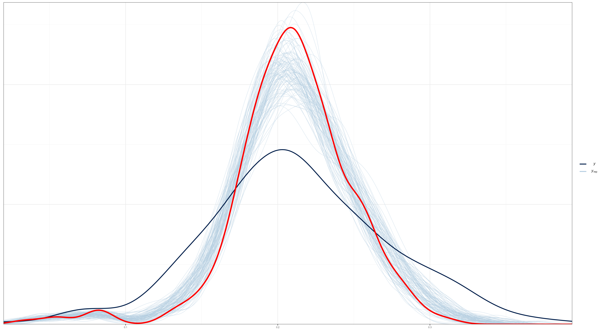

# Modelo de área para la estimación de la Escala de Experiencia de Inseguridad Alimentaria


El índice FIES (Escala de Experiencia de Inseguridad Alimentaria) se define como un sistema de medición para la inseguridad alimentaria a nivel individual y del hogar. La FIES se basa en cuestionarios que preguntan sobre las experiencias de los individuos y hogares en relación con el acceso a alimentos seguros y nutritivos. Estos cuestionarios se utilizan para definir un modelo probabilístico que vincule la medida (desconocida) de la inseguridad alimentaria con las respuestas (observables) a los cuestionarios basados en la experiencia. El modelo más sencillo utilizado para esto es el modelo de Rasch.

Los indicadores definidos son los porcentajes de individuos de la población con edades a partir de 15 años que experimentan niveles de inseguridad alimentaria moderada o grave (IA moderada+grave) y grave (IA grave). Estos indicadores se calculan utilizando una escala numérica que va desde 0 hasta 40, donde 0 indica seguridad alimentaria total y 40 indica inseguridad alimentaria extrema. Los puntajes más altos en la escala indican una mayor gravedad de la inseguridad alimentaria.


## Modelo de Rash 

El modelo de Rasch es un modelo matemático utilizado para el análisis de datos en la medición de habilidades y características de los individuos. Este modelo es ampliamente utilizado en la educación, psicología, medicina y otras áreas de investigación.

El modelo de Rasch se basa en la teoría de respuesta al ítem, que establece que la probabilidad de que un individuo responda correctamente a un ítem en particular depende de la habilidad del individuo y de la dificultad del ítem. El modelo de Rasch supone que la habilidad de un individuo y la dificultad de un ítem se pueden medir en una misma escala de medida, y que esta escala es unidimensional y lineal.

La ecuación del modelo de Rasch es la siguiente:

$$
P_i(X_j=1) = \frac{\exp(a_i -b_j)}{1 + \exp(a_i -b_j)}
$$

donde $P_i(X_j=1)$ es la probabilidad de que el individuo $i$ responda correctamente al ítem $j$, $a_i$ es el nivel de habilidad del individuo $i$, $b_j$ es la dificultad del ítem $j$, y $X_j$ es una variable indicadora que toma el valor de 1 si el individuo $i$ responde correctamente al ítem $j$, y 0 en caso contrario.

El proceso de estimación de los parámetros del modelo de Rasch se lleva a cabo mediante un procedimiento de máxima verosimilitud. Este proceso permite estimar tanto los niveles de habilidad de los individuos como las dificultades de los ítems. En el caso de las encuestas complejas, se utilizan métodos de estimación de la verosimilitud basados en muestras complejas para ajustar los parámetros del modelo. Es importante tener en cuenta el diseño de muestreo y la ponderación de las observaciones al utilizar el modelo de Rasch en encuestas complejas.


## Fuentes de error en la estimación del FIES

1. Error de muestreo: Este error se produce debido a la variabilidad natural en los datos recopilados a partir de una muestra de la población. Cuanto mayor sea el tamaño de la muestra, menor será este error.

2. Error de medición: Este error se produce debido a la variabilidad en las respuestas proporcionadas por los encuestados. El modelo de Rasch utilizado para estimar la inseguridad alimentaria tiene en cuenta este error y proporciona estimaciones precisas.


Debido a que los errores de muestreo y medición se consideran independientes, estos se combinan para obtener el error estándar de la prevalencia mundial de la siguiente forma: 

$$
\sigma^{2}_{total} = (Error de Muestreo)^2 + (Error de Medición)^2
$$

## Modelos de área 

La estimación de áreas pequeñas es un conjunto de técnicas que permiten la estimación de parámetros de interés para dominios donde los estimadores directos no pueden considerarse lo suficientemente confiables debido a que su varianza es demasiado alta para ser liberada. Las encuestas de oficinas estadísticas nacionales suelen planificarse a un nivel más alto, por lo que cuando se requiere información más detallada, el tamaño de la muestra puede no ser lo suficientemente grande como para garantizar la liberación de estimaciones directas y, en algunos casos, es posible que los dominios más pequeños no cuenten con unidades de muestra. Los métodos de estimación de áreas pequeñas aumentan la confiabilidad de la estimación "tomando fuerza prestada" de un conjunto de áreas en un dominio más grande para el cual el estimador directo es confiable. Esto significa que se utiliza información de otras áreas y / o se explota información adicional de diferentes fuentes.

Uno de los modelos más utilizados para la estimación de áreas pequeñas es el modelo de Fay-Herriot. El modelo de Fay-Herriot es un modelo lineal mixto que se utiliza para estimar parámetros de interés para pequeñas áreas en presencia de datos auxiliares. El modelo se utiliza para "prestar fuerza" de áreas más grandes a áreas más pequeñas y, por lo tanto, aumentar la precisión de las estimaciones para áreas pequeñas. 

En el modelo de Fay-Herriot, el parámetro de interés en cada área pequeña se modela como una combinación lineal de un estimador directo de la encuesta y un componente predicho basado en un modelo lineal mixto. El modelo relaciona el parámetro de interés con las variables auxiliares conocidas para cada uno de los dominios que constituyen la partición de la población completa. Se incluye un efecto para tener en cuenta la homogeneidad dentro de cada dominio. 


### Modelo de área de Fay-Herriot

Sea $P_d$ la probabilidad de encontrar un hogar con inseguridad alimentaria  en el $d-$ésimo dominio de la población. Entonces, el estimador directo de $P_d$ se puede escribir como:  

$$
\hat{P}^{DIR}_{d} = P_d + e_d
$$

Ahora bien, $P_d$ se puede modelar de la siguiente manera,  

$$
P_d = \boldsymbol{x}^{T}_{d}\boldsymbol{\beta} + u_d
$$
Luego, reescribiendo $\hat{P}^{DIR}_{d}$ en términos de las dos ecuaciones anteriores tenemos:  

$$
\hat{P}^{DIR}_{d} = \boldsymbol{x}^{T}_{d}\boldsymbol{\beta} + u_d + e_d
$$

Ahora, es posible suponer que $\hat{P}^{DIR}_d \sim N(\boldsymbol{x}^{T}_{d}\boldsymbol \beta, \sigma_u^2 +\sigma_{e_d}^2)$, $\hat{P}^{DIR}_d \mid u_d \sim N(\boldsymbol{x}^{T}_{d}\boldsymbol \beta + u_d,\sigma_{e_d}^2)$ y $u_d \sim N(0, \sigma^2_u)$

Luego, se asumen distribuciones previas para $\boldsymbol{\beta}$ y $\sigma^2_u$

$$
\begin{eqnarray*}
\beta_p & \sim   & N(0, 10000)\\
\sigma^2_u &\sim & IG(0.0001, 0.0001)
\end{eqnarray*}
$$

por tanto, el estimador bayesiano para $P_d$ esta dado como $\tilde{P}_d = E\left(P_d\mid\hat{P}_d^{DIR}\right)$


### Modelo de área de Fay-Herriot con tranformación arcoseno. 


En su concepción más básica, el modelo de **Fay-Herriot** es una combinación lineal de covariables. Sin embargo, el resultado de esta combinación pueden tomar valores que se salen del rango aceptable en el que puede estar una proporción; es decir, en general el estimador de Fay-Herriot $\theta \in R$, mientras que el estimador directo $\theta \in (0,1)$. La transformación arcoseno esta dada por: 

$$
\hat{z}_d = arcsin\left( \sqrt{ \hat{\theta}_d} \right)
$$ donde

$$
Var\left( \hat{z}_d \right) = \frac{\widehat{DEFF}_d}{4\times n_d} = \frac{1}{4\times n_{d,efectivo} }
$$

El modelo de Fay-Herriot  estaría definido de la siguiente forma:

$$
\begin{eqnarray*}
Z_d \mid \mu_d,\sigma^2_d &  \sim  & N(\mu_d, \sigma^2_d)\\
\mu_d & = & \boldsymbol{x}^{T}_{d}\boldsymbol{\beta} + u_d \\
\theta_d & = &  \left(sin(\mu_d)\right)^2
\end{eqnarray*}
$$ donde $u_d \sim N(0 , \sigma^2)$.


Suponga de las distribuciones previas para 
$\boldsymbol{\beta}$ y $\sigma_{u}^{2}$ son dadas por 
$$
\begin{eqnarray*}
\boldsymbol{\beta}	\sim	N\left(0,1000 \right)\\
\sigma_{u}^{2}	\sim	IG\left(0.0001,0.0001\right)
\end{eqnarray*}
$$

### Modelos de área con variable respuesta Beta. 


El modelo beta-logístico fue inicialmente considerado por Jiang y Lahiri (2006b) para un enfoque EBP en uno de sus ejemplos ilustrativos para estimar medias de dominio de población finita. 


El modelo de área beta-logístico estaría dado por las siguientes expresiones 
$$
\begin{eqnarray*}
\hat{p}_{d} \mid P_d & \sim & beta(a_d, b_d)\\
\end{eqnarray*}
$$
La función del enlace es 
$$
\begin{eqnarray*}
logit(P_{d}) \mid \boldsymbol{\beta}, \sigma^2_u  & \sim & N(\boldsymbol{x}_d^T\boldsymbol{\beta},\sigma^2_u)\\
\end{eqnarray*}
$$
Los parámetros $a_d$ y $b_d$ son estimados así: 
$$
\begin{eqnarray*}
a_d &=& P_d \times \phi_d\\
b_d &=& (1 - P_d) \times \phi_d\\
\end{eqnarray*}
$$ donde

$$\phi_d = \frac{n_d}{\widehat{DEFF}_d} -1 = n_{d,efecctivo} -1$$

Las distribuciones previas para $\boldsymbol{\beta}$ y $\sigma^2_u$

$$
\begin{eqnarray*}
\beta_k &\sim& N(0, 10000)\\
\sigma^2_u &\sim& IG(0.0001,0.0001)
\end{eqnarray*}
$$


### Modelos de área con variable respuesta Binomial.


El modelo lineal de Fay-Herriot puede ser reemplazado por un modelo mixto lineal generalizado (GLMM). Esto se puede hacer cuando los datos observados $Y_d$ son inherentemente discretos, como cuando son recuentos (no ponderados) de personas u hogares muestreados con ciertas características. Uno de estos modelos supone una distribución binomial para $Y_d$ con probabilidad de éxito $\theta_d$, y una logística modelo de regresión para $\theta_d$ con errores normales en la escala logit. El modelo resultante es


$$
\begin{eqnarray*}
Y_{d}\mid \theta_{d},n_{d} & \sim & Bin\left(n_{d},\theta_{d}\right)
\end{eqnarray*}
$$
para $d=1,\dots,D$ y 

$$
\begin{eqnarray*}
logit\left(\theta_{d}\right)=\log\left(\frac{\theta_{d}}{1-\theta_{d}}\right) & = & \boldsymbol{x}_{d}^{T}\boldsymbol{\beta}+u_{d}
\end{eqnarray*}
$$
donde $u_{d}\sim N\left(0,\sigma_{u}^{2}\right)$ y $n_{d}$ es el
tamaño de la muestra para el área $d$.

El modelo anterior se puede aplicar fácilmente a recuentos de muestras no ponderadas $Y_d$, pero esto ignora cualquier aspecto complejo del diseño de la encuesta. En muestras complejas donde las $Y_d$ son estimaciones ponderadas, surgen dos problemas. En primer lugar, los posibles valores de
el $Y_d$ no serán los números enteros $0, 1, \dots , n_d$ para cualquier definición directa de tamaño de muestra $n_d$. En su lugar, $Y_d$ tomará un valor de un conjunto finito de números desigualmente espaciados determinados por las ponderaciones de la encuesta que se aplican a los casos de muestra en el dominio  $d$. En segundo lugar, la varianza muestral de $Y_d$
implícito en la distribución Binomial, es decir,  $n_d \times \theta_d (1-\theta_d)$, será incorrecto. Abordamos estos dos problemas al definir un **tamaño de muestra efectivo** $\tilde{n}_d$, y un **número de muestra efectivo de éxitos** $\tilde{Y_d}$ determinó mantener: (i) la estimación directa  $\hat{\theta}_i$, de la pobreza y (ii) una estimación de la varianza de muestreo correspondiente,$\widehat{Var}(\hat{\theta}_d)$. 


Es posible suponer que 
$$
\begin{eqnarray*}
\tilde{n}_{d} & \sim & \frac{\check{\theta}_{d}\left(1-\check{\theta}_{d}\right)}{\widehat{Var}\left(\hat{\theta}_{d}\right)}
\end{eqnarray*}
$$
donde $\check{\theta}_{d}$ es una preliminar perdicción basada en el modelo para la proporción poblacional $\theta_d$ y $\widehat{Var}\left(\hat{\theta}_{d}\right)$ depende de$\check{\theta}_{d}$ a través de una función de varianza generalizada ajustada (FGV). Note que $\tilde{Y}_{d}=\tilde{n}_{d}\times\hat{\theta}_{d}$. 

Suponga de las distribuciones previas para 
$\boldsymbol{\beta}$ y $\sigma_{u}^{2}$ son dadas por 
$$
\begin{eqnarray*}
\boldsymbol{\beta}	\sim	N\left(0,10000\right)\\
\sigma_{u}^{2}	\sim	IG\left(0.0001,0.0001\right)
\end{eqnarray*}
$$

# Estimación de la Escala de Experiencia de Inseguridad Alimentaria

Luego de recopilar la información proporcionada por FAO, se procedió al ajuste de los 4 modelos anteriores utilizando un conjunto de covariables detalladas a continuación:

- region                                      
- accesibilidad_hospitales                    
- luces_nocturnas                             
- prop_b50median_afc_2020                     
- prop_fonasa_a_2019                          
- prop_fonasa_c_2019                          
- tasa_victimizacion_2019                     
- tasa_mort_infantil_2017                     
- log_ing_municipales_permanentes_pc_2018     
- prop_am_bajo_peso_2018                      
- prop_am_normal_2018                         
- prop_am_obeso_2018                          
- prop_obeso_sobrepeso_menores_2018           
- prop_riesgo_desnutricion_menores_2018       
- prop_obeso_sobrepeso_menores_2018_w         
- prop_isapre_2019                            
- prop_red_publica_2017                       
- prop_camion_aljibe_2017                     
- prop_rio_vertiente_estero_canal_2017        
- prop_deficit_habitacional_cuantitativo_2017 
- indice_de_vejez_2020                        
 

Posteriormente, se llevó a cabo un análisis de chequeo predictivo con el fin de seleccionar el modelo más adecuado. Cabe destacar que se realizaron 6500 iteraciones, descartando las primeras 5000 iteraciones como parte del proceso de quemado. Al evaluar el criterio de Rhat, se pudo constatar que todas las cadenas del modelo convergieron satisfactoriamente.  


### Resultado para el modelo de área de Fay-Herriot. {-}


### Resultado para el Modelo de área de Fay-Herriot con tranformación arcoseno. {-}



### Resultado para el modelo de área con variable respuesta Beta. {-}


### Resultado para el modelo de área con variable respuesta Binomial. {-}


De acuerdo con los resultados obtenidos, se determinó que el modelo de área con variable respuesta binomial presenta un mejor ajuste en comparación con los otros modelos considerados. 


A partir de este modelo, se procedió a realizar el proceso de benchmarking, el cual se describe a continuación:

## Proceso de Benchmark 

1. Leer estimaciones del modelo


```r
estimacionesPre <- readRDS("Data/estimacionesPre.rds") %>%
  transmute(dam2 = haven::as_factor(comuna, levels = "values"),
            dam2 = str_pad(width = 5, dam2, pad = "0"),
            dam = str_sub(dam2,1,2),
            theta_pred,thetaSyn)
```


2. Del censo extraer el total de personas por Región 


```r
total_hh <- readRDS(file = "Data/Total_Hogares.rds")
N_hh <- total_hh %>% group_by(dam = str_sub(dam2, 1, 2)) %>%
  mutate(dam_hh = sum(NN_Hogar)) 

tba(N_hh %>% data.frame() %>% slice(1:10))
```

<table class="table table-striped lightable-classic" style="width: auto !important; margin-left: auto; margin-right: auto; font-family: Arial Narrow; width: auto !important; margin-left: auto; margin-right: auto;">
 <thead>
  <tr>
   <th style="text-align:left;"> dam2 </th>
   <th style="text-align:right;"> NN_Hogar </th>
   <th style="text-align:left;"> dam </th>
   <th style="text-align:right;"> dam_hh </th>
  </tr>
 </thead>
<tbody>
  <tr>
   <td style="text-align:left;"> 01101 </td>
   <td style="text-align:right;"> 60226 </td>
   <td style="text-align:left;"> 01 </td>
   <td style="text-align:right;"> 97693 </td>
  </tr>
  <tr>
   <td style="text-align:left;"> 01107 </td>
   <td style="text-align:right;"> 29699 </td>
   <td style="text-align:left;"> 01 </td>
   <td style="text-align:right;"> 97693 </td>
  </tr>
  <tr>
   <td style="text-align:left;"> 01401 </td>
   <td style="text-align:right;"> 4188 </td>
   <td style="text-align:left;"> 01 </td>
   <td style="text-align:right;"> 97693 </td>
  </tr>
  <tr>
   <td style="text-align:left;"> 01402 </td>
   <td style="text-align:right;"> 484 </td>
   <td style="text-align:left;"> 01 </td>
   <td style="text-align:right;"> 97693 </td>
  </tr>
  <tr>
   <td style="text-align:left;"> 01403 </td>
   <td style="text-align:right;"> 488 </td>
   <td style="text-align:left;"> 01 </td>
   <td style="text-align:right;"> 97693 </td>
  </tr>
  <tr>
   <td style="text-align:left;"> 01404 </td>
   <td style="text-align:right;"> 965 </td>
   <td style="text-align:left;"> 01 </td>
   <td style="text-align:right;"> 97693 </td>
  </tr>
  <tr>
   <td style="text-align:left;"> 01405 </td>
   <td style="text-align:right;"> 1643 </td>
   <td style="text-align:left;"> 01 </td>
   <td style="text-align:right;"> 97693 </td>
  </tr>
  <tr>
   <td style="text-align:left;"> 02101 </td>
   <td style="text-align:right;"> 105863 </td>
   <td style="text-align:left;"> 02 </td>
   <td style="text-align:right;"> 174314 </td>
  </tr>
  <tr>
   <td style="text-align:left;"> 02102 </td>
   <td style="text-align:right;"> 3430 </td>
   <td style="text-align:left;"> 02 </td>
   <td style="text-align:right;"> 174314 </td>
  </tr>
  <tr>
   <td style="text-align:left;"> 02103 </td>
   <td style="text-align:right;"> 358 </td>
   <td style="text-align:left;"> 02 </td>
   <td style="text-align:right;"> 174314 </td>
  </tr>
</tbody>
</table>

3. Obtener las estimaciones directa por region o el nivel de agregación en el cual la encuesta es representativa. 


```r
directoDam <- readRDS("Data/FIES_region.rds") %>% 
  dplyr::select( dam, ModerateSevere = FIES)
```


4. Realizar el consolidando información obtenida en *1* y *2*.  


```r
temp <- estimacionesPre %>%
  inner_join(N_hh ) %>% 
  inner_join(directoDam )
```

5. Con la información organizada realizar el calculo de los pesos para el Benchmark


```r
R_dam2 <- temp %>% group_by(dam) %>%
  summarise(R_dam_RB = unique(ModerateSevere) / sum((NN_Hogar  / dam_hh) * theta_pred)) %>%
  left_join(directoDam, by = "dam")
```

calculando los pesos para cada comuna


```r
pesos <- temp %>% 
  mutate(W_i = NN_Hogar / dam_hh) %>% 
  select(dam2, W_i)
```


6. Realizar la estimación FH  Benchmark 


```r
estimacionesBench <- estimacionesPre %>%
  left_join(R_dam2, by = c("dam")) %>%
  mutate(theta_pred_RBench = R_dam_RB * theta_pred) %>%
  left_join(pesos) %>% 
   select(dam, dam2, W_i, theta_pred, thetaSyn, theta_pred_RBench)  
```

6. Validación: Estimación FH con Benchmark


```r
estimacionesBench %>% group_by(dam) %>%
  summarise(theta_reg_RB = sum(W_i * theta_pred_RBench)) %>%
  left_join(directoDam, by = "dam") %>% 
  data.frame()
```

## Validación de los resultados. 

La visualización resultante del siguiente código muestra puntos de diferentes formas y colores para representar los diferentes métodos de estimación, y dos líneas punteadas que representan los intervalos de confianza superior e inferior para los valores observados en la variable `theta_dir`.


```r
IC_dir <- readRDS("Data/FIES_region.rds") %>%
  dplyr::select(dam, FIES, var_hat) %>%
  transmute(dam,
            Ls = FIES + 1.96 * sqrt(var_hat),
            Li = FIES - 1.96 * sqrt(var_hat))
temp <- estimacionesBench %>% left_join( estimacionesPre ) %>% 
  group_by(dam) %>% 
  summarise(
            "FIES Modelo" = sum(W_i * theta_pred),
            "FIES Modelo Syn" = sum(W_i * thetaSyn),
            "FIES Modelo Bench" = sum(W_i * theta_pred_RBench)
  ) %>%   
  left_join(directoDam, by = "dam")  %>% 
  mutate(id = 1:n())

temp %<>% gather(key = "Metodo",value = "Estimacion",
                 -id, -dam)
temp <- inner_join(temp,IC_dir)
p_temp <- ggplot(data = temp, aes(x = id, y = Estimacion, shape = Metodo)) +
  geom_point(aes(color = Metodo), size = 2) +
  geom_line(aes(y = Li), linetype  = 2) +
  geom_line(aes(y = Ls),  linetype  = 2) +
  theme_bw(10) + 
  scale_x_continuous(breaks = temp$id,
                     labels =  temp$dam) +
  labs(y = "", x = "")
```


<!-- -->

## Mapa con la estimación de la Escala de Experiencia de Inseguridad Alimentaria 


### Tabla con las estimaciones por comuna. 

<table class="table table-striped lightable-classic" style="width: auto !important; margin-left: auto; margin-right: auto; font-family: Arial Narrow; width: auto !important; margin-left: auto; margin-right: auto;">
 <thead>
  <tr>
   <th style="text-align:left;"> Region </th>
   <th style="text-align:left;"> Comuna </th>
   <th style="text-align:right;"> FIES </th>
   <th style="text-align:right;"> FIES_ee </th>
   <th style="text-align:right;"> FIES_cv(%) </th>
  </tr>
 </thead>
<tbody>
  <tr>
   <td style="text-align:left;"> 05 </td>
   <td style="text-align:left;"> 05504 </td>
   <td style="text-align:right;"> 0.0886 </td>
   <td style="text-align:right;"> 0.0258 </td>
   <td style="text-align:right;"> 29.170 </td>
  </tr>
  <tr>
   <td style="text-align:left;"> 15 </td>
   <td style="text-align:left;"> 15102 </td>
   <td style="text-align:right;"> 0.1650 </td>
   <td style="text-align:right;"> 0.0433 </td>
   <td style="text-align:right;"> 26.269 </td>
  </tr>
  <tr>
   <td style="text-align:left;"> 05 </td>
   <td style="text-align:left;"> 05506 </td>
   <td style="text-align:right;"> 0.1533 </td>
   <td style="text-align:right;"> 0.0323 </td>
   <td style="text-align:right;"> 21.047 </td>
  </tr>
  <tr>
   <td style="text-align:left;"> 13 </td>
   <td style="text-align:left;"> 13132 </td>
   <td style="text-align:right;"> 0.0501 </td>
   <td style="text-align:right;"> 0.0102 </td>
   <td style="text-align:right;"> 20.460 </td>
  </tr>
  <tr>
   <td style="text-align:left;"> 12 </td>
   <td style="text-align:left;"> 12301 </td>
   <td style="text-align:right;"> 0.1583 </td>
   <td style="text-align:right;"> 0.0306 </td>
   <td style="text-align:right;"> 19.317 </td>
  </tr>
  <tr>
   <td style="text-align:left;"> 13 </td>
   <td style="text-align:left;"> 13115 </td>
   <td style="text-align:right;"> 0.0848 </td>
   <td style="text-align:right;"> 0.0151 </td>
   <td style="text-align:right;"> 17.745 </td>
  </tr>
  <tr>
   <td style="text-align:left;"> 05 </td>
   <td style="text-align:left;"> 05303 </td>
   <td style="text-align:right;"> 0.1901 </td>
   <td style="text-align:right;"> 0.0331 </td>
   <td style="text-align:right;"> 17.430 </td>
  </tr>
  <tr>
   <td style="text-align:left;"> 13 </td>
   <td style="text-align:left;"> 13113 </td>
   <td style="text-align:right;"> 0.0879 </td>
   <td style="text-align:right;"> 0.0143 </td>
   <td style="text-align:right;"> 16.228 </td>
  </tr>
  <tr>
   <td style="text-align:left;"> 08 </td>
   <td style="text-align:left;"> 08314 </td>
   <td style="text-align:right;"> 0.3274 </td>
   <td style="text-align:right;"> 0.0523 </td>
   <td style="text-align:right;"> 15.964 </td>
  </tr>
  <tr>
   <td style="text-align:left;"> 13 </td>
   <td style="text-align:left;"> 13203 </td>
   <td style="text-align:right;"> 0.1551 </td>
   <td style="text-align:right;"> 0.0245 </td>
   <td style="text-align:right;"> 15.830 </td>
  </tr>
  <tr>
   <td style="text-align:left;"> 05 </td>
   <td style="text-align:left;"> 05405 </td>
   <td style="text-align:right;"> 0.1419 </td>
   <td style="text-align:right;"> 0.0222 </td>
   <td style="text-align:right;"> 15.618 </td>
  </tr>
  <tr>
   <td style="text-align:left;"> 02 </td>
   <td style="text-align:left;"> 02104 </td>
   <td style="text-align:right;"> 0.2020 </td>
   <td style="text-align:right;"> 0.0315 </td>
   <td style="text-align:right;"> 15.570 </td>
  </tr>
  <tr>
   <td style="text-align:left;"> 06 </td>
   <td style="text-align:left;"> 06205 </td>
   <td style="text-align:right;"> 0.1462 </td>
   <td style="text-align:right;"> 0.0226 </td>
   <td style="text-align:right;"> 15.468 </td>
  </tr>
  <tr>
   <td style="text-align:left;"> 16 </td>
   <td style="text-align:left;"> 16202 </td>
   <td style="text-align:right;"> 0.1940 </td>
   <td style="text-align:right;"> 0.0300 </td>
   <td style="text-align:right;"> 15.458 </td>
  </tr>
  <tr>
   <td style="text-align:left;"> 13 </td>
   <td style="text-align:left;"> 13123 </td>
   <td style="text-align:right;"> 0.0653 </td>
   <td style="text-align:right;"> 0.0099 </td>
   <td style="text-align:right;"> 15.097 </td>
  </tr>
  <tr>
   <td style="text-align:left;"> 05 </td>
   <td style="text-align:left;"> 05402 </td>
   <td style="text-align:right;"> 0.1624 </td>
   <td style="text-align:right;"> 0.0244 </td>
   <td style="text-align:right;"> 15.012 </td>
  </tr>
  <tr>
   <td style="text-align:left;"> 02 </td>
   <td style="text-align:left;"> 02302 </td>
   <td style="text-align:right;"> 0.1465 </td>
   <td style="text-align:right;"> 0.0218 </td>
   <td style="text-align:right;"> 14.877 </td>
  </tr>
  <tr>
   <td style="text-align:left;"> 16 </td>
   <td style="text-align:left;"> 16207 </td>
   <td style="text-align:right;"> 0.1922 </td>
   <td style="text-align:right;"> 0.0286 </td>
   <td style="text-align:right;"> 14.861 </td>
  </tr>
  <tr>
   <td style="text-align:left;"> 01 </td>
   <td style="text-align:left;"> 01405 </td>
   <td style="text-align:right;"> 0.2066 </td>
   <td style="text-align:right;"> 0.0304 </td>
   <td style="text-align:right;"> 14.711 </td>
  </tr>
  <tr>
   <td style="text-align:left;"> 07 </td>
   <td style="text-align:left;"> 07103 </td>
   <td style="text-align:right;"> 0.1753 </td>
   <td style="text-align:right;"> 0.0256 </td>
   <td style="text-align:right;"> 14.624 </td>
  </tr>
  <tr>
   <td style="text-align:left;"> 05 </td>
   <td style="text-align:left;"> 05304 </td>
   <td style="text-align:right;"> 0.1729 </td>
   <td style="text-align:right;"> 0.0250 </td>
   <td style="text-align:right;"> 14.466 </td>
  </tr>
  <tr>
   <td style="text-align:left;"> 15 </td>
   <td style="text-align:left;"> 15201 </td>
   <td style="text-align:right;"> 0.2635 </td>
   <td style="text-align:right;"> 0.0379 </td>
   <td style="text-align:right;"> 14.366 </td>
  </tr>
  <tr>
   <td style="text-align:left;"> 05 </td>
   <td style="text-align:left;"> 05602 </td>
   <td style="text-align:right;"> 0.1600 </td>
   <td style="text-align:right;"> 0.0229 </td>
   <td style="text-align:right;"> 14.335 </td>
  </tr>
  <tr>
   <td style="text-align:left;"> 07 </td>
   <td style="text-align:left;"> 07107 </td>
   <td style="text-align:right;"> 0.1701 </td>
   <td style="text-align:right;"> 0.0244 </td>
   <td style="text-align:right;"> 14.335 </td>
  </tr>
  <tr>
   <td style="text-align:left;"> 06 </td>
   <td style="text-align:left;"> 06309 </td>
   <td style="text-align:right;"> 0.2017 </td>
   <td style="text-align:right;"> 0.0289 </td>
   <td style="text-align:right;"> 14.335 </td>
  </tr>
  <tr>
   <td style="text-align:left;"> 13 </td>
   <td style="text-align:left;"> 13504 </td>
   <td style="text-align:right;"> 0.1811 </td>
   <td style="text-align:right;"> 0.0259 </td>
   <td style="text-align:right;"> 14.317 </td>
  </tr>
  <tr>
   <td style="text-align:left;"> 06 </td>
   <td style="text-align:left;"> 06202 </td>
   <td style="text-align:right;"> 0.1530 </td>
   <td style="text-align:right;"> 0.0219 </td>
   <td style="text-align:right;"> 14.306 </td>
  </tr>
  <tr>
   <td style="text-align:left;"> 04 </td>
   <td style="text-align:left;"> 04304 </td>
   <td style="text-align:right;"> 0.1864 </td>
   <td style="text-align:right;"> 0.0265 </td>
   <td style="text-align:right;"> 14.221 </td>
  </tr>
  <tr>
   <td style="text-align:left;"> 01 </td>
   <td style="text-align:left;"> 01402 </td>
   <td style="text-align:right;"> 0.2816 </td>
   <td style="text-align:right;"> 0.0399 </td>
   <td style="text-align:right;"> 14.173 </td>
  </tr>
  <tr>
   <td style="text-align:left;"> 05 </td>
   <td style="text-align:left;"> 05103 </td>
   <td style="text-align:right;"> 0.1371 </td>
   <td style="text-align:right;"> 0.0193 </td>
   <td style="text-align:right;"> 14.086 </td>
  </tr>
  <tr>
   <td style="text-align:left;"> 04 </td>
   <td style="text-align:left;"> 04203 </td>
   <td style="text-align:right;"> 0.1882 </td>
   <td style="text-align:right;"> 0.0264 </td>
   <td style="text-align:right;"> 14.038 </td>
  </tr>
  <tr>
   <td style="text-align:left;"> 02 </td>
   <td style="text-align:left;"> 02203 </td>
   <td style="text-align:right;"> 0.2328 </td>
   <td style="text-align:right;"> 0.0325 </td>
   <td style="text-align:right;"> 13.952 </td>
  </tr>
  <tr>
   <td style="text-align:left;"> 05 </td>
   <td style="text-align:left;"> 05404 </td>
   <td style="text-align:right;"> 0.1806 </td>
   <td style="text-align:right;"> 0.0251 </td>
   <td style="text-align:right;"> 13.912 </td>
  </tr>
  <tr>
   <td style="text-align:left;"> 07 </td>
   <td style="text-align:left;"> 07302 </td>
   <td style="text-align:right;"> 0.1707 </td>
   <td style="text-align:right;"> 0.0237 </td>
   <td style="text-align:right;"> 13.895 </td>
  </tr>
  <tr>
   <td style="text-align:left;"> 16 </td>
   <td style="text-align:left;"> 16205 </td>
   <td style="text-align:right;"> 0.2179 </td>
   <td style="text-align:right;"> 0.0302 </td>
   <td style="text-align:right;"> 13.874 </td>
  </tr>
  <tr>
   <td style="text-align:left;"> 13 </td>
   <td style="text-align:left;"> 13107 </td>
   <td style="text-align:right;"> 0.1631 </td>
   <td style="text-align:right;"> 0.0226 </td>
   <td style="text-align:right;"> 13.851 </td>
  </tr>
  <tr>
   <td style="text-align:left;"> 06 </td>
   <td style="text-align:left;"> 06108 </td>
   <td style="text-align:right;"> 0.1441 </td>
   <td style="text-align:right;"> 0.0198 </td>
   <td style="text-align:right;"> 13.745 </td>
  </tr>
  <tr>
   <td style="text-align:left;"> 16 </td>
   <td style="text-align:left;"> 16304 </td>
   <td style="text-align:right;"> 0.2522 </td>
   <td style="text-align:right;"> 0.0345 </td>
   <td style="text-align:right;"> 13.700 </td>
  </tr>
  <tr>
   <td style="text-align:left;"> 13 </td>
   <td style="text-align:left;"> 13502 </td>
   <td style="text-align:right;"> 0.1746 </td>
   <td style="text-align:right;"> 0.0239 </td>
   <td style="text-align:right;"> 13.679 </td>
  </tr>
  <tr>
   <td style="text-align:left;"> 13 </td>
   <td style="text-align:left;"> 13114 </td>
   <td style="text-align:right;"> 0.0603 </td>
   <td style="text-align:right;"> 0.0082 </td>
   <td style="text-align:right;"> 13.616 </td>
  </tr>
  <tr>
   <td style="text-align:left;"> 06 </td>
   <td style="text-align:left;"> 06306 </td>
   <td style="text-align:right;"> 0.1775 </td>
   <td style="text-align:right;"> 0.0242 </td>
   <td style="text-align:right;"> 13.607 </td>
  </tr>
  <tr>
   <td style="text-align:left;"> 02 </td>
   <td style="text-align:left;"> 02102 </td>
   <td style="text-align:right;"> 0.2273 </td>
   <td style="text-align:right;"> 0.0308 </td>
   <td style="text-align:right;"> 13.567 </td>
  </tr>
  <tr>
   <td style="text-align:left;"> 07 </td>
   <td style="text-align:left;"> 07306 </td>
   <td style="text-align:right;"> 0.2020 </td>
   <td style="text-align:right;"> 0.0274 </td>
   <td style="text-align:right;"> 13.565 </td>
  </tr>
  <tr>
   <td style="text-align:left;"> 05 </td>
   <td style="text-align:left;"> 05503 </td>
   <td style="text-align:right;"> 0.2078 </td>
   <td style="text-align:right;"> 0.0280 </td>
   <td style="text-align:right;"> 13.469 </td>
  </tr>
  <tr>
   <td style="text-align:left;"> 03 </td>
   <td style="text-align:left;"> 03302 </td>
   <td style="text-align:right;"> 0.2564 </td>
   <td style="text-align:right;"> 0.0345 </td>
   <td style="text-align:right;"> 13.449 </td>
  </tr>
  <tr>
   <td style="text-align:left;"> 04 </td>
   <td style="text-align:left;"> 04201 </td>
   <td style="text-align:right;"> 0.1781 </td>
   <td style="text-align:right;"> 0.0239 </td>
   <td style="text-align:right;"> 13.433 </td>
  </tr>
  <tr>
   <td style="text-align:left;"> 13 </td>
   <td style="text-align:left;"> 13402 </td>
   <td style="text-align:right;"> 0.1747 </td>
   <td style="text-align:right;"> 0.0234 </td>
   <td style="text-align:right;"> 13.409 </td>
  </tr>
  <tr>
   <td style="text-align:left;"> 05 </td>
   <td style="text-align:left;"> 05102 </td>
   <td style="text-align:right;"> 0.1767 </td>
   <td style="text-align:right;"> 0.0235 </td>
   <td style="text-align:right;"> 13.314 </td>
  </tr>
  <tr>
   <td style="text-align:left;"> 08 </td>
   <td style="text-align:left;"> 08104 </td>
   <td style="text-align:right;"> 0.2192 </td>
   <td style="text-align:right;"> 0.0292 </td>
   <td style="text-align:right;"> 13.305 </td>
  </tr>
  <tr>
   <td style="text-align:left;"> 07 </td>
   <td style="text-align:left;"> 07309 </td>
   <td style="text-align:right;"> 0.1797 </td>
   <td style="text-align:right;"> 0.0239 </td>
   <td style="text-align:right;"> 13.293 </td>
  </tr>
  <tr>
   <td style="text-align:left;"> 13 </td>
   <td style="text-align:left;"> 13503 </td>
   <td style="text-align:right;"> 0.2121 </td>
   <td style="text-align:right;"> 0.0281 </td>
   <td style="text-align:right;"> 13.260 </td>
  </tr>
  <tr>
   <td style="text-align:left;"> 08 </td>
   <td style="text-align:left;"> 08207 </td>
   <td style="text-align:right;"> 0.2781 </td>
   <td style="text-align:right;"> 0.0368 </td>
   <td style="text-align:right;"> 13.231 </td>
  </tr>
  <tr>
   <td style="text-align:left;"> 04 </td>
   <td style="text-align:left;"> 04104 </td>
   <td style="text-align:right;"> 0.1925 </td>
   <td style="text-align:right;"> 0.0253 </td>
   <td style="text-align:right;"> 13.166 </td>
  </tr>
  <tr>
   <td style="text-align:left;"> 09 </td>
   <td style="text-align:left;"> 09121 </td>
   <td style="text-align:right;"> 0.2493 </td>
   <td style="text-align:right;"> 0.0326 </td>
   <td style="text-align:right;"> 13.081 </td>
  </tr>
  <tr>
   <td style="text-align:left;"> 11 </td>
   <td style="text-align:left;"> 11401 </td>
   <td style="text-align:right;"> 0.1902 </td>
   <td style="text-align:right;"> 0.0248 </td>
   <td style="text-align:right;"> 13.026 </td>
  </tr>
  <tr>
   <td style="text-align:left;"> 06 </td>
   <td style="text-align:left;"> 06105 </td>
   <td style="text-align:right;"> 0.1804 </td>
   <td style="text-align:right;"> 0.0235 </td>
   <td style="text-align:right;"> 13.004 </td>
  </tr>
  <tr>
   <td style="text-align:left;"> 08 </td>
   <td style="text-align:left;"> 08204 </td>
   <td style="text-align:right;"> 0.2095 </td>
   <td style="text-align:right;"> 0.0272 </td>
   <td style="text-align:right;"> 12.961 </td>
  </tr>
  <tr>
   <td style="text-align:left;"> 02 </td>
   <td style="text-align:left;"> 02103 </td>
   <td style="text-align:right;"> 0.2408 </td>
   <td style="text-align:right;"> 0.0312 </td>
   <td style="text-align:right;"> 12.939 </td>
  </tr>
  <tr>
   <td style="text-align:left;"> 13 </td>
   <td style="text-align:left;"> 13601 </td>
   <td style="text-align:right;"> 0.1818 </td>
   <td style="text-align:right;"> 0.0234 </td>
   <td style="text-align:right;"> 12.884 </td>
  </tr>
  <tr>
   <td style="text-align:left;"> 06 </td>
   <td style="text-align:left;"> 06114 </td>
   <td style="text-align:right;"> 0.2007 </td>
   <td style="text-align:right;"> 0.0258 </td>
   <td style="text-align:right;"> 12.853 </td>
  </tr>
  <tr>
   <td style="text-align:left;"> 13 </td>
   <td style="text-align:left;"> 13120 </td>
   <td style="text-align:right;"> 0.0834 </td>
   <td style="text-align:right;"> 0.0107 </td>
   <td style="text-align:right;"> 12.797 </td>
  </tr>
  <tr>
   <td style="text-align:left;"> 03 </td>
   <td style="text-align:left;"> 03304 </td>
   <td style="text-align:right;"> 0.1555 </td>
   <td style="text-align:right;"> 0.0198 </td>
   <td style="text-align:right;"> 12.764 </td>
  </tr>
  <tr>
   <td style="text-align:left;"> 13 </td>
   <td style="text-align:left;"> 13130 </td>
   <td style="text-align:right;"> 0.1250 </td>
   <td style="text-align:right;"> 0.0159 </td>
   <td style="text-align:right;"> 12.760 </td>
  </tr>
  <tr>
   <td style="text-align:left;"> 05 </td>
   <td style="text-align:left;"> 05703 </td>
   <td style="text-align:right;"> 0.1880 </td>
   <td style="text-align:right;"> 0.0239 </td>
   <td style="text-align:right;"> 12.721 </td>
  </tr>
  <tr>
   <td style="text-align:left;"> 02 </td>
   <td style="text-align:left;"> 02301 </td>
   <td style="text-align:right;"> 0.2380 </td>
   <td style="text-align:right;"> 0.0302 </td>
   <td style="text-align:right;"> 12.712 </td>
  </tr>
  <tr>
   <td style="text-align:left;"> 08 </td>
   <td style="text-align:left;"> 08306 </td>
   <td style="text-align:right;"> 0.1919 </td>
   <td style="text-align:right;"> 0.0243 </td>
   <td style="text-align:right;"> 12.680 </td>
  </tr>
  <tr>
   <td style="text-align:left;"> 12 </td>
   <td style="text-align:left;"> 12401 </td>
   <td style="text-align:right;"> 0.1846 </td>
   <td style="text-align:right;"> 0.0233 </td>
   <td style="text-align:right;"> 12.624 </td>
  </tr>
  <tr>
   <td style="text-align:left;"> 06 </td>
   <td style="text-align:left;"> 06112 </td>
   <td style="text-align:right;"> 0.1724 </td>
   <td style="text-align:right;"> 0.0217 </td>
   <td style="text-align:right;"> 12.599 </td>
  </tr>
  <tr>
   <td style="text-align:left;"> 01 </td>
   <td style="text-align:left;"> 01404 </td>
   <td style="text-align:right;"> 0.2458 </td>
   <td style="text-align:right;"> 0.0308 </td>
   <td style="text-align:right;"> 12.549 </td>
  </tr>
  <tr>
   <td style="text-align:left;"> 13 </td>
   <td style="text-align:left;"> 13603 </td>
   <td style="text-align:right;"> 0.1881 </td>
   <td style="text-align:right;"> 0.0236 </td>
   <td style="text-align:right;"> 12.547 </td>
  </tr>
  <tr>
   <td style="text-align:left;"> 13 </td>
   <td style="text-align:left;"> 13501 </td>
   <td style="text-align:right;"> 0.1917 </td>
   <td style="text-align:right;"> 0.0240 </td>
   <td style="text-align:right;"> 12.537 </td>
  </tr>
  <tr>
   <td style="text-align:left;"> 13 </td>
   <td style="text-align:left;"> 13602 </td>
   <td style="text-align:right;"> 0.2141 </td>
   <td style="text-align:right;"> 0.0267 </td>
   <td style="text-align:right;"> 12.492 </td>
  </tr>
  <tr>
   <td style="text-align:left;"> 09 </td>
   <td style="text-align:left;"> 09113 </td>
   <td style="text-align:right;"> 0.2398 </td>
   <td style="text-align:right;"> 0.0299 </td>
   <td style="text-align:right;"> 12.457 </td>
  </tr>
  <tr>
   <td style="text-align:left;"> 06 </td>
   <td style="text-align:left;"> 06302 </td>
   <td style="text-align:right;"> 0.2153 </td>
   <td style="text-align:right;"> 0.0268 </td>
   <td style="text-align:right;"> 12.439 </td>
  </tr>
  <tr>
   <td style="text-align:left;"> 13 </td>
   <td style="text-align:left;"> 13118 </td>
   <td style="text-align:right;"> 0.1595 </td>
   <td style="text-align:right;"> 0.0197 </td>
   <td style="text-align:right;"> 12.364 </td>
  </tr>
  <tr>
   <td style="text-align:left;"> 09 </td>
   <td style="text-align:left;"> 09210 </td>
   <td style="text-align:right;"> 0.2443 </td>
   <td style="text-align:right;"> 0.0301 </td>
   <td style="text-align:right;"> 12.330 </td>
  </tr>
  <tr>
   <td style="text-align:left;"> 05 </td>
   <td style="text-align:left;"> 05802 </td>
   <td style="text-align:right;"> 0.1931 </td>
   <td style="text-align:right;"> 0.0238 </td>
   <td style="text-align:right;"> 12.313 </td>
  </tr>
  <tr>
   <td style="text-align:left;"> 09 </td>
   <td style="text-align:left;"> 09202 </td>
   <td style="text-align:right;"> 0.2252 </td>
   <td style="text-align:right;"> 0.0276 </td>
   <td style="text-align:right;"> 12.275 </td>
  </tr>
  <tr>
   <td style="text-align:left;"> 08 </td>
   <td style="text-align:left;"> 08202 </td>
   <td style="text-align:right;"> 0.1990 </td>
   <td style="text-align:right;"> 0.0244 </td>
   <td style="text-align:right;"> 12.267 </td>
  </tr>
  <tr>
   <td style="text-align:left;"> 13 </td>
   <td style="text-align:left;"> 13302 </td>
   <td style="text-align:right;"> 0.2306 </td>
   <td style="text-align:right;"> 0.0282 </td>
   <td style="text-align:right;"> 12.228 </td>
  </tr>
  <tr>
   <td style="text-align:left;"> 05 </td>
   <td style="text-align:left;"> 05401 </td>
   <td style="text-align:right;"> 0.2106 </td>
   <td style="text-align:right;"> 0.0256 </td>
   <td style="text-align:right;"> 12.175 </td>
  </tr>
  <tr>
   <td style="text-align:left;"> 13 </td>
   <td style="text-align:left;"> 13301 </td>
   <td style="text-align:right;"> 0.1965 </td>
   <td style="text-align:right;"> 0.0239 </td>
   <td style="text-align:right;"> 12.157 </td>
  </tr>
  <tr>
   <td style="text-align:left;"> 06 </td>
   <td style="text-align:left;"> 06104 </td>
   <td style="text-align:right;"> 0.2230 </td>
   <td style="text-align:right;"> 0.0271 </td>
   <td style="text-align:right;"> 12.132 </td>
  </tr>
  <tr>
   <td style="text-align:left;"> 07 </td>
   <td style="text-align:left;"> 07108 </td>
   <td style="text-align:right;"> 0.2034 </td>
   <td style="text-align:right;"> 0.0246 </td>
   <td style="text-align:right;"> 12.113 </td>
  </tr>
  <tr>
   <td style="text-align:left;"> 16 </td>
   <td style="text-align:left;"> 16303 </td>
   <td style="text-align:right;"> 0.2358 </td>
   <td style="text-align:right;"> 0.0286 </td>
   <td style="text-align:right;"> 12.109 </td>
  </tr>
  <tr>
   <td style="text-align:left;"> 05 </td>
   <td style="text-align:left;"> 05604 </td>
   <td style="text-align:right;"> 0.2183 </td>
   <td style="text-align:right;"> 0.0264 </td>
   <td style="text-align:right;"> 12.088 </td>
  </tr>
  <tr>
   <td style="text-align:left;"> 07 </td>
   <td style="text-align:left;"> 07407 </td>
   <td style="text-align:right;"> 0.1973 </td>
   <td style="text-align:right;"> 0.0238 </td>
   <td style="text-align:right;"> 12.059 </td>
  </tr>
  <tr>
   <td style="text-align:left;"> 13 </td>
   <td style="text-align:left;"> 13109 </td>
   <td style="text-align:right;"> 0.1780 </td>
   <td style="text-align:right;"> 0.0215 </td>
   <td style="text-align:right;"> 12.049 </td>
  </tr>
  <tr>
   <td style="text-align:left;"> 07 </td>
   <td style="text-align:left;"> 07307 </td>
   <td style="text-align:right;"> 0.2013 </td>
   <td style="text-align:right;"> 0.0242 </td>
   <td style="text-align:right;"> 12.033 </td>
  </tr>
  <tr>
   <td style="text-align:left;"> 07 </td>
   <td style="text-align:left;"> 07201 </td>
   <td style="text-align:right;"> 0.1947 </td>
   <td style="text-align:right;"> 0.0233 </td>
   <td style="text-align:right;"> 11.972 </td>
  </tr>
  <tr>
   <td style="text-align:left;"> 09 </td>
   <td style="text-align:left;"> 09106 </td>
   <td style="text-align:right;"> 0.2626 </td>
   <td style="text-align:right;"> 0.0314 </td>
   <td style="text-align:right;"> 11.962 </td>
  </tr>
  <tr>
   <td style="text-align:left;"> 07 </td>
   <td style="text-align:left;"> 07405 </td>
   <td style="text-align:right;"> 0.2282 </td>
   <td style="text-align:right;"> 0.0273 </td>
   <td style="text-align:right;"> 11.958 </td>
  </tr>
  <tr>
   <td style="text-align:left;"> 16 </td>
   <td style="text-align:left;"> 16106 </td>
   <td style="text-align:right;"> 0.2426 </td>
   <td style="text-align:right;"> 0.0290 </td>
   <td style="text-align:right;"> 11.954 </td>
  </tr>
  <tr>
   <td style="text-align:left;"> 03 </td>
   <td style="text-align:left;"> 03102 </td>
   <td style="text-align:right;"> 0.1976 </td>
   <td style="text-align:right;"> 0.0236 </td>
   <td style="text-align:right;"> 11.927 </td>
  </tr>
  <tr>
   <td style="text-align:left;"> 04 </td>
   <td style="text-align:left;"> 04303 </td>
   <td style="text-align:right;"> 0.2412 </td>
   <td style="text-align:right;"> 0.0287 </td>
   <td style="text-align:right;"> 11.908 </td>
  </tr>
  <tr>
   <td style="text-align:left;"> 05 </td>
   <td style="text-align:left;"> 05605 </td>
   <td style="text-align:right;"> 0.1605 </td>
   <td style="text-align:right;"> 0.0191 </td>
   <td style="text-align:right;"> 11.895 </td>
  </tr>
  <tr>
   <td style="text-align:left;"> 10 </td>
   <td style="text-align:left;"> 10204 </td>
   <td style="text-align:right;"> 0.1683 </td>
   <td style="text-align:right;"> 0.0200 </td>
   <td style="text-align:right;"> 11.860 </td>
  </tr>
  <tr>
   <td style="text-align:left;"> 06 </td>
   <td style="text-align:left;"> 06201 </td>
   <td style="text-align:right;"> 0.1981 </td>
   <td style="text-align:right;"> 0.0235 </td>
   <td style="text-align:right;"> 11.844 </td>
  </tr>
  <tr>
   <td style="text-align:left;"> 09 </td>
   <td style="text-align:left;"> 09110 </td>
   <td style="text-align:right;"> 0.2341 </td>
   <td style="text-align:right;"> 0.0276 </td>
   <td style="text-align:right;"> 11.805 </td>
  </tr>
  <tr>
   <td style="text-align:left;"> 11 </td>
   <td style="text-align:left;"> 11202 </td>
   <td style="text-align:right;"> 0.1993 </td>
   <td style="text-align:right;"> 0.0235 </td>
   <td style="text-align:right;"> 11.765 </td>
  </tr>
  <tr>
   <td style="text-align:left;"> 03 </td>
   <td style="text-align:left;"> 03103 </td>
   <td style="text-align:right;"> 0.2238 </td>
   <td style="text-align:right;"> 0.0263 </td>
   <td style="text-align:right;"> 11.733 </td>
  </tr>
  <tr>
   <td style="text-align:left;"> 07 </td>
   <td style="text-align:left;"> 07102 </td>
   <td style="text-align:right;"> 0.2029 </td>
   <td style="text-align:right;"> 0.0238 </td>
   <td style="text-align:right;"> 11.707 </td>
  </tr>
  <tr>
   <td style="text-align:left;"> 08 </td>
   <td style="text-align:left;"> 08303 </td>
   <td style="text-align:right;"> 0.2237 </td>
   <td style="text-align:right;"> 0.0261 </td>
   <td style="text-align:right;"> 11.682 </td>
  </tr>
  <tr>
   <td style="text-align:left;"> 09 </td>
   <td style="text-align:left;"> 09104 </td>
   <td style="text-align:right;"> 0.2987 </td>
   <td style="text-align:right;"> 0.0348 </td>
   <td style="text-align:right;"> 11.647 </td>
  </tr>
  <tr>
   <td style="text-align:left;"> 04 </td>
   <td style="text-align:left;"> 04305 </td>
   <td style="text-align:right;"> 0.1962 </td>
   <td style="text-align:right;"> 0.0228 </td>
   <td style="text-align:right;"> 11.644 </td>
  </tr>
  <tr>
   <td style="text-align:left;"> 13 </td>
   <td style="text-align:left;"> 13604 </td>
   <td style="text-align:right;"> 0.2222 </td>
   <td style="text-align:right;"> 0.0258 </td>
   <td style="text-align:right;"> 11.629 </td>
  </tr>
  <tr>
   <td style="text-align:left;"> 07 </td>
   <td style="text-align:left;"> 07105 </td>
   <td style="text-align:right;"> 0.2255 </td>
   <td style="text-align:right;"> 0.0262 </td>
   <td style="text-align:right;"> 11.628 </td>
  </tr>
  <tr>
   <td style="text-align:left;"> 05 </td>
   <td style="text-align:left;"> 05603 </td>
   <td style="text-align:right;"> 0.2215 </td>
   <td style="text-align:right;"> 0.0257 </td>
   <td style="text-align:right;"> 11.610 </td>
  </tr>
  <tr>
   <td style="text-align:left;"> 16 </td>
   <td style="text-align:left;"> 16301 </td>
   <td style="text-align:right;"> 0.2199 </td>
   <td style="text-align:right;"> 0.0255 </td>
   <td style="text-align:right;"> 11.599 </td>
  </tr>
  <tr>
   <td style="text-align:left;"> 05 </td>
   <td style="text-align:left;"> 05301 </td>
   <td style="text-align:right;"> 0.1919 </td>
   <td style="text-align:right;"> 0.0222 </td>
   <td style="text-align:right;"> 11.585 </td>
  </tr>
  <tr>
   <td style="text-align:left;"> 06 </td>
   <td style="text-align:left;"> 06116 </td>
   <td style="text-align:right;"> 0.1970 </td>
   <td style="text-align:right;"> 0.0228 </td>
   <td style="text-align:right;"> 11.582 </td>
  </tr>
  <tr>
   <td style="text-align:left;"> 10 </td>
   <td style="text-align:left;"> 10109 </td>
   <td style="text-align:right;"> 0.1921 </td>
   <td style="text-align:right;"> 0.0222 </td>
   <td style="text-align:right;"> 11.581 </td>
  </tr>
  <tr>
   <td style="text-align:left;"> 06 </td>
   <td style="text-align:left;"> 06106 </td>
   <td style="text-align:right;"> 0.2202 </td>
   <td style="text-align:right;"> 0.0253 </td>
   <td style="text-align:right;"> 11.502 </td>
  </tr>
  <tr>
   <td style="text-align:left;"> 06 </td>
   <td style="text-align:left;"> 06206 </td>
   <td style="text-align:right;"> 0.2135 </td>
   <td style="text-align:right;"> 0.0245 </td>
   <td style="text-align:right;"> 11.497 </td>
  </tr>
  <tr>
   <td style="text-align:left;"> 10 </td>
   <td style="text-align:left;"> 10104 </td>
   <td style="text-align:right;"> 0.2456 </td>
   <td style="text-align:right;"> 0.0282 </td>
   <td style="text-align:right;"> 11.496 </td>
  </tr>
  <tr>
   <td style="text-align:left;"> 07 </td>
   <td style="text-align:left;"> 07109 </td>
   <td style="text-align:right;"> 0.2315 </td>
   <td style="text-align:right;"> 0.0266 </td>
   <td style="text-align:right;"> 11.492 </td>
  </tr>
  <tr>
   <td style="text-align:left;"> 08 </td>
   <td style="text-align:left;"> 08313 </td>
   <td style="text-align:right;"> 0.2543 </td>
   <td style="text-align:right;"> 0.0291 </td>
   <td style="text-align:right;"> 11.444 </td>
  </tr>
  <tr>
   <td style="text-align:left;"> 08 </td>
   <td style="text-align:left;"> 08205 </td>
   <td style="text-align:right;"> 0.2170 </td>
   <td style="text-align:right;"> 0.0248 </td>
   <td style="text-align:right;"> 11.427 </td>
  </tr>
  <tr>
   <td style="text-align:left;"> 07 </td>
   <td style="text-align:left;"> 07304 </td>
   <td style="text-align:right;"> 0.1775 </td>
   <td style="text-align:right;"> 0.0203 </td>
   <td style="text-align:right;"> 11.421 </td>
  </tr>
  <tr>
   <td style="text-align:left;"> 06 </td>
   <td style="text-align:left;"> 06310 </td>
   <td style="text-align:right;"> 0.2199 </td>
   <td style="text-align:right;"> 0.0251 </td>
   <td style="text-align:right;"> 11.414 </td>
  </tr>
  <tr>
   <td style="text-align:left;"> 07 </td>
   <td style="text-align:left;"> 07406 </td>
   <td style="text-align:right;"> 0.2079 </td>
   <td style="text-align:right;"> 0.0237 </td>
   <td style="text-align:right;"> 11.408 </td>
  </tr>
  <tr>
   <td style="text-align:left;"> 05 </td>
   <td style="text-align:left;"> 05502 </td>
   <td style="text-align:right;"> 0.2192 </td>
   <td style="text-align:right;"> 0.0250 </td>
   <td style="text-align:right;"> 11.402 </td>
  </tr>
  <tr>
   <td style="text-align:left;"> 08 </td>
   <td style="text-align:left;"> 08112 </td>
   <td style="text-align:right;"> 0.1958 </td>
   <td style="text-align:right;"> 0.0223 </td>
   <td style="text-align:right;"> 11.367 </td>
  </tr>
  <tr>
   <td style="text-align:left;"> 04 </td>
   <td style="text-align:left;"> 04106 </td>
   <td style="text-align:right;"> 0.2230 </td>
   <td style="text-align:right;"> 0.0253 </td>
   <td style="text-align:right;"> 11.361 </td>
  </tr>
  <tr>
   <td style="text-align:left;"> 08 </td>
   <td style="text-align:left;"> 08107 </td>
   <td style="text-align:right;"> 0.2156 </td>
   <td style="text-align:right;"> 0.0245 </td>
   <td style="text-align:right;"> 11.350 </td>
  </tr>
  <tr>
   <td style="text-align:left;"> 03 </td>
   <td style="text-align:left;"> 03201 </td>
   <td style="text-align:right;"> 0.2042 </td>
   <td style="text-align:right;"> 0.0231 </td>
   <td style="text-align:right;"> 11.335 </td>
  </tr>
  <tr>
   <td style="text-align:left;"> 13 </td>
   <td style="text-align:left;"> 13106 </td>
   <td style="text-align:right;"> 0.2132 </td>
   <td style="text-align:right;"> 0.0241 </td>
   <td style="text-align:right;"> 11.290 </td>
  </tr>
  <tr>
   <td style="text-align:left;"> 09 </td>
   <td style="text-align:left;"> 09211 </td>
   <td style="text-align:right;"> 0.2200 </td>
   <td style="text-align:right;"> 0.0248 </td>
   <td style="text-align:right;"> 11.275 </td>
  </tr>
  <tr>
   <td style="text-align:left;"> 09 </td>
   <td style="text-align:left;"> 09119 </td>
   <td style="text-align:right;"> 0.2407 </td>
   <td style="text-align:right;"> 0.0271 </td>
   <td style="text-align:right;"> 11.247 </td>
  </tr>
  <tr>
   <td style="text-align:left;"> 08 </td>
   <td style="text-align:left;"> 08305 </td>
   <td style="text-align:right;"> 0.2425 </td>
   <td style="text-align:right;"> 0.0272 </td>
   <td style="text-align:right;"> 11.232 </td>
  </tr>
  <tr>
   <td style="text-align:left;"> 09 </td>
   <td style="text-align:left;"> 09206 </td>
   <td style="text-align:right;"> 0.2561 </td>
   <td style="text-align:right;"> 0.0288 </td>
   <td style="text-align:right;"> 11.232 </td>
  </tr>
  <tr>
   <td style="text-align:left;"> 13 </td>
   <td style="text-align:left;"> 13104 </td>
   <td style="text-align:right;"> 0.2074 </td>
   <td style="text-align:right;"> 0.0233 </td>
   <td style="text-align:right;"> 11.225 </td>
  </tr>
  <tr>
   <td style="text-align:left;"> 10 </td>
   <td style="text-align:left;"> 10105 </td>
   <td style="text-align:right;"> 0.2372 </td>
   <td style="text-align:right;"> 0.0266 </td>
   <td style="text-align:right;"> 11.207 </td>
  </tr>
  <tr>
   <td style="text-align:left;"> 08 </td>
   <td style="text-align:left;"> 08108 </td>
   <td style="text-align:right;"> 0.1723 </td>
   <td style="text-align:right;"> 0.0193 </td>
   <td style="text-align:right;"> 11.179 </td>
  </tr>
  <tr>
   <td style="text-align:left;"> 07 </td>
   <td style="text-align:left;"> 07404 </td>
   <td style="text-align:right;"> 0.2140 </td>
   <td style="text-align:right;"> 0.0239 </td>
   <td style="text-align:right;"> 11.149 </td>
  </tr>
  <tr>
   <td style="text-align:left;"> 14 </td>
   <td style="text-align:left;"> 14203 </td>
   <td style="text-align:right;"> 0.2522 </td>
   <td style="text-align:right;"> 0.0281 </td>
   <td style="text-align:right;"> 11.147 </td>
  </tr>
  <tr>
   <td style="text-align:left;"> 14 </td>
   <td style="text-align:left;"> 14202 </td>
   <td style="text-align:right;"> 0.2751 </td>
   <td style="text-align:right;"> 0.0306 </td>
   <td style="text-align:right;"> 11.141 </td>
  </tr>
  <tr>
   <td style="text-align:left;"> 10 </td>
   <td style="text-align:left;"> 10108 </td>
   <td style="text-align:right;"> 0.2583 </td>
   <td style="text-align:right;"> 0.0288 </td>
   <td style="text-align:right;"> 11.138 </td>
  </tr>
  <tr>
   <td style="text-align:left;"> 07 </td>
   <td style="text-align:left;"> 07104 </td>
   <td style="text-align:right;"> 0.2084 </td>
   <td style="text-align:right;"> 0.0232 </td>
   <td style="text-align:right;"> 11.109 </td>
  </tr>
  <tr>
   <td style="text-align:left;"> 05 </td>
   <td style="text-align:left;"> 05107 </td>
   <td style="text-align:right;"> 0.2152 </td>
   <td style="text-align:right;"> 0.0239 </td>
   <td style="text-align:right;"> 11.106 </td>
  </tr>
  <tr>
   <td style="text-align:left;"> 13 </td>
   <td style="text-align:left;"> 13126 </td>
   <td style="text-align:right;"> 0.2056 </td>
   <td style="text-align:right;"> 0.0228 </td>
   <td style="text-align:right;"> 11.106 </td>
  </tr>
  <tr>
   <td style="text-align:left;"> 05 </td>
   <td style="text-align:left;"> 05704 </td>
   <td style="text-align:right;"> 0.2415 </td>
   <td style="text-align:right;"> 0.0267 </td>
   <td style="text-align:right;"> 11.057 </td>
  </tr>
  <tr>
   <td style="text-align:left;"> 06 </td>
   <td style="text-align:left;"> 06107 </td>
   <td style="text-align:right;"> 0.2299 </td>
   <td style="text-align:right;"> 0.0254 </td>
   <td style="text-align:right;"> 11.057 </td>
  </tr>
  <tr>
   <td style="text-align:left;"> 13 </td>
   <td style="text-align:left;"> 13121 </td>
   <td style="text-align:right;"> 0.2347 </td>
   <td style="text-align:right;"> 0.0259 </td>
   <td style="text-align:right;"> 11.019 </td>
  </tr>
  <tr>
   <td style="text-align:left;"> 08 </td>
   <td style="text-align:left;"> 08304 </td>
   <td style="text-align:right;"> 0.2077 </td>
   <td style="text-align:right;"> 0.0229 </td>
   <td style="text-align:right;"> 11.018 </td>
  </tr>
  <tr>
   <td style="text-align:left;"> 09 </td>
   <td style="text-align:left;"> 09118 </td>
   <td style="text-align:right;"> 0.2731 </td>
   <td style="text-align:right;"> 0.0300 </td>
   <td style="text-align:right;"> 11.003 </td>
  </tr>
  <tr>
   <td style="text-align:left;"> 08 </td>
   <td style="text-align:left;"> 08307 </td>
   <td style="text-align:right;"> 0.2661 </td>
   <td style="text-align:right;"> 0.0293 </td>
   <td style="text-align:right;"> 11.001 </td>
  </tr>
  <tr>
   <td style="text-align:left;"> 02 </td>
   <td style="text-align:left;"> 02201 </td>
   <td style="text-align:right;"> 0.1812 </td>
   <td style="text-align:right;"> 0.0198 </td>
   <td style="text-align:right;"> 10.942 </td>
  </tr>
  <tr>
   <td style="text-align:left;"> 10 </td>
   <td style="text-align:left;"> 10210 </td>
   <td style="text-align:right;"> 0.2291 </td>
   <td style="text-align:right;"> 0.0250 </td>
   <td style="text-align:right;"> 10.911 </td>
  </tr>
  <tr>
   <td style="text-align:left;"> 09 </td>
   <td style="text-align:left;"> 09120 </td>
   <td style="text-align:right;"> 0.2475 </td>
   <td style="text-align:right;"> 0.0270 </td>
   <td style="text-align:right;"> 10.903 </td>
  </tr>
  <tr>
   <td style="text-align:left;"> 08 </td>
   <td style="text-align:left;"> 08103 </td>
   <td style="text-align:right;"> 0.1922 </td>
   <td style="text-align:right;"> 0.0209 </td>
   <td style="text-align:right;"> 10.870 </td>
  </tr>
  <tr>
   <td style="text-align:left;"> 06 </td>
   <td style="text-align:left;"> 06117 </td>
   <td style="text-align:right;"> 0.1985 </td>
   <td style="text-align:right;"> 0.0216 </td>
   <td style="text-align:right;"> 10.861 </td>
  </tr>
  <tr>
   <td style="text-align:left;"> 05 </td>
   <td style="text-align:left;"> 05804 </td>
   <td style="text-align:right;"> 0.1811 </td>
   <td style="text-align:right;"> 0.0197 </td>
   <td style="text-align:right;"> 10.850 </td>
  </tr>
  <tr>
   <td style="text-align:left;"> 13 </td>
   <td style="text-align:left;"> 13505 </td>
   <td style="text-align:right;"> 0.2085 </td>
   <td style="text-align:right;"> 0.0226 </td>
   <td style="text-align:right;"> 10.830 </td>
  </tr>
  <tr>
   <td style="text-align:left;"> 06 </td>
   <td style="text-align:left;"> 06103 </td>
   <td style="text-align:right;"> 0.1558 </td>
   <td style="text-align:right;"> 0.0169 </td>
   <td style="text-align:right;"> 10.827 </td>
  </tr>
  <tr>
   <td style="text-align:left;"> 13 </td>
   <td style="text-align:left;"> 13124 </td>
   <td style="text-align:right;"> 0.1991 </td>
   <td style="text-align:right;"> 0.0215 </td>
   <td style="text-align:right;"> 10.801 </td>
  </tr>
  <tr>
   <td style="text-align:left;"> 10 </td>
   <td style="text-align:left;"> 10102 </td>
   <td style="text-align:right;"> 0.2341 </td>
   <td style="text-align:right;"> 0.0253 </td>
   <td style="text-align:right;"> 10.800 </td>
  </tr>
  <tr>
   <td style="text-align:left;"> 08 </td>
   <td style="text-align:left;"> 08308 </td>
   <td style="text-align:right;"> 0.2019 </td>
   <td style="text-align:right;"> 0.0218 </td>
   <td style="text-align:right;"> 10.798 </td>
  </tr>
  <tr>
   <td style="text-align:left;"> 05 </td>
   <td style="text-align:left;"> 05501 </td>
   <td style="text-align:right;"> 0.1998 </td>
   <td style="text-align:right;"> 0.0215 </td>
   <td style="text-align:right;"> 10.782 </td>
  </tr>
  <tr>
   <td style="text-align:left;"> 13 </td>
   <td style="text-align:left;"> 13108 </td>
   <td style="text-align:right;"> 0.2310 </td>
   <td style="text-align:right;"> 0.0249 </td>
   <td style="text-align:right;"> 10.771 </td>
  </tr>
  <tr>
   <td style="text-align:left;"> 09 </td>
   <td style="text-align:left;"> 09105 </td>
   <td style="text-align:right;"> 0.2530 </td>
   <td style="text-align:right;"> 0.0272 </td>
   <td style="text-align:right;"> 10.748 </td>
  </tr>
  <tr>
   <td style="text-align:left;"> 08 </td>
   <td style="text-align:left;"> 08201 </td>
   <td style="text-align:right;"> 0.2829 </td>
   <td style="text-align:right;"> 0.0304 </td>
   <td style="text-align:right;"> 10.737 </td>
  </tr>
  <tr>
   <td style="text-align:left;"> 13 </td>
   <td style="text-align:left;"> 13303 </td>
   <td style="text-align:right;"> 0.1495 </td>
   <td style="text-align:right;"> 0.0160 </td>
   <td style="text-align:right;"> 10.713 </td>
  </tr>
  <tr>
   <td style="text-align:left;"> 07 </td>
   <td style="text-align:left;"> 07308 </td>
   <td style="text-align:right;"> 0.2392 </td>
   <td style="text-align:right;"> 0.0255 </td>
   <td style="text-align:right;"> 10.669 </td>
  </tr>
  <tr>
   <td style="text-align:left;"> 08 </td>
   <td style="text-align:left;"> 08302 </td>
   <td style="text-align:right;"> 0.2565 </td>
   <td style="text-align:right;"> 0.0272 </td>
   <td style="text-align:right;"> 10.613 </td>
  </tr>
  <tr>
   <td style="text-align:left;"> 13 </td>
   <td style="text-align:left;"> 13122 </td>
   <td style="text-align:right;"> 0.1945 </td>
   <td style="text-align:right;"> 0.0206 </td>
   <td style="text-align:right;"> 10.586 </td>
  </tr>
  <tr>
   <td style="text-align:left;"> 09 </td>
   <td style="text-align:left;"> 09204 </td>
   <td style="text-align:right;"> 0.3620 </td>
   <td style="text-align:right;"> 0.0383 </td>
   <td style="text-align:right;"> 10.578 </td>
  </tr>
  <tr>
   <td style="text-align:left;"> 09 </td>
   <td style="text-align:left;"> 09201 </td>
   <td style="text-align:right;"> 0.2270 </td>
   <td style="text-align:right;"> 0.0240 </td>
   <td style="text-align:right;"> 10.573 </td>
  </tr>
  <tr>
   <td style="text-align:left;"> 06 </td>
   <td style="text-align:left;"> 06308 </td>
   <td style="text-align:right;"> 0.1810 </td>
   <td style="text-align:right;"> 0.0191 </td>
   <td style="text-align:right;"> 10.557 </td>
  </tr>
  <tr>
   <td style="text-align:left;"> 07 </td>
   <td style="text-align:left;"> 07305 </td>
   <td style="text-align:right;"> 0.2182 </td>
   <td style="text-align:right;"> 0.0230 </td>
   <td style="text-align:right;"> 10.542 </td>
  </tr>
  <tr>
   <td style="text-align:left;"> 09 </td>
   <td style="text-align:left;"> 09111 </td>
   <td style="text-align:right;"> 0.2525 </td>
   <td style="text-align:right;"> 0.0266 </td>
   <td style="text-align:right;"> 10.541 </td>
  </tr>
  <tr>
   <td style="text-align:left;"> 16 </td>
   <td style="text-align:left;"> 16305 </td>
   <td style="text-align:right;"> 0.2553 </td>
   <td style="text-align:right;"> 0.0268 </td>
   <td style="text-align:right;"> 10.491 </td>
  </tr>
  <tr>
   <td style="text-align:left;"> 07 </td>
   <td style="text-align:left;"> 07403 </td>
   <td style="text-align:right;"> 0.2587 </td>
   <td style="text-align:right;"> 0.0271 </td>
   <td style="text-align:right;"> 10.488 </td>
  </tr>
  <tr>
   <td style="text-align:left;"> 07 </td>
   <td style="text-align:left;"> 07402 </td>
   <td style="text-align:right;"> 0.2610 </td>
   <td style="text-align:right;"> 0.0273 </td>
   <td style="text-align:right;"> 10.472 </td>
  </tr>
  <tr>
   <td style="text-align:left;"> 13 </td>
   <td style="text-align:left;"> 13128 </td>
   <td style="text-align:right;"> 0.2561 </td>
   <td style="text-align:right;"> 0.0267 </td>
   <td style="text-align:right;"> 10.432 </td>
  </tr>
  <tr>
   <td style="text-align:left;"> 05 </td>
   <td style="text-align:left;"> 05801 </td>
   <td style="text-align:right;"> 0.1657 </td>
   <td style="text-align:right;"> 0.0173 </td>
   <td style="text-align:right;"> 10.410 </td>
  </tr>
  <tr>
   <td style="text-align:left;"> 14 </td>
   <td style="text-align:left;"> 14106 </td>
   <td style="text-align:right;"> 0.2601 </td>
   <td style="text-align:right;"> 0.0271 </td>
   <td style="text-align:right;"> 10.408 </td>
  </tr>
  <tr>
   <td style="text-align:left;"> 05 </td>
   <td style="text-align:left;"> 05403 </td>
   <td style="text-align:right;"> 0.1478 </td>
   <td style="text-align:right;"> 0.0153 </td>
   <td style="text-align:right;"> 10.375 </td>
  </tr>
  <tr>
   <td style="text-align:left;"> 10 </td>
   <td style="text-align:left;"> 10303 </td>
   <td style="text-align:right;"> 0.2066 </td>
   <td style="text-align:right;"> 0.0214 </td>
   <td style="text-align:right;"> 10.351 </td>
  </tr>
  <tr>
   <td style="text-align:left;"> 10 </td>
   <td style="text-align:left;"> 10304 </td>
   <td style="text-align:right;"> 0.2827 </td>
   <td style="text-align:right;"> 0.0292 </td>
   <td style="text-align:right;"> 10.315 </td>
  </tr>
  <tr>
   <td style="text-align:left;"> 14 </td>
   <td style="text-align:left;"> 14204 </td>
   <td style="text-align:right;"> 0.2438 </td>
   <td style="text-align:right;"> 0.0251 </td>
   <td style="text-align:right;"> 10.278 </td>
  </tr>
  <tr>
   <td style="text-align:left;"> 13 </td>
   <td style="text-align:left;"> 13131 </td>
   <td style="text-align:right;"> 0.2465 </td>
   <td style="text-align:right;"> 0.0253 </td>
   <td style="text-align:right;"> 10.277 </td>
  </tr>
  <tr>
   <td style="text-align:left;"> 06 </td>
   <td style="text-align:left;"> 06301 </td>
   <td style="text-align:right;"> 0.1844 </td>
   <td style="text-align:right;"> 0.0189 </td>
   <td style="text-align:right;"> 10.245 </td>
  </tr>
  <tr>
   <td style="text-align:left;"> 05 </td>
   <td style="text-align:left;"> 05606 </td>
   <td style="text-align:right;"> 0.1321 </td>
   <td style="text-align:right;"> 0.0135 </td>
   <td style="text-align:right;"> 10.234 </td>
  </tr>
  <tr>
   <td style="text-align:left;"> 08 </td>
   <td style="text-align:left;"> 08310 </td>
   <td style="text-align:right;"> 0.2412 </td>
   <td style="text-align:right;"> 0.0247 </td>
   <td style="text-align:right;"> 10.223 </td>
  </tr>
  <tr>
   <td style="text-align:left;"> 08 </td>
   <td style="text-align:left;"> 08203 </td>
   <td style="text-align:right;"> 0.2865 </td>
   <td style="text-align:right;"> 0.0292 </td>
   <td style="text-align:right;"> 10.208 </td>
  </tr>
  <tr>
   <td style="text-align:left;"> 08 </td>
   <td style="text-align:left;"> 08105 </td>
   <td style="text-align:right;"> 0.2546 </td>
   <td style="text-align:right;"> 0.0258 </td>
   <td style="text-align:right;"> 10.132 </td>
  </tr>
  <tr>
   <td style="text-align:left;"> 13 </td>
   <td style="text-align:left;"> 13102 </td>
   <td style="text-align:right;"> 0.1917 </td>
   <td style="text-align:right;"> 0.0194 </td>
   <td style="text-align:right;"> 10.119 </td>
  </tr>
  <tr>
   <td style="text-align:left;"> 10 </td>
   <td style="text-align:left;"> 10307 </td>
   <td style="text-align:right;"> 0.1910 </td>
   <td style="text-align:right;"> 0.0193 </td>
   <td style="text-align:right;"> 10.090 </td>
  </tr>
  <tr>
   <td style="text-align:left;"> 16 </td>
   <td style="text-align:left;"> 16103 </td>
   <td style="text-align:right;"> 0.2294 </td>
   <td style="text-align:right;"> 0.0231 </td>
   <td style="text-align:right;"> 10.068 </td>
  </tr>
  <tr>
   <td style="text-align:left;"> 09 </td>
   <td style="text-align:left;"> 09109 </td>
   <td style="text-align:right;"> 0.2653 </td>
   <td style="text-align:right;"> 0.0267 </td>
   <td style="text-align:right;"> 10.050 </td>
  </tr>
  <tr>
   <td style="text-align:left;"> 09 </td>
   <td style="text-align:left;"> 09115 </td>
   <td style="text-align:right;"> 0.2639 </td>
   <td style="text-align:right;"> 0.0264 </td>
   <td style="text-align:right;"> 10.011 </td>
  </tr>
  <tr>
   <td style="text-align:left;"> 14 </td>
   <td style="text-align:left;"> 14107 </td>
   <td style="text-align:right;"> 0.2350 </td>
   <td style="text-align:right;"> 0.0235 </td>
   <td style="text-align:right;"> 9.981 </td>
  </tr>
  <tr>
   <td style="text-align:left;"> 04 </td>
   <td style="text-align:left;"> 04301 </td>
   <td style="text-align:right;"> 0.1867 </td>
   <td style="text-align:right;"> 0.0186 </td>
   <td style="text-align:right;"> 9.975 </td>
  </tr>
  <tr>
   <td style="text-align:left;"> 09 </td>
   <td style="text-align:left;"> 09205 </td>
   <td style="text-align:right;"> 0.2863 </td>
   <td style="text-align:right;"> 0.0285 </td>
   <td style="text-align:right;"> 9.970 </td>
  </tr>
  <tr>
   <td style="text-align:left;"> 11 </td>
   <td style="text-align:left;"> 11301 </td>
   <td style="text-align:right;"> 0.1335 </td>
   <td style="text-align:right;"> 0.0133 </td>
   <td style="text-align:right;"> 9.959 </td>
  </tr>
  <tr>
   <td style="text-align:left;"> 06 </td>
   <td style="text-align:left;"> 06303 </td>
   <td style="text-align:right;"> 0.2278 </td>
   <td style="text-align:right;"> 0.0227 </td>
   <td style="text-align:right;"> 9.958 </td>
  </tr>
  <tr>
   <td style="text-align:left;"> 09 </td>
   <td style="text-align:left;"> 09203 </td>
   <td style="text-align:right;"> 0.2399 </td>
   <td style="text-align:right;"> 0.0239 </td>
   <td style="text-align:right;"> 9.957 </td>
  </tr>
  <tr>
   <td style="text-align:left;"> 09 </td>
   <td style="text-align:left;"> 09117 </td>
   <td style="text-align:right;"> 0.3392 </td>
   <td style="text-align:right;"> 0.0338 </td>
   <td style="text-align:right;"> 9.952 </td>
  </tr>
  <tr>
   <td style="text-align:left;"> 03 </td>
   <td style="text-align:left;"> 03303 </td>
   <td style="text-align:right;"> 0.1776 </td>
   <td style="text-align:right;"> 0.0177 </td>
   <td style="text-align:right;"> 9.947 </td>
  </tr>
  <tr>
   <td style="text-align:left;"> 13 </td>
   <td style="text-align:left;"> 13103 </td>
   <td style="text-align:right;"> 0.2670 </td>
   <td style="text-align:right;"> 0.0265 </td>
   <td style="text-align:right;"> 9.918 </td>
  </tr>
  <tr>
   <td style="text-align:left;"> 16 </td>
   <td style="text-align:left;"> 16206 </td>
   <td style="text-align:right;"> 0.1882 </td>
   <td style="text-align:right;"> 0.0186 </td>
   <td style="text-align:right;"> 9.897 </td>
  </tr>
  <tr>
   <td style="text-align:left;"> 05 </td>
   <td style="text-align:left;"> 05701 </td>
   <td style="text-align:right;"> 0.2398 </td>
   <td style="text-align:right;"> 0.0237 </td>
   <td style="text-align:right;"> 9.865 </td>
  </tr>
  <tr>
   <td style="text-align:left;"> 11 </td>
   <td style="text-align:left;"> 11402 </td>
   <td style="text-align:right;"> 0.1708 </td>
   <td style="text-align:right;"> 0.0168 </td>
   <td style="text-align:right;"> 9.843 </td>
  </tr>
  <tr>
   <td style="text-align:left;"> 13 </td>
   <td style="text-align:left;"> 13125 </td>
   <td style="text-align:right;"> 0.2161 </td>
   <td style="text-align:right;"> 0.0212 </td>
   <td style="text-align:right;"> 9.807 </td>
  </tr>
  <tr>
   <td style="text-align:left;"> 03 </td>
   <td style="text-align:left;"> 03301 </td>
   <td style="text-align:right;"> 0.1795 </td>
   <td style="text-align:right;"> 0.0176 </td>
   <td style="text-align:right;"> 9.784 </td>
  </tr>
  <tr>
   <td style="text-align:left;"> 13 </td>
   <td style="text-align:left;"> 13117 </td>
   <td style="text-align:right;"> 0.2730 </td>
   <td style="text-align:right;"> 0.0267 </td>
   <td style="text-align:right;"> 9.784 </td>
  </tr>
  <tr>
   <td style="text-align:left;"> 13 </td>
   <td style="text-align:left;"> 13110 </td>
   <td style="text-align:right;"> 0.1696 </td>
   <td style="text-align:right;"> 0.0165 </td>
   <td style="text-align:right;"> 9.732 </td>
  </tr>
  <tr>
   <td style="text-align:left;"> 13 </td>
   <td style="text-align:left;"> 13116 </td>
   <td style="text-align:right;"> 0.2620 </td>
   <td style="text-align:right;"> 0.0255 </td>
   <td style="text-align:right;"> 9.716 </td>
  </tr>
  <tr>
   <td style="text-align:left;"> 14 </td>
   <td style="text-align:left;"> 14108 </td>
   <td style="text-align:right;"> 0.2695 </td>
   <td style="text-align:right;"> 0.0261 </td>
   <td style="text-align:right;"> 9.699 </td>
  </tr>
  <tr>
   <td style="text-align:left;"> 09 </td>
   <td style="text-align:left;"> 09108 </td>
   <td style="text-align:right;"> 0.2545 </td>
   <td style="text-align:right;"> 0.0246 </td>
   <td style="text-align:right;"> 9.665 </td>
  </tr>
  <tr>
   <td style="text-align:left;"> 10 </td>
   <td style="text-align:left;"> 10201 </td>
   <td style="text-align:right;"> 0.2077 </td>
   <td style="text-align:right;"> 0.0200 </td>
   <td style="text-align:right;"> 9.632 </td>
  </tr>
  <tr>
   <td style="text-align:left;"> 06 </td>
   <td style="text-align:left;"> 06115 </td>
   <td style="text-align:right;"> 0.2494 </td>
   <td style="text-align:right;"> 0.0240 </td>
   <td style="text-align:right;"> 9.625 </td>
  </tr>
  <tr>
   <td style="text-align:left;"> 08 </td>
   <td style="text-align:left;"> 08110 </td>
   <td style="text-align:right;"> 0.1837 </td>
   <td style="text-align:right;"> 0.0176 </td>
   <td style="text-align:right;"> 9.582 </td>
  </tr>
  <tr>
   <td style="text-align:left;"> 05 </td>
   <td style="text-align:left;"> 05105 </td>
   <td style="text-align:right;"> 0.1832 </td>
   <td style="text-align:right;"> 0.0175 </td>
   <td style="text-align:right;"> 9.566 </td>
  </tr>
  <tr>
   <td style="text-align:left;"> 16 </td>
   <td style="text-align:left;"> 16203 </td>
   <td style="text-align:right;"> 0.1880 </td>
   <td style="text-align:right;"> 0.0180 </td>
   <td style="text-align:right;"> 9.556 </td>
  </tr>
  <tr>
   <td style="text-align:left;"> 04 </td>
   <td style="text-align:left;"> 04101 </td>
   <td style="text-align:right;"> 0.1836 </td>
   <td style="text-align:right;"> 0.0175 </td>
   <td style="text-align:right;"> 9.555 </td>
  </tr>
  <tr>
   <td style="text-align:left;"> 10 </td>
   <td style="text-align:left;"> 10202 </td>
   <td style="text-align:right;"> 0.2512 </td>
   <td style="text-align:right;"> 0.0240 </td>
   <td style="text-align:right;"> 9.548 </td>
  </tr>
  <tr>
   <td style="text-align:left;"> 08 </td>
   <td style="text-align:left;"> 08102 </td>
   <td style="text-align:right;"> 0.2444 </td>
   <td style="text-align:right;"> 0.0231 </td>
   <td style="text-align:right;"> 9.445 </td>
  </tr>
  <tr>
   <td style="text-align:left;"> 09 </td>
   <td style="text-align:left;"> 09114 </td>
   <td style="text-align:right;"> 0.2412 </td>
   <td style="text-align:right;"> 0.0227 </td>
   <td style="text-align:right;"> 9.389 </td>
  </tr>
  <tr>
   <td style="text-align:left;"> 13 </td>
   <td style="text-align:left;"> 13111 </td>
   <td style="text-align:right;"> 0.2351 </td>
   <td style="text-align:right;"> 0.0221 </td>
   <td style="text-align:right;"> 9.386 </td>
  </tr>
  <tr>
   <td style="text-align:left;"> 16 </td>
   <td style="text-align:left;"> 16101 </td>
   <td style="text-align:right;"> 0.2025 </td>
   <td style="text-align:right;"> 0.0190 </td>
   <td style="text-align:right;"> 9.378 </td>
  </tr>
  <tr>
   <td style="text-align:left;"> 07 </td>
   <td style="text-align:left;"> 07301 </td>
   <td style="text-align:right;"> 0.2015 </td>
   <td style="text-align:right;"> 0.0189 </td>
   <td style="text-align:right;"> 9.364 </td>
  </tr>
  <tr>
   <td style="text-align:left;"> 13 </td>
   <td style="text-align:left;"> 13127 </td>
   <td style="text-align:right;"> 0.2377 </td>
   <td style="text-align:right;"> 0.0222 </td>
   <td style="text-align:right;"> 9.325 </td>
  </tr>
  <tr>
   <td style="text-align:left;"> 10 </td>
   <td style="text-align:left;"> 10203 </td>
   <td style="text-align:right;"> 0.2414 </td>
   <td style="text-align:right;"> 0.0223 </td>
   <td style="text-align:right;"> 9.249 </td>
  </tr>
  <tr>
   <td style="text-align:left;"> 11 </td>
   <td style="text-align:left;"> 11201 </td>
   <td style="text-align:right;"> 0.2400 </td>
   <td style="text-align:right;"> 0.0222 </td>
   <td style="text-align:right;"> 9.232 </td>
  </tr>
  <tr>
   <td style="text-align:left;"> 03 </td>
   <td style="text-align:left;"> 03202 </td>
   <td style="text-align:right;"> 0.1721 </td>
   <td style="text-align:right;"> 0.0158 </td>
   <td style="text-align:right;"> 9.198 </td>
  </tr>
  <tr>
   <td style="text-align:left;"> 10 </td>
   <td style="text-align:left;"> 10206 </td>
   <td style="text-align:right;"> 0.1721 </td>
   <td style="text-align:right;"> 0.0158 </td>
   <td style="text-align:right;"> 9.169 </td>
  </tr>
  <tr>
   <td style="text-align:left;"> 16 </td>
   <td style="text-align:left;"> 16204 </td>
   <td style="text-align:right;"> 0.2707 </td>
   <td style="text-align:right;"> 0.0248 </td>
   <td style="text-align:right;"> 9.149 </td>
  </tr>
  <tr>
   <td style="text-align:left;"> 04 </td>
   <td style="text-align:left;"> 04102 </td>
   <td style="text-align:right;"> 0.1954 </td>
   <td style="text-align:right;"> 0.0179 </td>
   <td style="text-align:right;"> 9.142 </td>
  </tr>
  <tr>
   <td style="text-align:left;"> 08 </td>
   <td style="text-align:left;"> 08101 </td>
   <td style="text-align:right;"> 0.1628 </td>
   <td style="text-align:right;"> 0.0148 </td>
   <td style="text-align:right;"> 9.115 </td>
  </tr>
  <tr>
   <td style="text-align:left;"> 04 </td>
   <td style="text-align:left;"> 04105 </td>
   <td style="text-align:right;"> 0.2021 </td>
   <td style="text-align:right;"> 0.0183 </td>
   <td style="text-align:right;"> 9.060 </td>
  </tr>
  <tr>
   <td style="text-align:left;"> 04 </td>
   <td style="text-align:left;"> 04302 </td>
   <td style="text-align:right;"> 0.2002 </td>
   <td style="text-align:right;"> 0.0180 </td>
   <td style="text-align:right;"> 8.982 </td>
  </tr>
  <tr>
   <td style="text-align:left;"> 16 </td>
   <td style="text-align:left;"> 16201 </td>
   <td style="text-align:right;"> 0.2037 </td>
   <td style="text-align:right;"> 0.0182 </td>
   <td style="text-align:right;"> 8.946 </td>
  </tr>
  <tr>
   <td style="text-align:left;"> 08 </td>
   <td style="text-align:left;"> 08301 </td>
   <td style="text-align:right;"> 0.2110 </td>
   <td style="text-align:right;"> 0.0188 </td>
   <td style="text-align:right;"> 8.910 </td>
  </tr>
  <tr>
   <td style="text-align:left;"> 13 </td>
   <td style="text-align:left;"> 13105 </td>
   <td style="text-align:right;"> 0.2752 </td>
   <td style="text-align:right;"> 0.0245 </td>
   <td style="text-align:right;"> 8.907 </td>
  </tr>
  <tr>
   <td style="text-align:left;"> 07 </td>
   <td style="text-align:left;"> 07101 </td>
   <td style="text-align:right;"> 0.1890 </td>
   <td style="text-align:right;"> 0.0167 </td>
   <td style="text-align:right;"> 8.844 </td>
  </tr>
  <tr>
   <td style="text-align:left;"> 07 </td>
   <td style="text-align:left;"> 07401 </td>
   <td style="text-align:right;"> 0.1821 </td>
   <td style="text-align:right;"> 0.0160 </td>
   <td style="text-align:right;"> 8.778 </td>
  </tr>
  <tr>
   <td style="text-align:left;"> 13 </td>
   <td style="text-align:left;"> 13401 </td>
   <td style="text-align:right;"> 0.2539 </td>
   <td style="text-align:right;"> 0.0222 </td>
   <td style="text-align:right;"> 8.761 </td>
  </tr>
  <tr>
   <td style="text-align:left;"> 09 </td>
   <td style="text-align:left;"> 09112 </td>
   <td style="text-align:right;"> 0.2799 </td>
   <td style="text-align:right;"> 0.0242 </td>
   <td style="text-align:right;"> 8.653 </td>
  </tr>
  <tr>
   <td style="text-align:left;"> 13 </td>
   <td style="text-align:left;"> 13201 </td>
   <td style="text-align:right;"> 0.2030 </td>
   <td style="text-align:right;"> 0.0175 </td>
   <td style="text-align:right;"> 8.637 </td>
  </tr>
  <tr>
   <td style="text-align:left;"> 14 </td>
   <td style="text-align:left;"> 14102 </td>
   <td style="text-align:right;"> 0.2425 </td>
   <td style="text-align:right;"> 0.0209 </td>
   <td style="text-align:right;"> 8.634 </td>
  </tr>
  <tr>
   <td style="text-align:left;"> 05 </td>
   <td style="text-align:left;"> 05702 </td>
   <td style="text-align:right;"> 0.2214 </td>
   <td style="text-align:right;"> 0.0191 </td>
   <td style="text-align:right;"> 8.620 </td>
  </tr>
  <tr>
   <td style="text-align:left;"> 13 </td>
   <td style="text-align:left;"> 13119 </td>
   <td style="text-align:right;"> 0.1792 </td>
   <td style="text-align:right;"> 0.0154 </td>
   <td style="text-align:right;"> 8.582 </td>
  </tr>
  <tr>
   <td style="text-align:left;"> 05 </td>
   <td style="text-align:left;"> 05705 </td>
   <td style="text-align:right;"> 0.2123 </td>
   <td style="text-align:right;"> 0.0181 </td>
   <td style="text-align:right;"> 8.505 </td>
  </tr>
  <tr>
   <td style="text-align:left;"> 08 </td>
   <td style="text-align:left;"> 08111 </td>
   <td style="text-align:right;"> 0.1755 </td>
   <td style="text-align:right;"> 0.0148 </td>
   <td style="text-align:right;"> 8.444 </td>
  </tr>
  <tr>
   <td style="text-align:left;"> 04 </td>
   <td style="text-align:left;"> 04103 </td>
   <td style="text-align:right;"> 0.1596 </td>
   <td style="text-align:right;"> 0.0134 </td>
   <td style="text-align:right;"> 8.419 </td>
  </tr>
  <tr>
   <td style="text-align:left;"> 13 </td>
   <td style="text-align:left;"> 13112 </td>
   <td style="text-align:right;"> 0.3072 </td>
   <td style="text-align:right;"> 0.0258 </td>
   <td style="text-align:right;"> 8.410 </td>
  </tr>
  <tr>
   <td style="text-align:left;"> 01 </td>
   <td style="text-align:left;"> 01107 </td>
   <td style="text-align:right;"> 0.2686 </td>
   <td style="text-align:right;"> 0.0226 </td>
   <td style="text-align:right;"> 8.400 </td>
  </tr>
  <tr>
   <td style="text-align:left;"> 07 </td>
   <td style="text-align:left;"> 07203 </td>
   <td style="text-align:right;"> 0.2001 </td>
   <td style="text-align:right;"> 0.0168 </td>
   <td style="text-align:right;"> 8.381 </td>
  </tr>
  <tr>
   <td style="text-align:left;"> 12 </td>
   <td style="text-align:left;"> 12101 </td>
   <td style="text-align:right;"> 0.1494 </td>
   <td style="text-align:right;"> 0.0125 </td>
   <td style="text-align:right;"> 8.367 </td>
  </tr>
  <tr>
   <td style="text-align:left;"> 08 </td>
   <td style="text-align:left;"> 08106 </td>
   <td style="text-align:right;"> 0.2570 </td>
   <td style="text-align:right;"> 0.0214 </td>
   <td style="text-align:right;"> 8.340 </td>
  </tr>
  <tr>
   <td style="text-align:left;"> 06 </td>
   <td style="text-align:left;"> 06101 </td>
   <td style="text-align:right;"> 0.1936 </td>
   <td style="text-align:right;"> 0.0161 </td>
   <td style="text-align:right;"> 8.330 </td>
  </tr>
  <tr>
   <td style="text-align:left;"> 16 </td>
   <td style="text-align:left;"> 16109 </td>
   <td style="text-align:right;"> 0.1973 </td>
   <td style="text-align:right;"> 0.0164 </td>
   <td style="text-align:right;"> 8.309 </td>
  </tr>
  <tr>
   <td style="text-align:left;"> 05 </td>
   <td style="text-align:left;"> 05109 </td>
   <td style="text-align:right;"> 0.1728 </td>
   <td style="text-align:right;"> 0.0143 </td>
   <td style="text-align:right;"> 8.295 </td>
  </tr>
  <tr>
   <td style="text-align:left;"> 04 </td>
   <td style="text-align:left;"> 04204 </td>
   <td style="text-align:right;"> 0.1808 </td>
   <td style="text-align:right;"> 0.0150 </td>
   <td style="text-align:right;"> 8.270 </td>
  </tr>
  <tr>
   <td style="text-align:left;"> 05 </td>
   <td style="text-align:left;"> 05302 </td>
   <td style="text-align:right;"> 0.2088 </td>
   <td style="text-align:right;"> 0.0172 </td>
   <td style="text-align:right;"> 8.251 </td>
  </tr>
  <tr>
   <td style="text-align:left;"> 06 </td>
   <td style="text-align:left;"> 06203 </td>
   <td style="text-align:right;"> 0.1859 </td>
   <td style="text-align:right;"> 0.0153 </td>
   <td style="text-align:right;"> 8.234 </td>
  </tr>
  <tr>
   <td style="text-align:left;"> 05 </td>
   <td style="text-align:left;"> 05101 </td>
   <td style="text-align:right;"> 0.2029 </td>
   <td style="text-align:right;"> 0.0167 </td>
   <td style="text-align:right;"> 8.214 </td>
  </tr>
  <tr>
   <td style="text-align:left;"> 14 </td>
   <td style="text-align:left;"> 14201 </td>
   <td style="text-align:right;"> 0.2154 </td>
   <td style="text-align:right;"> 0.0177 </td>
   <td style="text-align:right;"> 8.211 </td>
  </tr>
  <tr>
   <td style="text-align:left;"> 09 </td>
   <td style="text-align:left;"> 09208 </td>
   <td style="text-align:right;"> 0.2613 </td>
   <td style="text-align:right;"> 0.0213 </td>
   <td style="text-align:right;"> 8.142 </td>
  </tr>
  <tr>
   <td style="text-align:left;"> 11 </td>
   <td style="text-align:left;"> 11101 </td>
   <td style="text-align:right;"> 0.1923 </td>
   <td style="text-align:right;"> 0.0156 </td>
   <td style="text-align:right;"> 8.119 </td>
  </tr>
  <tr>
   <td style="text-align:left;"> 10 </td>
   <td style="text-align:left;"> 10101 </td>
   <td style="text-align:right;"> 0.2312 </td>
   <td style="text-align:right;"> 0.0186 </td>
   <td style="text-align:right;"> 8.057 </td>
  </tr>
  <tr>
   <td style="text-align:left;"> 05 </td>
   <td style="text-align:left;"> 05601 </td>
   <td style="text-align:right;"> 0.2374 </td>
   <td style="text-align:right;"> 0.0191 </td>
   <td style="text-align:right;"> 8.056 </td>
  </tr>
  <tr>
   <td style="text-align:left;"> 03 </td>
   <td style="text-align:left;"> 03101 </td>
   <td style="text-align:right;"> 0.1873 </td>
   <td style="text-align:right;"> 0.0149 </td>
   <td style="text-align:right;"> 7.955 </td>
  </tr>
  <tr>
   <td style="text-align:left;"> 10 </td>
   <td style="text-align:left;"> 10301 </td>
   <td style="text-align:right;"> 0.2127 </td>
   <td style="text-align:right;"> 0.0169 </td>
   <td style="text-align:right;"> 7.947 </td>
  </tr>
  <tr>
   <td style="text-align:left;"> 08 </td>
   <td style="text-align:left;"> 08109 </td>
   <td style="text-align:right;"> 0.2009 </td>
   <td style="text-align:right;"> 0.0159 </td>
   <td style="text-align:right;"> 7.921 </td>
  </tr>
  <tr>
   <td style="text-align:left;"> 13 </td>
   <td style="text-align:left;"> 13202 </td>
   <td style="text-align:right;"> 0.1497 </td>
   <td style="text-align:right;"> 0.0118 </td>
   <td style="text-align:right;"> 7.914 </td>
  </tr>
  <tr>
   <td style="text-align:left;"> 13 </td>
   <td style="text-align:left;"> 13101 </td>
   <td style="text-align:right;"> 0.1767 </td>
   <td style="text-align:right;"> 0.0139 </td>
   <td style="text-align:right;"> 7.886 </td>
  </tr>
  <tr>
   <td style="text-align:left;"> 16 </td>
   <td style="text-align:left;"> 16107 </td>
   <td style="text-align:right;"> 0.2427 </td>
   <td style="text-align:right;"> 0.0191 </td>
   <td style="text-align:right;"> 7.874 </td>
  </tr>
  <tr>
   <td style="text-align:left;"> 09 </td>
   <td style="text-align:left;"> 09101 </td>
   <td style="text-align:right;"> 0.2102 </td>
   <td style="text-align:right;"> 0.0165 </td>
   <td style="text-align:right;"> 7.843 </td>
  </tr>
  <tr>
   <td style="text-align:left;"> 06 </td>
   <td style="text-align:left;"> 06204 </td>
   <td style="text-align:right;"> 0.1542 </td>
   <td style="text-align:right;"> 0.0120 </td>
   <td style="text-align:right;"> 7.788 </td>
  </tr>
  <tr>
   <td style="text-align:left;"> 14 </td>
   <td style="text-align:left;"> 14101 </td>
   <td style="text-align:right;"> 0.2012 </td>
   <td style="text-align:right;"> 0.0156 </td>
   <td style="text-align:right;"> 7.768 </td>
  </tr>
  <tr>
   <td style="text-align:left;"> 06 </td>
   <td style="text-align:left;"> 06304 </td>
   <td style="text-align:right;"> 0.1804 </td>
   <td style="text-align:right;"> 0.0140 </td>
   <td style="text-align:right;"> 7.765 </td>
  </tr>
  <tr>
   <td style="text-align:left;"> 10 </td>
   <td style="text-align:left;"> 10209 </td>
   <td style="text-align:right;"> 0.1650 </td>
   <td style="text-align:right;"> 0.0128 </td>
   <td style="text-align:right;"> 7.762 </td>
  </tr>
  <tr>
   <td style="text-align:left;"> 01 </td>
   <td style="text-align:left;"> 01401 </td>
   <td style="text-align:right;"> 0.2195 </td>
   <td style="text-align:right;"> 0.0170 </td>
   <td style="text-align:right;"> 7.754 </td>
  </tr>
  <tr>
   <td style="text-align:left;"> 01 </td>
   <td style="text-align:left;"> 01101 </td>
   <td style="text-align:right;"> 0.1933 </td>
   <td style="text-align:right;"> 0.0149 </td>
   <td style="text-align:right;"> 7.721 </td>
  </tr>
  <tr>
   <td style="text-align:left;"> 13 </td>
   <td style="text-align:left;"> 13404 </td>
   <td style="text-align:right;"> 0.2120 </td>
   <td style="text-align:right;"> 0.0162 </td>
   <td style="text-align:right;"> 7.665 </td>
  </tr>
  <tr>
   <td style="text-align:left;"> 07 </td>
   <td style="text-align:left;"> 07202 </td>
   <td style="text-align:right;"> 0.2456 </td>
   <td style="text-align:right;"> 0.0186 </td>
   <td style="text-align:right;"> 7.558 </td>
  </tr>
  <tr>
   <td style="text-align:left;"> 02 </td>
   <td style="text-align:left;"> 02101 </td>
   <td style="text-align:right;"> 0.1999 </td>
   <td style="text-align:right;"> 0.0151 </td>
   <td style="text-align:right;"> 7.549 </td>
  </tr>
  <tr>
   <td style="text-align:left;"> 10 </td>
   <td style="text-align:left;"> 10208 </td>
   <td style="text-align:right;"> 0.2690 </td>
   <td style="text-align:right;"> 0.0202 </td>
   <td style="text-align:right;"> 7.497 </td>
  </tr>
  <tr>
   <td style="text-align:left;"> 06 </td>
   <td style="text-align:left;"> 06110 </td>
   <td style="text-align:right;"> 0.2041 </td>
   <td style="text-align:right;"> 0.0152 </td>
   <td style="text-align:right;"> 7.458 </td>
  </tr>
  <tr>
   <td style="text-align:left;"> 16 </td>
   <td style="text-align:left;"> 16105 </td>
   <td style="text-align:right;"> 0.2527 </td>
   <td style="text-align:right;"> 0.0187 </td>
   <td style="text-align:right;"> 7.391 </td>
  </tr>
  <tr>
   <td style="text-align:left;"> 10 </td>
   <td style="text-align:left;"> 10207 </td>
   <td style="text-align:right;"> 0.2211 </td>
   <td style="text-align:right;"> 0.0163 </td>
   <td style="text-align:right;"> 7.390 </td>
  </tr>
  <tr>
   <td style="text-align:left;"> 06 </td>
   <td style="text-align:left;"> 06111 </td>
   <td style="text-align:right;"> 0.1852 </td>
   <td style="text-align:right;"> 0.0137 </td>
   <td style="text-align:right;"> 7.375 </td>
  </tr>
  <tr>
   <td style="text-align:left;"> 06 </td>
   <td style="text-align:left;"> 06113 </td>
   <td style="text-align:right;"> 0.1982 </td>
   <td style="text-align:right;"> 0.0145 </td>
   <td style="text-align:right;"> 7.342 </td>
  </tr>
  <tr>
   <td style="text-align:left;"> 04 </td>
   <td style="text-align:left;"> 04202 </td>
   <td style="text-align:right;"> 0.1773 </td>
   <td style="text-align:right;"> 0.0130 </td>
   <td style="text-align:right;"> 7.328 </td>
  </tr>
  <tr>
   <td style="text-align:left;"> 10 </td>
   <td style="text-align:left;"> 10205 </td>
   <td style="text-align:right;"> 0.2150 </td>
   <td style="text-align:right;"> 0.0158 </td>
   <td style="text-align:right;"> 7.328 </td>
  </tr>
  <tr>
   <td style="text-align:left;"> 06 </td>
   <td style="text-align:left;"> 06102 </td>
   <td style="text-align:right;"> 0.1825 </td>
   <td style="text-align:right;"> 0.0133 </td>
   <td style="text-align:right;"> 7.289 </td>
  </tr>
  <tr>
   <td style="text-align:left;"> 16 </td>
   <td style="text-align:left;"> 16102 </td>
   <td style="text-align:right;"> 0.2445 </td>
   <td style="text-align:right;"> 0.0178 </td>
   <td style="text-align:right;"> 7.286 </td>
  </tr>
  <tr>
   <td style="text-align:left;"> 13 </td>
   <td style="text-align:left;"> 13605 </td>
   <td style="text-align:right;"> 0.2047 </td>
   <td style="text-align:right;"> 0.0147 </td>
   <td style="text-align:right;"> 7.203 </td>
  </tr>
  <tr>
   <td style="text-align:left;"> 05 </td>
   <td style="text-align:left;"> 05803 </td>
   <td style="text-align:right;"> 0.2038 </td>
   <td style="text-align:right;"> 0.0146 </td>
   <td style="text-align:right;"> 7.189 </td>
  </tr>
  <tr>
   <td style="text-align:left;"> 09 </td>
   <td style="text-align:left;"> 09107 </td>
   <td style="text-align:right;"> 0.2407 </td>
   <td style="text-align:right;"> 0.0171 </td>
   <td style="text-align:right;"> 7.108 </td>
  </tr>
  <tr>
   <td style="text-align:left;"> 08 </td>
   <td style="text-align:left;"> 08206 </td>
   <td style="text-align:right;"> 0.2799 </td>
   <td style="text-align:right;"> 0.0194 </td>
   <td style="text-align:right;"> 6.920 </td>
  </tr>
  <tr>
   <td style="text-align:left;"> 16 </td>
   <td style="text-align:left;"> 16302 </td>
   <td style="text-align:right;"> 0.2953 </td>
   <td style="text-align:right;"> 0.0202 </td>
   <td style="text-align:right;"> 6.856 </td>
  </tr>
  <tr>
   <td style="text-align:left;"> 10 </td>
   <td style="text-align:left;"> 10107 </td>
   <td style="text-align:right;"> 0.1676 </td>
   <td style="text-align:right;"> 0.0115 </td>
   <td style="text-align:right;"> 6.847 </td>
  </tr>
  <tr>
   <td style="text-align:left;"> 06 </td>
   <td style="text-align:left;"> 06305 </td>
   <td style="text-align:right;"> 0.2098 </td>
   <td style="text-align:right;"> 0.0144 </td>
   <td style="text-align:right;"> 6.847 </td>
  </tr>
  <tr>
   <td style="text-align:left;"> 09 </td>
   <td style="text-align:left;"> 09209 </td>
   <td style="text-align:right;"> 0.2540 </td>
   <td style="text-align:right;"> 0.0171 </td>
   <td style="text-align:right;"> 6.742 </td>
  </tr>
  <tr>
   <td style="text-align:left;"> 16 </td>
   <td style="text-align:left;"> 16104 </td>
   <td style="text-align:right;"> 0.2683 </td>
   <td style="text-align:right;"> 0.0180 </td>
   <td style="text-align:right;"> 6.698 </td>
  </tr>
  <tr>
   <td style="text-align:left;"> 08 </td>
   <td style="text-align:left;"> 08309 </td>
   <td style="text-align:right;"> 0.2109 </td>
   <td style="text-align:right;"> 0.0140 </td>
   <td style="text-align:right;"> 6.618 </td>
  </tr>
  <tr>
   <td style="text-align:left;"> 10 </td>
   <td style="text-align:left;"> 10106 </td>
   <td style="text-align:right;"> 0.2848 </td>
   <td style="text-align:right;"> 0.0186 </td>
   <td style="text-align:right;"> 6.530 </td>
  </tr>
  <tr>
   <td style="text-align:left;"> 08 </td>
   <td style="text-align:left;"> 08312 </td>
   <td style="text-align:right;"> 0.2073 </td>
   <td style="text-align:right;"> 0.0135 </td>
   <td style="text-align:right;"> 6.523 </td>
  </tr>
  <tr>
   <td style="text-align:left;"> 09 </td>
   <td style="text-align:left;"> 09207 </td>
   <td style="text-align:right;"> 0.3204 </td>
   <td style="text-align:right;"> 0.0208 </td>
   <td style="text-align:right;"> 6.480 </td>
  </tr>
  <tr>
   <td style="text-align:left;"> 05 </td>
   <td style="text-align:left;"> 05706 </td>
   <td style="text-align:right;"> 0.2271 </td>
   <td style="text-align:right;"> 0.0147 </td>
   <td style="text-align:right;"> 6.476 </td>
  </tr>
  <tr>
   <td style="text-align:left;"> 09 </td>
   <td style="text-align:left;"> 09103 </td>
   <td style="text-align:right;"> 0.2389 </td>
   <td style="text-align:right;"> 0.0152 </td>
   <td style="text-align:right;"> 6.365 </td>
  </tr>
  <tr>
   <td style="text-align:left;"> 13 </td>
   <td style="text-align:left;"> 13403 </td>
   <td style="text-align:right;"> 0.1660 </td>
   <td style="text-align:right;"> 0.0104 </td>
   <td style="text-align:right;"> 6.292 </td>
  </tr>
  <tr>
   <td style="text-align:left;"> 07 </td>
   <td style="text-align:left;"> 07408 </td>
   <td style="text-align:right;"> 0.2643 </td>
   <td style="text-align:right;"> 0.0165 </td>
   <td style="text-align:right;"> 6.241 </td>
  </tr>
  <tr>
   <td style="text-align:left;"> 14 </td>
   <td style="text-align:left;"> 14103 </td>
   <td style="text-align:right;"> 0.2087 </td>
   <td style="text-align:right;"> 0.0129 </td>
   <td style="text-align:right;"> 6.196 </td>
  </tr>
  <tr>
   <td style="text-align:left;"> 09 </td>
   <td style="text-align:left;"> 09102 </td>
   <td style="text-align:right;"> 0.2605 </td>
   <td style="text-align:right;"> 0.0161 </td>
   <td style="text-align:right;"> 6.184 </td>
  </tr>
  <tr>
   <td style="text-align:left;"> 15 </td>
   <td style="text-align:left;"> 15101 </td>
   <td style="text-align:right;"> 0.2152 </td>
   <td style="text-align:right;"> 0.0130 </td>
   <td style="text-align:right;"> 6.051 </td>
  </tr>
  <tr>
   <td style="text-align:left;"> 10 </td>
   <td style="text-align:left;"> 10306 </td>
   <td style="text-align:right;"> 0.3382 </td>
   <td style="text-align:right;"> 0.0200 </td>
   <td style="text-align:right;"> 5.913 </td>
  </tr>
  <tr>
   <td style="text-align:left;"> 10 </td>
   <td style="text-align:left;"> 10305 </td>
   <td style="text-align:right;"> 0.2396 </td>
   <td style="text-align:right;"> 0.0137 </td>
   <td style="text-align:right;"> 5.711 </td>
  </tr>
  <tr>
   <td style="text-align:left;"> 08 </td>
   <td style="text-align:left;"> 08311 </td>
   <td style="text-align:right;"> 0.2440 </td>
   <td style="text-align:right;"> 0.0137 </td>
   <td style="text-align:right;"> 5.595 </td>
  </tr>
  <tr>
   <td style="text-align:left;"> 13 </td>
   <td style="text-align:left;"> 13129 </td>
   <td style="text-align:right;"> 0.2204 </td>
   <td style="text-align:right;"> 0.0111 </td>
   <td style="text-align:right;"> 5.026 </td>
  </tr>
  <tr>
   <td style="text-align:left;"> 09 </td>
   <td style="text-align:left;"> 09116 </td>
   <td style="text-align:right;"> 0.2856 </td>
   <td style="text-align:right;"> 0.0143 </td>
   <td style="text-align:right;"> 5.022 </td>
  </tr>
  <tr>
   <td style="text-align:left;"> 10 </td>
   <td style="text-align:left;"> 10302 </td>
   <td style="text-align:right;"> 0.2355 </td>
   <td style="text-align:right;"> 0.0111 </td>
   <td style="text-align:right;"> 4.718 </td>
  </tr>
  <tr>
   <td style="text-align:left;"> 06 </td>
   <td style="text-align:left;"> 06109 </td>
   <td style="text-align:right;"> 0.2446 </td>
   <td style="text-align:right;"> 0.0112 </td>
   <td style="text-align:right;"> 4.575 </td>
  </tr>
  <tr>
   <td style="text-align:left;"> 14 </td>
   <td style="text-align:left;"> 14105 </td>
   <td style="text-align:right;"> 0.2959 </td>
   <td style="text-align:right;"> 0.0130 </td>
   <td style="text-align:right;"> 4.398 </td>
  </tr>
  <tr>
   <td style="text-align:left;"> 16 </td>
   <td style="text-align:left;"> 16108 </td>
   <td style="text-align:right;"> 0.3297 </td>
   <td style="text-align:right;"> 0.0142 </td>
   <td style="text-align:right;"> 4.314 </td>
  </tr>
  <tr>
   <td style="text-align:left;"> 07 </td>
   <td style="text-align:left;"> 07303 </td>
   <td style="text-align:right;"> 0.1740 </td>
   <td style="text-align:right;"> 0.0067 </td>
   <td style="text-align:right;"> 3.845 </td>
  </tr>
  <tr>
   <td style="text-align:left;"> 06 </td>
   <td style="text-align:left;"> 06307 </td>
   <td style="text-align:right;"> 0.1366 </td>
   <td style="text-align:right;"> 0.0045 </td>
   <td style="text-align:right;"> 3.272 </td>
  </tr>
  <tr>
   <td style="text-align:left;"> 14 </td>
   <td style="text-align:left;"> 14104 </td>
   <td style="text-align:right;"> 0.2201 </td>
   <td style="text-align:right;"> 0.0069 </td>
   <td style="text-align:right;"> 3.136 </td>
  </tr>
  <tr>
   <td style="text-align:left;"> 07 </td>
   <td style="text-align:left;"> 07110 </td>
   <td style="text-align:right;"> 0.2043 </td>
   <td style="text-align:right;"> 0.0044 </td>
   <td style="text-align:right;"> 2.162 </td>
  </tr>
  <tr>
   <td style="text-align:left;"> 07 </td>
   <td style="text-align:left;"> 07106 </td>
   <td style="text-align:right;"> 0.2279 </td>
   <td style="text-align:right;"> 0.0029 </td>
   <td style="text-align:right;"> 1.279 </td>
  </tr>
</tbody>
</table>


